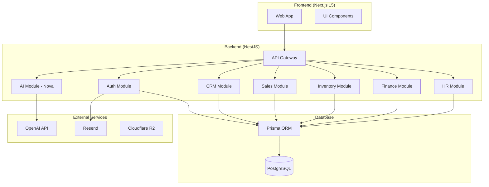

# Arquitectura de Nexora

## Visión General

Nexora utiliza una arquitectura de **Monolito Modular** que permite:

- Desarrollo independiente de módulos
- Comunicación vía eventos (EventBus)
- Extracción futura a microservicios si es necesario

## Principios de Diseño

### 1. Modularidad
Cada módulo es independiente y expone una API clara:
- CRM
- Sales
- Inventory
- Finance
- HR
- Automations (Nexora Flow)
- Marketplace (Nexora Marketplace)

### 2. Event-Driven
Los módulos se comunican mediante eventos:
```typescript
// Publicar evento
eventBus.publish(new InvoiceCreated(invoice));

// Suscribirse
eventBus.subscribe('InvoiceCreated', async (event) => {
  await updateInventory(event.items);
});
```

### 3. Multi-Tenant
Jerarquía completa de aislamiento:
```
Tenant → Workspace → Organization → Branch → Department → User
```

### 4. Seguridad
- RBAC + ABAC para control de acceso
- JWT RS256 con refresh tokens
- Auditoría completa vía AuditLog

## Stack Tecnológico

| Capa | Tecnología |
|------|------------|
| Frontend | Next.js 15, React, Tailwind CSS, shadcn/ui |
| Backend | NestJS, Prisma, PostgreSQL |
| IA | OpenAI Responses API, Tool Calling |
| Infra | Railway, Docker, GitHub Actions |
| Docs | VitePress, Markdown, Mermaid |

## Diagrama de Arquitectura



## Decisiones de Arquitectura

Ver [ADR](./adr/) para decisiones detalladas.
