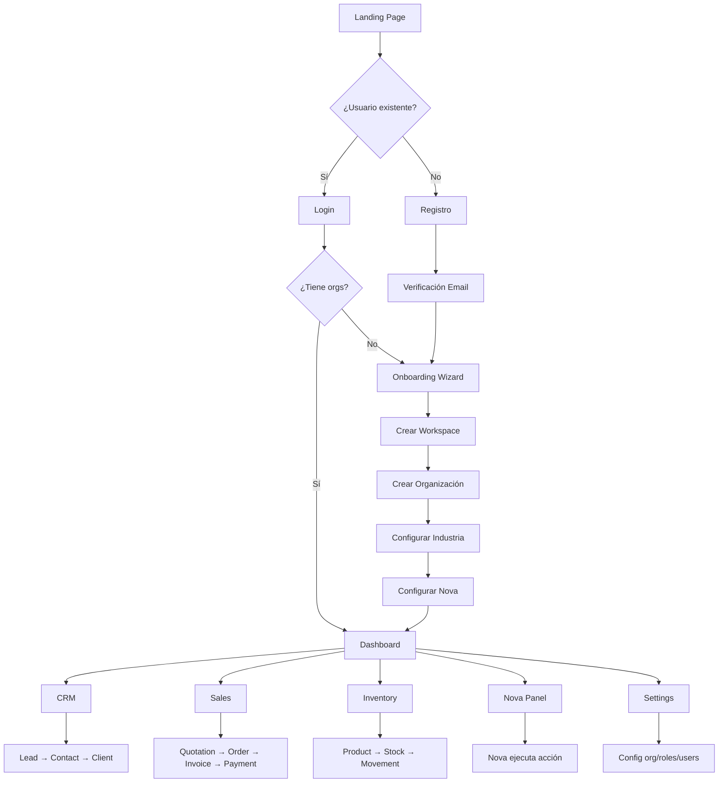
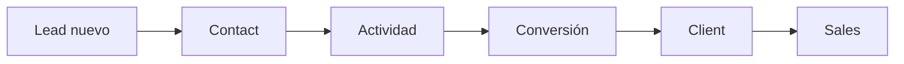
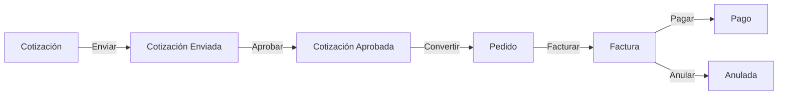
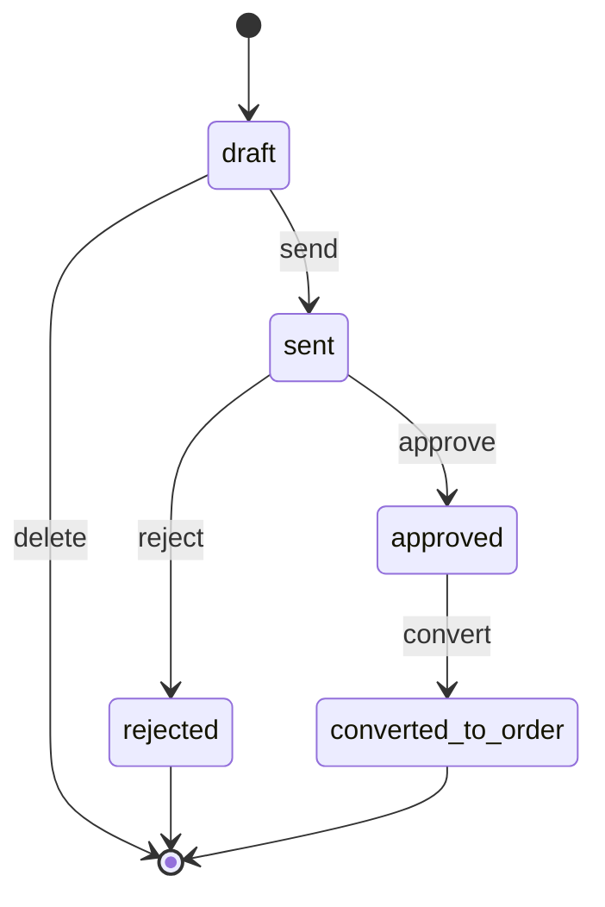
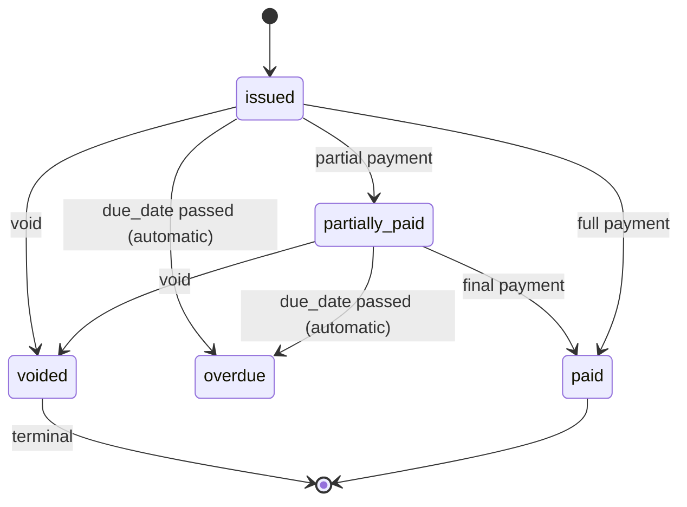
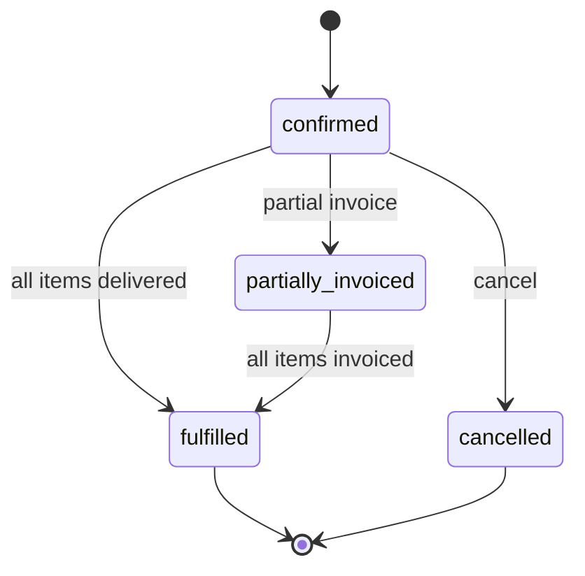

# 0002 — Flujo Completo del Usuario

> Flujo end-to-end de Nexora: desde que el usuario llega hasta que ejecuta acciones en cada módulo. Cada paso incluye: pantalla, backend, frontend, APIs, BD, eventos, permisos, validaciones, errores, y auditoría.

---

## 1. Diagrama de Flujo General



---

## 2. Flujo Detallado por Paso

### PASO 1: Landing Page

**Pantalla**: Homepage pública de Nexora

**Qué ve el usuario**:
- Hero section con headline y CTA
- Características principales
- Pricing (si aplica)
- Testimonios
- FAQ
- Footer con links

**Qué puede hacer**:
- Navegar a pricing
- Hacer click en "Comenzar gratis"
- Hacer click en "Iniciar sesión"
- Ver demo

**Backend**: Ninguno (estática)

**Frontend**:
- Componentes: `Hero`, `Features`, `Pricing`, `Testimonials`, `FAQ`, `Footer`
- Routing: `/` (landing)
- SEO: meta tags, structured data

**API**: Ninguna

**BD**: Ninguna

**Eventos**: Ninguno

**Permisos**: Público (no requiere auth)

**Validaciones**: Ninguna

**Errores**: Ninguno

**Auditoría**: Ninguna

**Dependencias**: Ninguna

---

### PASO 2: Registro

**Pantalla**: Formulario de registro

**Qué ve el usuario**:
- Campo: Nombre
- Campo: Apellido
- Campo: Correo electrónico
- Campo: Contraseña (con indicador de fortaleza)
- Campo: Confirmar contraseña
- Checkbox: "Acepto los términos y condiciones"
- Botón: "Crear cuenta"
- Link: "¿Ya tienes cuenta? Iniciar sesión"

**Qué puede hacer**:
- Llenar el formulario
- Ver.toggle de contraseña
- Ver indicador de fortaleza de contraseña
- Enviar formulario

**Backend**:
```
Use Case: RegisterUserUseCase
  1. Validar que el email no exista
  2. Hashear contraseña (bcrypt, 12 rounds)
  3. Crear User en BD
  4. Crear EmailVerificationToken
  5. Enviar email de verificación (Resend)
  6. Generar audit log
  7. Retornar userId
```

**Frontend**:
- Componente: `RegisterForm`
- Hook: `useRegister()` → llama a `POST /api/v1/auth/register`
- Validación client: Zod schema
- Estados: idle, loading, error, success

**API**:
```http
POST /api/v1/auth/register
Content-Type: application/json

{
  "firstName": "string (required)",
  "lastName": "string (required)",
  "email": "string (required, email format)",
  "password": "string (required, min 10 chars, uppercase, lowercase, number, symbol)",
  "passwordConfirmation": "string (required, must match password)",
  "acceptTerms": "boolean (required, must be true)"
}

Response 201:
{
  "data": {
    "id": "usr_abc123",
    "email": "user@example.com",
    "firstName": "John",
    "lastName": "Doe",
    "emailVerified": null,
    "createdAt": "2026-01-15T10:30:00Z"
  }
}

Response 409:
{
  "error": {
    "code": "EMAIL_ALREADY_EXISTS",
    "message": "Ya existe una cuenta con este correo electrónico",
    "http_status": 409
  }
}
```

**BD**:
```sql
-- Tabla: users
INSERT INTO users (id, email, password_hash, first_name, last_name, status, created_at)
VALUES (gen_random_uuid(), 'user@example.com', '$2b$12$...', 'John', 'Doe', 'PENDING_VERIFICATION', NOW());

-- Tabla: email_verification_tokens
INSERT INTO email_verification_tokens (id, email, token, expires_at, created_at)
VALUES (gen_random_uuid(), 'user@example.com', 'tok_xyz789', NOW() + INTERVAL '24 hours', NOW());
```

**Eventos**:
```
UserRegistered {
  userId: string
  email: string
  firstName: string
  lastName: string
  timestamp: DateTime
}

VerificationEmailSent {
  userId: string
  email: string
  expiresAt: DateTime
}
```

**Permisos**: Público (no requiere auth)

**Validaciones**:
- `firstName`: obligatorio, string, 1-100 chars
- `lastName`: obligatorio, string, 1-100 chars
- `email`: obligatorio, formato email, único en el sistema
- `password`: obligatorio, min 10 chars, al menos 1 mayúscula, 1 minúscula, 1 número, 1 símbolo
- `passwordConfirmation`: obligatorio, debe coincidir con password
- `acceptTerms`: obligatorio, debe ser `true`

**Errores**:
| Código | HTTP | Significado |
|--------|------|-------------|
| `VALIDATION_ERROR` | 400 | Payload no cumple schema |
| `EMAIL_ALREADY_EXISTS` | 409 | Email ya registrado |

**Auditoría**:
```json
{
  "action": "create",
  "module": "auth",
  "entity": "user",
  "entityId": "usr_abc123",
  "actor_type": "system",
  "after_state": { "email": "user@example.com", "status": "PENDING_VERIFICATION" }
}
```

---

### PASO 3: Verificación de Email

**Pantalla**: "Revisa tu correo electrónico"

**Qué ve el usuario**:
- Icono de email
- Título: "Verifica tu correo electrónico"
- Mensaje: "Hemos enviado un enlace de verificación a tu correo"
- Botón: "Reenviar email"
- Link: "Volver al login"

**Qué puede hacer**:
- Hacer click en el enlace del email
- Reenviar email

**Backend (click en enlace)**:
```
Use Case: VerifyEmailUseCase
  1. Buscar token en email_verification_tokens
  2. Validar que no esté expirado
  3. Actualizar user.email_verified = NOW()
  4. Actualizar user.status = 'ACTIVE'
  5. Eliminar token usado
  6. Generar audit log
  7. Redirigir a onboarding
```

**API**:
```http
GET /api/v1/auth/verify-email?token=tok_xyz789

Response 302: Redirect to /onboarding

Response 410:
{
  "error": {
    "code": "VERIFICATION_TOKEN_EXPIRED",
    "message": "El enlace de verificación ha expirado",
    "http_status": 410
  }
}
```

**Eventos**:
```
EmailVerified {
  userId: string
  email: string
  timestamp: DateTime
}
```

---

### PASO 4: Onboarding Wizard

**Pantalla**: Wizard de 3-4 pasos

#### Paso 4.1: Crear Workspace

**Qué ve el usuario**:
- Título: "Bienvenido a Nexora"
- Subtítulo: "Primero, creemos tu espacio de trabajo"
- Campo: Nombre del workspace (ej: "Mi Empresa")
- Botón: "Siguiente"

**Backend**:
```
Use Case: CreateWorkspaceUseCase
  1. Validar nombre (1-100 chars, alfanumérico + espacios)
  2. Generar slug automáticamente
  3. Crear Workspace
  4. Crear membership del usuario como OWNER
  5. Generar audit log
```

**API**:
```http
POST /api/v1/workspaces
Authorization: Bearer <token>

{
  "name": "Mi Empresa"
}

Response 201:
{
  "data": {
    "id": "ws_abc123",
    "name": "Mi Empresa",
    "slug": "mi-empresa",
    "createdAt": "2026-01-15T10:35:00Z"
  }
}
```

**Eventos**:
```
WorkspaceCreated {
  workspaceId: string
  name: string
  ownerId: string
  timestamp: DateTime
}
```

#### Paso 4.2: Crear Organización

**Qué ve el usuario**:
- Título: "Cuéntanos sobre tu empresa"
- Campo: Nombre de la organización
- Select: Industria (Comercio, Servicios, Manufactura, Salud, Educación, Otro)
- Select: País
- Select: Moneda (COP, USD, EUR, MXN, etc.)
- Select: Zona horaria
- Select: Cantidad de empleados (1-5, 6-20, 21-50, 51-200, 200+)
- Upload: Logo (opcional)
- Botón: "Siguiente"

**Backend**:
```
Use Case: CreateOrganizationUseCase
  1. Validar datos
  2. Crear Organization (workspace_id, name, industry, country, currency, timezone)
  3. Crear Branch principal (is_headquarter = true)
  4. Asignar rol OWNER al usuario
  5. Crear roles predefinidos (Owner, Admin, Manager, Employee, Viewer)
  6. Asignar permisos a cada rol
  7. Generar audit log
```

**API**:
```http
POST /api/v1/organizations
Authorization: Bearer <token>

{
  "name": "Mi Empresa S.A.S",
  "industry": "COMMERCE",
  "countryCode": "CO",
  "defaultCurrency": "COP",
  "timezone": "America/Bogota",
  "employeeRange": "1-5",
  "logo": null (optional file upload)
}

Response 201:
{
  "data": {
    "id": "org_abc123",
    "name": "Mi Empresa S.A.S",
    "industry": "COMMERCE",
    "branchId": "br_abc123",
    "roleId": "role_owner_123",
    "createdAt": "2026-01-15T10:40:00Z"
  }
}
```

**BD** (transacción):
```sql
BEGIN;
  -- Organization
  INSERT INTO organizations (id, workspace_id, name, industry, country_code, default_currency, timezone)
  VALUES (gen_random_uuid(), 'ws_abc123', 'Mi Empresa S.A.S', 'COMMERCE', 'CO', 'COP', 'America/Bogota');
  
  -- Branch principal
  INSERT INTO branches (id, organization_id, name, is_headquarter, is_active)
  VALUES (gen_random_uuid(), 'org_abc123', 'Sede Principal', true, true);
  
  -- Roles predefinidos
  INSERT INTO roles (id, organization_id, name, is_system_default) VALUES
    (gen_random_uuid(), 'org_abc123', 'Owner', true),
    (gen_random_uuid(), 'org_abc123', 'Admin', true),
    (gen_random_uuid(), 'org_abc123', 'Manager', true),
    (gen_random_uuid(), 'org_abc123', 'Employee', true),
    (gen_random_uuid(), 'org_abc123', 'Viewer', true);
  
  -- Asignar Owner al usuario
  INSERT INTO organization_members (id, organization_id, user_id, role_id, status, joined_at)
  VALUES (gen_random_uuid(), 'org_abc123', 'usr_abc123', 'role_owner_123', 'active', NOW());
COMMIT;
```

**Eventos**:
```
OrganizationCreated {
  organizationId: string
  workspaceId: string
  name: string
  industry: string
  ownerId: string
  timestamp: DateTime
}

OwnerAssigned {
  organizationId: string
  userId: string
  roleId: string
  timestamp: DateTime
}
```

#### Paso 4.3: Configurar Nova

**Qué ve el usuario**:
- Título: "Conoce a Nova"
- Avatar de Nova
- Mensaje: "Soy Nova, tu asistente de IA. Puedo ayudarte a gestionar tu negocio."
- Toggle: "Habilitar Nova para esta organización"
- Select: "Nivel de asistencia" (Básico, Intermedio, Avanzado)
- Botón: "Ir al Dashboard"

**Backend**:
```
Use Case: ConfigureNovaUseCase
  1. Guardar configuración de Nova en organization settings
  2. Inicializar contexto de Nova para la organización
  3. Generar audit log
```

**Eventos**:
```
NovaConfigured {
  organizationId: string
  enabled: boolean
  assistanceLevel: string
  timestamp: DateTime
}
```

---

### PASO 5: Dashboard

**Pantalla**: Centro de decisiones

**Qué ve el usuario**:
- Header: Organization name, branch selector, notifications bell, Nova avatar
- Sidebar: Module navigation (CRM, Sales, Inventory, etc.)
- Main content:
  - KPI cards: Ventas del mes, Clientes activos, Productos, Stock bajo
  - Chart: Ventas últimos 30 días
  - Alertas: Stock bajo, Facturas vencidas
  - Actividad reciente
  - Tareas pendientes
  - Nova quick access

**Qué puede hacer**:
- Navegar a módulos
- Ver KPIs
- Click en alertas → ir al módulo
- Abrir Nova panel (Cmd+K o click)
- Cambiar de organización
- Configurar widgets

**Backend**:
```
Use Case: GetDashboardUseCase
  1. Resolver contexto (org, branch, user, permissions)
  2. Calcular KPIs (ventas, clientes, productos, stock)
  3. Obtener alertas activas
  4. Obtener actividad reciente
  5. Obtener tareas pendientes
  6. Retornar dashboard data
```

**API**:
```http
GET /api/v1/dashboard
Authorization: Bearer <token>
X-Organization-ID: org_abc123

Response 200:
{
  "data": {
    "kpis": {
      "monthlySales": { "value": 15000000, "currency": "COP", "change": 12.5 },
      "activeClients": { "value": 45, "change": 8.0 },
      "totalProducts": { "value": 120 },
      "lowStock": { "value": 3, "severity": "warning" }
    },
    "salesChart": [...],
    "alerts": [...],
    "recentActivity": [...],
    "pendingTasks": [...]
  }
}
```

---

### PASO 6: CRM

**Flujo principal**: Lead → Contact → Client



#### 6.1 Crear Lead

**Pantalla**: Formulario de lead

**Qué ve el usuario**:
- Campo: Nombre completo
- Campo: Email
- Campo: Teléfono
- Select: Fuente (Web, Referido, Publicidad, Otro)
- Textarea: Notas
- Botón: "Guardar lead"

**API**:
```http
POST /api/v1/leads
Authorization: Bearer <token>

{
  "fullName": "Juan Pérez",
  "email": "juan@empresa.com",
  "phone": "+57 300 123 4567",
  "source": "WEB",
  "notes": "Interesado en producto X"
}

Response 201:
{
  "data": {
    "id": "lead_abc123",
    "contactId": "contact_abc123",
    "pipelineStageId": "stage_new",
    "status": "active",
    "createdAt": "2026-01-15T11:00:00Z"
  }
}
```

**Eventos**:
```
LeadCreated {
  leadId: string
  contactId: string
  organizationId: string
  source: string
  timestamp: DateTime
}
```

**Permisos**: `crm.lead.create`

#### 6.2 Convertir Lead a Client

**Pantalla**: Confirmación de conversión

**Qué ve el usuario**:
- Resumen del lead
- Checkbox: "Convertir a cliente"
- Botón: "Confirmar conversión"

**Backend**:
```
Use Case: ConvertLeadUseCase
  1. Validar que el lead no esté ya convertido (RN-CRM-01)
  2. Actualizar contact.type = 'client'
  3. Actualizar lead.status = 'converted'
  4. Preservar historial de actividades
  5. Generar audit log
```

**API**:
```http
POST /api/v1/leads/{id}/convert
Authorization: Bearer <token>

Response 200:
{
  "data": {
    "leadId": "lead_abc123",
    "contactId": "contact_abc123",
    "convertedAt": "2026-01-15T11:30:00Z"
  }
}

Response 409:
{
  "error": {
    "code": "LEAD_ALREADY_CONVERTED",
    "message": "Este lead ya fue convertido",
    "http_status": 409
  }
}
```

**Eventos**:
```
LeadConverted {
  leadId: string
  contactId: string
  organizationId: string
  timestamp: DateTime
}

ContactTypeChanged {
  contactId: string
  fromType: 'lead'
  toType: 'client'
  timestamp: DateTime
}
```

---

### PASO 7: Sales

**Flujo principal**:


#### 7.1 Crear Cotización

**Pantalla**: Formulario de cotización

**Qué ve el usuario**:
- Select: Cliente (existente o crear nuevo)
- Tabla de items:
  - Select: Producto
  - Cantidad
  - Precio unitario
  - Subtotal
- Botón: "+ Agregar item"
- Campo: Fecha de validez
- Textarea: Notas
- Resumen: Subtotal, Impuesto, Total
- Botón: "Guardar borrador"

**API**:
```http
POST /api/v1/quotations
Authorization: Bearer <token>

{
  "clientId": "contact_abc123",
  "items": [
    { "productId": "prod_001", "quantity": 10, "unitPrice": 50000 }
  ],
  "validUntil": "2026-02-15",
  "notes": "Entrega en 5 días hábiles",
  "taxRate": 19
}

Response 201:
{
  "data": {
    "id": "qt_abc123",
    "status": "draft",
    "totalAmount": 595000,
    "currency": "COP",
    "validUntil": "2026-02-15",
    "createdAt": "2026-01-15T12:00:00Z"
  }
}
```

**Eventos**:
```
QuotationCreated {
  quotationId: string
  clientId: string
  totalAmount: integer
  organizationId: string
  timestamp: DateTime
}
```

**Permisos**: `sales.quotation.create`

#### 7.2 Enviar Cotización

**API**:
```http
POST /api/v1/quotations/{id}/send
Authorization: Bearer <token>

Response 200:
{
  "data": {
    "id": "qt_abc123",
    "status": "sent",
    "sentAt": "2026-01-15T12:30:00Z"
  }
}
```

**Eventos**:
```
QuotationSent {
  quotationId: string
  clientId: string
  sentAt: DateTime
  timestamp: DateTime
}
```

#### 7.3 Convertir Cotización a Pedido

**Backend**:
```
Use Case: ConvertQuotationToOrderUseCase
  1. Validar que la cotización esté en status 'approved' (RN-SALES-03)
  2. Validar que no esté expirada (valid_until >= NOW)
  3. Crear Order con los mismos items y montos
  4. Actualizar quotation.status = 'converted_to_order'
  5. Generar audit log
```

**API**:
```http
POST /api/v1/quotations/{id}/convert-to-order
Authorization: Bearer <token>

Response 200:
{
  "data": {
    "quotationId": "qt_abc123",
    "orderId": "ord_abc123",
    "convertedAt": "2026-01-16T09:00:00Z"
  }
}

Response 409:
{
  "error": {
    "code": "QUOTATION_EXPIRED",
    "message": "La cotización ha expirado. Renueve antes de convertir.",
    "http_status": 409
  }
}
```

**Eventos**:
```
QuotationConvertedToOrder {
  quotationId: string
  orderId: string
  totalAmount: integer
  organizationId: string
  timestamp: DateTime
}

OrderCreated {
  orderId: string
  clientId: string
  quotationId: string
  totalAmount: integer
  timestamp: DateTime
}
```

#### 7.4 Generar Factura desde Pedido

**Backend**:
```
Use Case: CreateInvoiceFromOrderUseCase
  1. Validar que el pedido esté en status 'confirmed'
  2. Validar que el pedido no esté totalmente facturado (RN-SALES-04)
  3. Calcular monto de la factura (total o parcial)
  4. Generar número de factura secuencial por org (RN-GLOBAL-09)
  5. Crear Invoice
  6. Crear InvoiceItems
  7. Actualizar order status si está totalmente facturado
  8. Generar audit log
```

**API**:
```http
POST /api/v1/orders/{id}/invoices
Authorization: Bearer <token>
Idempotency-Key: idem_abc123

{
  "amount": 595000,
  "dueDate": "2026-02-15",
  "taxRate": 19
}

Response 201:
{
  "data": {
    "id": "inv_abc123",
    "invoiceNumber": "FAC-2026-00001",
    "status": "issued",
    "totalAmount": 595000,
    "dueDate": "2026-02-15",
    "createdAt": "2026-01-16T10:00:00Z"
  }
}
```

**Eventos**:
```
InvoiceIssued {
  invoiceId: string
  invoiceNumber: string
  orderId: string
  clientId: string
  totalAmount: integer
  dueDate: DateTime
  organizationId: string
  timestamp: DateTime
}
```

#### 7.5 Registrar Pago

**Backend**:
```
Use Case: RegisterPaymentUseCase
  1. Validar que la factura esté en status 'issued' o 'partially_paid'
  2. Validar que el pago no exceda el balance pendiente (RN-SALES-05)
  3. Crear Payment
  4. Actualizar invoice.paid_amount
  5. Si paid_amount >= total_amount → invoice.status = 'paid'
  6. Generar audit log
```

**API**:
```http
POST /api/v1/invoices/{id}/payments
Authorization: Bearer <token>
Idempotency-Key: idem_pay_123

{
  "amount": 300000,
  "method": "transfer",
  "paidAt": "2026-01-20T14:00:00Z",
  "reference": "Transferencia bancaria #12345"
}

Response 201:
{
  "data": {
    "id": "pay_abc123",
    "amount": 300000,
    "method": "transfer",
    "invoiceStatus": "partially_paid",
    "remainingBalance": 295000,
    "createdAt": "2026-01-20T14:00:00Z"
  }
}
```

**Eventos**:
```
PaymentRegistered {
  paymentId: string
  invoiceId: string
  amount: integer
  method: string
  timestamp: DateTime
}

InvoicePartiallyPaid {
  invoiceId: string
  paidAmount: integer
  remainingBalance: integer
  timestamp: DateTime
}

-- o si se pagó totalmente:
InvoicePaid {
  invoiceId: string
  invoiceNumber: string
  totalAmount: integer
  paidAt: DateTime
  timestamp: DateTime
}
```

#### 7.6 Anular Factura

**Backend**:
```
Use Case: VoidInvoiceUseCase
  1. Validar que la factura NO esté en status 'voided' (RN-SALES-01)
  2. Validar que la factura NO esté en status 'paid' (RN-SALES-08 → requiere nota crédito)
  3. Actualizar invoice.status = 'voided'
  4. Generar audit log con razón
```

**API**:
```http
POST /api/v1/invoices/{id}/void
Authorization: Bearer <token>

{
  "reason": "Error en los ítems de la factura"
}

Response 200:
{
  "data": {
    "id": "inv_abc123",
    "status": "voided",
    "voidedAt": "2026-01-20T15:00:00Z"
  }
}

Response 409:
{
  "error": {
    "code": "INVOICE_VOID_NOT_ALLOWED_FULLY_PAID",
    "message": "No se puede anular una factura pagada. Use una nota crédito.",
    "http_status": 409
  }
}
```

**Eventos**:
```
InvoiceVoided {
  invoiceId: string
  invoiceNumber: string
  reason: string
  voidedBy: string
  timestamp: DateTime
}
```

---

### PASO 8: Inventory

#### 8.1 Crear Producto

**API**:
```http
POST /api/v1/products
Authorization: Bearer <token>

{
  "sku": "PROD-001",
  "name": "Widget Premium",
  "description": "Widget de alta calidad",
  "unitPrice": 50000,
  "currency": "COP",
  "categoryId": "cat_abc123",
  "hasBatches": false,
  "allowNegativeStock": false
}

Response 201:
{
  "data": {
    "id": "prod_abc123",
    "sku": "PROD-001",
    "name": "Widget Premium",
    "unitPrice": 50000,
    "createdAt": "2026-01-15T13:00:00Z"
  }
}
```

**Eventos**:
```
ProductCreated {
  productId: string
  sku: string
  name: string
  unitPrice: integer
  organizationId: string
  timestamp: DateTime
}
```

#### 8.2 Registrar Movimiento de Stock

**API**:
```http
POST /api/v1/stock-movements
Authorization: Bearer <token>

{
  "productId": "prod_abc123",
  "warehouseId": "wh_abc123",
  "type": "in",
  "quantity": 100,
  "reason": "Compra inicial",
  "unitCost": 30000
}

Response 201:
{
  "data": {
    "id": "sm_abc123",
    "productId": "prod_abc123",
    "warehouseId": "wh_abc123",
    "type": "in",
    "quantity": 100,
    "newStock": 100,
    "createdAt": "2026-01-15T13:30:00Z"
  }
}
```

#### 8.3 Transferir Stock entre Almacenes

**Backend**:
```
Use Case: TransferStockUseCase
  1. Validar stock suficiente en almacén origen (RN-INV-02)
  2. Crear movimiento de salida (type: 'transfer', warehouse_from)
  3. Crear movimiento de entrada (type: 'transfer', warehouse_to)
  4. Ambos movimientos compartnen transfer_id
  5. Actualizar stock_levels para ambos almacenes
  6. Todo en UNA transacción (RN-INV-01)
  7. Si stock < minimum_quantity → evento StockBelowMinimum
  8. Generar audit log
```

**API**:
```http
POST /api/v1/stock-transfers
Authorization: Bearer <token>

{
  "productId": "prod_abc123",
  "fromWarehouseId": "wh_origin",
  "toWarehouseId": "wh_destiny",
  "quantity": 50,
  "reason": "Transferencia entre sucursales"
}

Response 201:
{
  "data": {
    "transferId": "trf_abc123",
    "movements": [
      { "id": "sm_out_123", "type": "out", "quantity": -50 },
      { "id": "sm_in_456", "type": "in", "quantity": 50 }
    ],
    "createdAt": "2026-01-15T14:00:00Z"
  }
}
```

**Eventos**:
```
StockTransferred {
  transferId: string
  productId: string
  fromWarehouseId: string
  toWarehouseId: string
  quantity: integer
  organizationId: string
  timestamp: DateTime
}

StockBelowMinimum {
  productId: string
  warehouseId: string
  currentStock: integer
  minimumQuantity: integer
  organizationId: string
  timestamp: DateTime
}
```

---

### PASO 9: Nova (Asistente IA)

**Pantalla**: Side panel persistente (Cmd+K)

**Qué ve el usuario**:
- Panel lateral derecho (30% width desktop, full screen mobile)
- Historial de conversación
- Input de texto
- Sugerencias rápidas
- Tool calls con estado
- Confirmation cards para acciones destructivas

**Flujo de Nova**:
```
1. Usuario escribe mensaje
2. Nova resuelve contexto (org, branch, permisos)
3. Nova analiza intención
4. Si es lectura → responde directamente con datos
5. Si es escritura → selecciona tool
6. Si es destructivo → muestra confirmation card
7. Usuario confirma → ejecuta Use Case
8. Nova muestra resultado
```

**API**:
```http
POST /api/v1/ai/chat
Authorization: Bearer <token>
Content-Type: text/event-stream (SSE)

{
  "message": "¿Cuánto vendí este mes?",
  "conversationId": "conv_abc123"
}

Response 200 (SSE):
data: {"type":"thinking","content":"Analizando ventas del mes..."}
data: {"type":"tool_call","tool":"get_sales_summary","status":"executing"}
data: {"type":"tool_result","tool":"get_sales_summary","result":{...}}
data: {"type":"response","content":"Este mes has vendido $15,000,000 COP, un 12% más que el mes pasado."}
data: [DONE]
```

**Nova Tools disponibles en MVP**:
| Tool | Descripción | Risk Flag | Permiso |
|------|-------------|-----------|---------|
| `create_client` | Crear cliente | normal | `crm.contact.create` |
| `find_customer` | Buscar cliente | - | `crm.contact.read` |
| `create_invoice` | Crear factura | normal | `sales.invoice.create` |
| `find_product` | Buscar producto | - | `inventory.product.read` |
| `get_sales_summary` | Resumen de ventas | - | `analytics.dashboard.read` |
| `get_inventory_report` | Reporte de inventario | - | `inventory.stock.read` |
| `transfer_stock` | Transferir stock | high_impact | `inventory.stock.transfer` |
| `void_invoice` | Anular factura | destructive | `sales.invoice.void` |
| `register_payment` | Registrar pago | normal | `sales.payment.create` |
| `create_task` | Crear tarea | normal | `tasks:create` |

**Confirmation Flow para destructivos**:
```
1. Nova detecta riskFlag = 'destructive'
2. Muestra NovaActionConfirmCard:
   - Acción: "Anular factura FAC-2026-00042"
   - Estado actual: "Emitida, $595,000 COP"
   - Estado después: "Anulada"
   - Advertencia: "Esta acción no se puede deshacer"
3. Botones de igual peso: "Confirmar" / "Cancelar"
4. Si confirma → ejecuta Use Case
5. Si cancela → Nova responde "Entendido, no se ejecutó la acción"
```

---

### PASO 10: Settings

**Pantalla**: Configuración de la organización

**Qué ve el usuario**:
- Tabs: General, Sucursales, Usuarios, Roles, Facturación, Nova, Notificaciones
- Cada tab con su formulario

**Flujos principales**:
1. **General**: Editar nombre, industria, moneda, timezone
2. **Sucursales**: CRUD de branches
3. **Usuarios**: Invitar usuarios, asignar roles
4. **Roles**: Crear/editar roles custom, asignar permisos
5. **Facturación**: Configuración de facturación (prefijo, secuencia)
6. **Nova**: Configurar nivel de asistencia, tools habilitados
7. **Notificaciones**: Preferencias de notificación por canal

---

## 3. Flujos Transversales

### 3.1 Cambio de Organización

**Pantalla**: Dropdown de organización en header

**Qué pasa**:
1. Usuario selecciona otra organización
2. Frontend llama `POST /api/v1/auth/switch-organization`
3. Backend genera nuevo JWT con nueva `organization_id`
4. Frontend limpia caché de React Query
5. Recarga datos con nuevo contexto

**API**:
```http
POST /api/v1/auth/switch-organization
Authorization: Bearer <token>

{
  "organizationId": "org_other_123"
}

Response 200:
{
  "data": {
    "accessToken": "eyJhbGciOiJSUzI1NiIs...",
    "organization": {
      "id": "org_other_123",
      "name": "Otra Empresa",
      "role": "admin"
    }
  }
}
```

### 3.2 Invitar Usuario

**Pantalla**: Formulario de invitación

**Qué ve el usuario**:
- Campo: Email del invitado
- Select: Rol a asignar
- Select: Sucursales (si aplica scope)
- Botón: "Enviar invitación"

**Backend**:
```
Use Case: InviteUserUseCase
  1. Validar que el email no esté ya en la org
  2. Crear invitation con expiración (7 días)
  3. Enviar email de invitación
  4. Generar audit log
```

**API**:
```http
POST /api/v1/users/invite
Authorization: Bearer <token>

{
  "email": "nuevo@empresa.com",
  "roleId": "role_manager_123",
  "branchIds": ["br_001", "br_002"]
}

Response 201:
{
  "data": {
    "invitationId": "inv_abc123",
    "email": "nuevo@empresa.com",
    "expiresAt": "2026-01-22T10:30:00Z"
  }
}
```

**Eventos**:
```
UserInvited {
  invitationId: string
  email: string
  organizationId: string
  roleId: string
  invitedBy: string
  expiresAt: DateTime
  timestamp: DateTime
}
```

### 3.3 Notificaciones

**Pantalla**: Centro de notificaciones (dropdown del bell icon)

**Qué ve el usuario**:
- Badge con número de no leídas
- Lista de notificaciones agrupadas por fecha
- Cada notificación: icono, título, mensaje, tiempo, link
- Botón: "Marcar todo como leído"
- Link: "Ver todas"

**Flujo**:
```
1. Evento de dominio se publica (ej: InvoiceOverdue)
2. Notification Service escucha el evento
3. Resuelve destinatarios (por rol, relación, o branch scope)
4. Resuelve template
5. Crea NOTIFICATION record
6. Dispatch vía canales aplicables (in-app, email)
7. Registra delivery status
```

---

## 4. Estados de Máquina Completos

### Quotation


### Invoice


### Order


---

## 5. Checklist de Flujos por Módulo

| Módulo | Flujos cubiertos | Archivo de detalle |
|--------|------------------|-------------------|
| Landing | Marketing → Registro | 0003 |
| Auth | Login, Registro, Verificación, Forgot Password | 0004 |
| Onboarding | Workspace → Org → Config | 0005 |
| Core | Orgs, Branches, Users, Roles | 0006 |
| Dashboard | KPIs, Alertas, Activity | 0007 |
| Nova | Chat, Tools, Confirmation | 0008 |
| CRM | Lead → Contact → Client | 0009 |
| Sales | Quote → Order → Invoice → Payment | 0010 |
| Inventory | Product → Stock → Movement → Transfer | 0011 |
| Notifications | Event → Template → Dispatch | 0012 |
| Audit | Write → Audit Log | 0013 |

---

*Este documento es la vista de 30,000 pies. Para detalles de implementación de cada módulo, ver el archivo correspondiente (0003-0030).*
