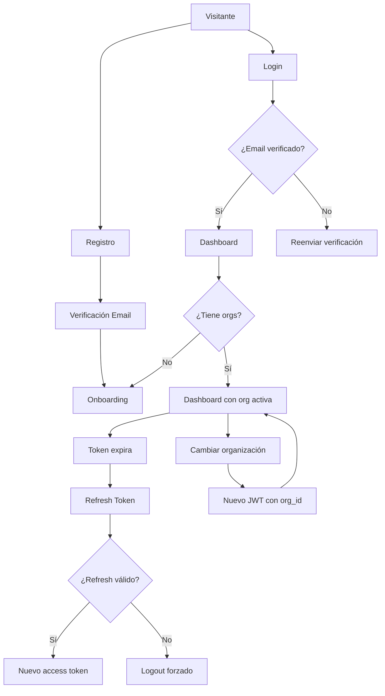

# 0004 — Autenticación

---

## 1. Descripción y Alcance

Sistema completo de autenticación: registro, login, verificación de email, recuperación de contraseña, refresh tokens, y multi-organización. Todo basado en JWT RS256 con refresh token rotation.

### Alcance Fase 1
- Registro con email/contraseña
- Login con email/contraseña
- Verificación de email
- Forgot password / Reset password
- Refresh token rotation
- Multi-organization switch
- Sesiones (listar, revocar)

### Alcance Futuro (Fase 2+)
- OAuth2 (Google, Microsoft)
- SSO / SAML (Enterprise)
- Two-factor authentication (2FA)
- Passkeys

---

## 2. Diagrama de Flujo



---

## 3. Pantallas

### 3.1 Login

**Qué ve el usuario**:
- Logo de Nexora
- Título: "Iniciar sesión"
- Campo: Correo electrónico
- Campo: Contraseña (toggle show/hide)
- Link: "¿Olvidaste tu contraseña?"
- Botón: "Iniciar sesión"
- Divider: "o"
- Botones OAuth: "Continuar con Google", "Continuar con Microsoft"
- Link: "¿No tienes cuenta? Regístrate"

**Wireframe**:
```
┌─────────────────────────────┐
│         [Logo Nexora]       │
│                             │
│      Iniciar sesión         │
│                             │
│  Correo electrónico         │
│  ┌───────────────────────┐  │
│  │ user@example.com      │  │
│  └───────────────────────┘  │
│                             │
│  Contraseña                 │
│  ┌───────────────────────┐  │
│  │ ••••••••••      [👁]  │  │
│  └───────────────────────┘  │
│              ¿Olvidaste tu contraseña? │
│                             │
│  ┌───────────────────────┐  │
│  │    Iniciar sesión      │  │
│  └───────────────────────┘  │
│                             │
│  ─── o ───                  │
│                             │
│  ┌───────────────────────┐  │
│  │ 🔵 Continuar con Google│  │
│  └───────────────────────┘  │
│  ┌───────────────────────┐  │
│  │ 🔷 Continuar con Microsoft│
│  └───────────────────────┘  │
│                             │
│  ¿No tienes cuenta? Regístrate │
└─────────────────────────────┘
```

---

### 3.2 Registro

(Ver sección PASO 2 en `0002-user-flow-complete.md`)

---

### 3.3 Verificación de Email

**Qué ve el usuario**:
- Icono de email grande
- Título: "Verifica tu correo electrónico"
- Mensaje: "Hemos enviado un enlace de verificación a **{email}**"
- Botón: "Reenviar email" (con cooldown de 60s)
- Link: "Volver al login"

**Estados**:
- `sending`: Enviando email
- `sent`: Email enviado exitosamente
- `error`: Error al enviar
- `cooldown`: Esperando para reenviar

---

### 3.4 Forgot Password

**Qué ve el usuario**:
- Título: "Recuperar contraseña"
- Mensaje: "Ingresa tu correo y te enviaremos un enlace para restablecer tu contraseña"
- Campo: Correo electrónico
- Botón: "Enviar enlace"
- Link: "Volver al login"

**Flujo**:
```
1. Usuario ingresa email
2. Backend busca user por email
3. Si no existe → mensaje genérico (no revelar existencia)
4. Si existe → crear PasswordResetToken
5. Enviar email con enlace
6. Mostrar mensaje de confirmación
```

---

### 3.5 Reset Password

**Qué ve el usuario**:
- Título: "Nueva contraseña"
- Campo: Nueva contraseña (con indicador de fortaleza)
- Campo: Confirmar contraseña
- Botón: "Restablecer contraseña"

**Flujo**:
```
1. Usuario hace click en enlace del email
2. Backend valida token (no expirado, no usado)
3. Muestra formulario de nueva contraseña
4. Usuario ingresa nueva contraseña
5. Backend actualiza password_hash
6. Marca token como usado
7. Revoca todas las sesiones del usuario
8. Redirige a login con mensaje de éxito
```

---

### 3.6 Sesiones

**Qué ve el usuario** (en Settings > Security):
- Lista de sesiones activas
- Cada sesión: dispositivo, IP, último acceso, ubicación
- Sesión actual destacada
- Botón: "Cerrar sesión" por sesión
- Botón: "Cerrar todas las demás sesiones"

---

## 4. Backend

### 4.1 Domain Entities

```typescript
// User
interface User {
  id: string;
  email: string;
  passwordHash: string;
  firstName: string;
  lastName: string;
  status: 'PENDING_VERIFICATION' | 'ACTIVE' | 'INACTIVE' | 'SUSPENDED';
  emailVerifiedAt: Date | null;
  lastLoginAt: Date | null;
  twoFactorEnabled: boolean;
  createdAt: Date;
  updatedAt: Date;
}

// Session
interface Session {
  id: string;
  userId: string;
  token: string;        // JWT access token ID
  refreshToken: string;  // Refresh token hash
  ipAddress: string;
  userAgent: string;
  expiresAt: Date;
  refreshExpiresAt: Date;
  createdAt: Date;
}

// EmailVerificationToken
interface EmailVerificationToken {
  id: string;
  email: string;
  token: string;        // Hash del token
  expiresAt: Date;
  createdAt: Date;
}

// PasswordResetToken
interface PasswordResetToken {
  id: string;
  userId: string;
  token: string;        // Hash del token
  expiresAt: Date;
  used: boolean;
  createdAt: Date;
}
```

### 4.2 Use Cases

#### RegisterUserUseCase
```typescript
class RegisterUserUseCase {
  async execute(dto: RegisterUserDto): Promise<User> {
    // 1. Validar email único
    const existing = await this.userRepository.findByEmail(dto.email);
    if (existing) throw new EmailAlreadyExistsException();
    
    // 2. Hashear contraseña
    const passwordHash = await this.hashService.hash(dto.password);
    
    // 3. Crear usuario
    const user = await this.userRepository.create({
      email: dto.email,
      passwordHash,
      firstName: dto.firstName,
      lastName: dto.lastName,
      status: 'PENDING_VERIFICATION'
    });
    
    // 4. Crear token de verificación
    const verificationToken = await this.verificationService.create(user.email);
    
    // 5. Enviar email
    await this.emailService.sendVerification(user.email, verificationToken);
    
    // 6. Audit log
    await this.auditService.log({
      action: 'create',
      module: 'auth',
      entity: 'user',
      entityId: user.id,
      actorType: 'system',
      afterState: { email: user.email, status: user.status }
    });
    
    return user;
  }
}
```

#### LoginUseCase
```typescript
class LoginUseCase {
  async execute(dto: LoginDto): Promise<LoginResponse> {
    // 1. Buscar usuario
    const user = await this.userRepository.findByEmail(dto.email);
    if (!user) throw new UnauthenticatedException();
    
    // 2. Validar contraseña
    const valid = await this.hashService.compare(dto.password, user.passwordHash);
    if (!valid) throw new UnauthenticatedException();
    
    // 3. Verificar email verificado
    if (!user.emailVerifiedAt) throw new EmailNotVerifiedException();
    
    // 4. Verificar estado
    if (user.status !== 'ACTIVE') throw new AccountDisabledException();
    
    // 5. Obtener organizaciones del usuario
    const memberships = await this.membershipRepository.findByUserId(user.id);
    
    // 6. Generar tokens
    const accessToken = this.jwtService.generateAccessToken({
      sub: user.id,
      organizationId: memberships[0]?.organizationId
    });
    const refreshToken = this.jwtService.generateRefreshToken({
      sub: user.id
    });
    
    // 7. Crear sesión
    await this.sessionService.create({
      userId: user.id,
      token: this.jwtService.decode(accessToken).jti,
      refreshToken: await this.hashService.hash(refreshToken),
      ipAddress: dto.ipAddress,
      userAgent: dto.userAgent,
      expiresAt: new Date(Date.now() + 15 * 60 * 1000), // 15 min
      refreshExpiresAt: new Date(Date.now() + 7 * 24 * 60 * 60 * 1000) // 7 days
    });
    
    // 8. Actualizar último login
    await this.userRepository.updateLastLogin(user.id);
    
    // 9. Audit log
    await this.auditService.log({
      action: 'login',
      module: 'auth',
      entity: 'user',
      entityId: user.id,
      actorType: 'human'
    });
    
    return {
      accessToken,
      refreshToken,
      user: { id: user.id, email: user.email, firstName: user.firstName, lastName: user.lastName },
      organizations: memberships.map(m => ({
        id: m.organizationId,
        name: m.organization.name,
        role: m.role.name
      }))
    };
  }
}
```

#### RefreshTokensUseCase
```typescript
class RefreshTokensUseCase {
  async execute(dto: RefreshTokenDto): Promise<TokenResponse> {
    // 1. Validar refresh token
    const payload = this.jwtService.verifyRefreshToken(dto.refreshToken);
    
    // 2. Buscar sesión por token hash
    const tokenHash = await this.hashService.hash(dto.refreshToken);
    const session = await this.sessionService.findByRefreshToken(tokenHash);
    if (!session) throw new UnauthenticatedException();
    
    // 3. Verificar que no esté expirada
    if (session.refreshExpiresAt < new Date()) {
      await this.sessionService.delete(session.id);
      throw new RefreshTokenExpiredException();
    }
    
    // 4. ROTATION: Eliminar sesión actual
    await this.sessionService.delete(session.id);
    
    // 5. Generar nuevos tokens
    const user = await this.userRepository.findById(session.userId);
    const memberships = await this.membershipRepository.findByUserId(user.id);
    
    const newAccessToken = this.jwtService.generateAccessToken({
      sub: user.id,
      organizationId: memberships[0]?.organizationId
    });
    const newRefreshToken = this.jwtService.generateRefreshToken({
      sub: user.id
    });
    
    // 6. Crear nueva sesión
    await this.sessionService.create({
      userId: user.id,
      token: this.jwtService.decode(newAccessToken).jti,
      refreshToken: await this.hashService.hash(newRefreshToken),
      ipAddress: dto.ipAddress,
      userAgent: dto.userAgent,
      expiresAt: new Date(Date.now() + 15 * 60 * 1000),
      refreshExpiresAt: new Date(Date.now() + 7 * 24 * 60 * 60 * 1000)
    });
    
    return {
      accessToken: newAccessToken,
      refreshToken: newRefreshToken
    };
  }
}
```

#### SwitchOrganizationUseCase
```typescript
class SwitchOrganizationUseCase {
  async execute(dto: SwitchOrgDto): Promise<TokenResponse> {
    // 1. Verificar que el usuario pertenece a la organización
    const membership = await this.membershipRepository.findByUserAndOrg(
      dto.userId, 
      dto.organizationId
    );
    if (!membership) throw new PermissionDeniedException();
    
    // 2. Generar nuevo JWT con nueva organization_id
    const newAccessToken = this.jwtService.generateAccessToken({
      sub: dto.userId,
      organizationId: dto.organizationId
    });
    
    // 3. Audit log
    await this.auditService.log({
      action: 'switch_organization',
      module: 'auth',
      entity: 'user',
      entityId: dto.userId,
      actorType: 'human',
      metadata: { organizationId: dto.organizationId }
    });
    
    return {
      accessToken: newAccessToken,
      organization: {
        id: dto.organizationId,
        name: membership.organization.name,
        role: membership.role.name
      }
    };
  }
}
```

---

## 5. Frontend

### 5.1 Components

- `LoginForm` - Formulario de login
- `RegisterForm` - Formulario de registro
- `ForgotPasswordForm` - Solicitar reset
- `ResetPasswordForm` - Nueva contraseña
- `EmailVerificationBanner` - Banner de verificación pendiente
- `SessionList` - Lista de sesiones activas
- `OAuthButtons` - Botones de Google/Microsoft

### 5.2 Hooks

```typescript
useLogin()           // POST /api/v1/auth/login
useRegister()        // POST /api/v1/auth/register
useLogout()          // POST /api/v1/auth/logout
useRefreshToken()    // POST /api/v1/auth/refresh
useForgotPassword()  // POST /api/v1/auth/forgot-password
useResetPassword()   // POST /api/v1/auth/reset-password
useVerifyEmail()     // GET /api/v1/auth/verify-email
useResendVerification() // POST /api/v1/auth/resend-verification
useSessions()        // GET /api/v1/auth/sessions
useRevokeSession()   // DELETE /api/v1/auth/sessions/:id
useSwitchOrganization() // POST /api/v1/auth/switch-organization
```

### 5.3 Auth Flow en Frontend (ARREGLADO)

> **IMPORTANTE**: Existen DOS sistemas de auth en el frontend. Se deben unificar en UNO solo.

#### Sistema A: `apps/web/src/lib/api.ts` + `apps/web/src/lib/hooks.ts`
- Base URL: `process.env.NEXT_PUBLIC_API_URL` → `http://localhost:3001/api/v1` (NestJS API)
- Token: `localStorage` (`access_token`)
- Transport: `Authorization: Bearer` header
- Usado por: Login page, Register page, todos los data hooks

#### Sistema B: `packages/ui/src/hooks/use-auth.tsx` (AuthProvider)
- Base URL: rutas relativas `/api/auth/me`, `/api/auth/login` → **HIT EL ORIGEN DEL WEB APP**
- **BUG CONOCIDO**: Llama a `/api/auth/me` que NO EXISTE en Next.js (no hay API routes), causando 404 en cada carga de página
- Usado por: `providers.tsx` → `<AuthProvider>` que envuelve toda la app

#### ARREGLADO: Unificar en Sistema A
El `AuthProvider` debe usar el `api` client de `apps/web/src/lib/api.ts` para llamar a `http://localhost:3001/api/v1/auth/me`.

#### Estados de Carga (Loading States)

```typescript
// AuthContext actualizado con estados de carga
interface AuthContextType {
  user: AuthUser | null;
  isLoading: boolean;        // true durante checkAuth inicial
  isAuthenticated: boolean;  // true si user !== null
  login: (email: string, password: string) => Promise<void>;
  register: (data: { ... }) => Promise<void>;
  logout: () => Promise<void>;
  refreshUser: () => Promise<void>;
}
```

**Cada pantalla debe mostrar estados de carga:**

| Pantalla | Estado | UI |
|----------|--------|-----|
| Login | `isInitialLoading` (sin token) | Spinner centrado, sin formulario |
| Login | `isSubmitting` (POST login) | Spinner en botón, formulario disabled |
| Login | `isError` | Mensaje de error + shake animation |
| Login | `isSuccess` | Redirect a dashboard |
| Register | `isSubmitting` | Spinner en botón, formulario disabled |
| Dashboard | `isAuthLoading` | Full-page skeleton/spinner |
| Cualquier página | `isAuthLoading` | Skeleton layout o spinner |

```tsx
// Ejemplo: Login con estados de carga
function LoginForm() {
  const [isLoading, setIsLoading] = useState(false);
  const [error, setError] = useState<string | null>(null);
  
  // Durante carga inicial (checkAuth), mostrar spinner completo
  if (isInitialLoading) {
    return <FullPageSpinner />;
  }
  
  return (
    <form onSubmit={handleSubmit} className={isLoading ? 'opacity-50 pointer-events-none' : ''}>
      {/* ... campos ... */}
      <Button type="submit" disabled={isLoading}>
        {isLoading ? <Spinner className="mr-2 h-4 w-4" /> : null}
        {isLoading ? 'Iniciando sesión...' : 'Iniciar sesión'}
      </Button>
      {error && <ErrorMessage message={error} />}
    </form>
  );
}
```

**Skeleton Layout para Dashboard:**
```tsx
function DashboardSkeleton() {
  return (
    <div className="animate-pulse space-y-4">
      <div className="h-8 bg-muted rounded w-1/3" />
      <div className="grid grid-cols-4 gap-4">
        {[...Array(4)].map((_, i) => (
          <div key={i} className="h-24 bg-muted rounded" />
        ))}
      </div>
      <div className="h-64 bg-muted rounded" />
    </div>
  );
}
```

---

## 6. API REST

### POST /api/v1/auth/register
(Ver sección PASO 2 en 0002)

### POST /api/v1/auth/login
```http
POST /api/v1/auth/login
Content-Type: application/json

{
  "email": "user@example.com",
  "password": "SecureP@ss10"
}

Response 200:
{
  "data": {
    "accessToken": "eyJhbGciOiJSUzI1NiIs...",
    "refreshToken": "eyJhbGciOiJSUzI1NiIs...",
    "expiresIn": 900,
    "user": {
      "id": "usr_abc123",
      "email": "user@example.com",
      "firstName": "John",
      "lastName": "Doe",
      "emailVerified": true
    },
    "organizations": [
      {
        "id": "org_abc123",
        "name": "Mi Empresa",
        "role": "owner"
      }
    ]
  }
}

Response 401:
{
  "error": {
    "code": "UNAUTHENTICATED",
    "message": "Credenciales inválidas",
    "http_status": 401
  }
}

Response 403:
{
  "error": {
    "code": "EMAIL_NOT_VERIFIED",
    "message": "Debes verificar tu correo electrónico",
    "http_status": 403
  }
}
```

### POST /api/v1/auth/refresh
```http
POST /api/v1/auth/refresh
{
  "refreshToken": "eyJhbGciOiJSUzI1NiIs..."
}

Response 200:
{
  "data": {
    "accessToken": "eyJhbGciOiJSUzI1NiIs...",
    "refreshToken": "eyJhbGciOiJSUzI1NiIs...",
    "expiresIn": 900
  }
}
```

### POST /api/v1/auth/switch-organization
```http
POST /api/v1/auth/switch-organization
Authorization: Bearer <token>

{
  "organizationId": "org_other_123"
}

Response 200:
{
  "data": {
    "accessToken": "eyJhbGciOiJSUzI1NiIs...",
    "organization": {
      "id": "org_other_123",
      "name": "Otra Empresa",
      "role": "admin"
    }
  }
}
```

### POST /api/v1/auth/logout
```http
POST /api/v1/auth/logout
Authorization: Bearer <token>

Response 200:
{
  "data": { "loggedOut": true }
}
```

### GET /api/v1/auth/sessions
```http
GET /api/v1/auth/sessions
Authorization: Bearer <token>

Response 200:
{
  "data": [
    {
      "id": "sess_abc123",
      "device": "Chrome on macOS",
      "ip": "192.168.1.1",
      "lastActive": "2026-01-15T10:30:00Z",
      "isCurrent": true
    },
    {
      "id": "sess_def456",
      "device": "Safari on iPhone",
      "ip": "10.0.0.1",
      "lastActive": "2026-01-14T08:15:00Z",
      "isCurrent": false
    }
  ]
}
```

### DELETE /api/v1/auth/sessions/:id
```http
DELETE /api/v1/auth/sess_def456
Authorization: Bearer <token>

Response 200:
{
  "data": { "revoked": true }
}
```

---

## 7. Base de Datos

```sql
-- Users
CREATE TABLE users (
  id UUID PRIMARY KEY DEFAULT gen_random_uuid(),
  email VARCHAR(255) UNIQUE NOT NULL,
  password_hash VARCHAR(255) NOT NULL,
  first_name VARCHAR(100) NOT NULL,
  last_name VARCHAR(100) NOT NULL,
  phone VARCHAR(20),
  avatar_url TEXT,
  status VARCHAR(30) DEFAULT 'PENDING_VERIFICATION',
  email_verified_at TIMESTAMPTZ,
  last_login_at TIMESTAMPTZ,
  two_factor_enabled BOOLEAN DEFAULT false,
  two_factor_secret VARCHAR(255),
  backup_codes TEXT[],
  created_at TIMESTAMPTZ DEFAULT NOW(),
  updated_at TIMESTAMPTZ DEFAULT NOW(),
  deleted_at TIMESTAMPTZ
);

CREATE INDEX idx_users_email ON users(email);
CREATE INDEX idx_users_status ON users(status);

-- Sessions
CREATE TABLE sessions (
  id UUID PRIMARY KEY DEFAULT gen_random_uuid(),
  user_id UUID NOT NULL REFERENCES users(id) ON DELETE CASCADE,
  token VARCHAR(255) UNIQUE NOT NULL,
  refresh_token_hash VARCHAR(255) NOT NULL,
  ip_address INET,
  user_agent TEXT,
  expires_at TIMESTAMPTZ NOT NULL,
  refresh_expires_at TIMESTAMPTZ NOT NULL,
  created_at TIMESTAMPTZ DEFAULT NOW(),
  updated_at TIMESTAMPTZ DEFAULT NOW()
);

CREATE INDEX idx_sessions_user_id ON sessions(user_id);
CREATE INDEX idx_sessions_token ON sessions(token);
CREATE INDEX idx_sessions_refresh_token ON sessions(refresh_token_hash);
CREATE INDEX idx_sessions_expires_at ON sessions(expires_at);

-- Email Verification Tokens
CREATE TABLE email_verification_tokens (
  id UUID PRIMARY KEY DEFAULT gen_random_uuid(),
  email VARCHAR(255) NOT NULL,
  token_hash VARCHAR(255) UNIQUE NOT NULL,
  expires_at TIMESTAMPTZ NOT NULL,
  created_at TIMESTAMPTZ DEFAULT NOW()
);

CREATE INDEX idx_evt_email ON email_verification_tokens(email);
CREATE INDEX idx_evt_expires ON email_verification_tokens(expires_at);

-- Password Reset Tokens
CREATE TABLE password_reset_tokens (
  id UUID PRIMARY KEY DEFAULT gen_random_uuid(),
  user_id UUID NOT NULL REFERENCES users(id) ON DELETE CASCADE,
  token_hash VARCHAR(255) UNIQUE NOT NULL,
  expires_at TIMESTAMPTZ NOT NULL,
  used BOOLEAN DEFAULT false,
  created_at TIMESTAMPTZ DEFAULT NOW()
);

CREATE INDEX idx_prt_user_id ON password_reset_tokens(user_id);
CREATE INDEX idx_prt_expires ON password_reset_tokens(expires_at);
```

---

## 8. Eventos

```
UserRegistered {
  userId: string
  email: string
  firstName: string
  lastName: string
  timestamp: DateTime
}

EmailVerified {
  userId: string
  email: string
  timestamp: DateTime
}

UserLoggedIn {
  userId: string
  sessionId: string
  ipAddress: string
  userAgent: string
  timestamp: DateTime
}

UserLoggedOut {
  userId: string
  sessionId: string
  timestamp: DateTime
}

PasswordResetRequested {
  userId: string
  email: string
  timestamp: DateTime
}

PasswordResetCompleted {
  userId: string
  timestamp: DateTime
}

OrganizationSwitched {
  userId: string
  fromOrganizationId: string | null
  toOrganizationId: string
  timestamp: DateTime
}

SessionRevoked {
  userId: string
  sessionId: string
  timestamp: DateTime
}
```

---

## 9. Permisos

| Acción | Permiso | Requiere Auth |
|--------|---------|---------------|
| Registro | Público | No |
| Login | Público | No |
| Verificación email | Público (token) | No |
| Forgot password | Público | No |
| Reset password | Público (token) | No |
| Refresh token | Refresh token válido | Sí (refresh) |
| Switch org | `core.organization.update` (self) | Sí |
| Listar sesiones | Propias | Sí |
| Revocar sesión | Propias | Sí |

---

## 10. Validaciones

### Register
- `firstName`: obligatorio, 1-100 chars, solo letras y espacios
- `lastName`: obligatorio, 1-100 chars, solo letras y espacios
- `email`: obligatorio, formato email, único en el sistema
- `password`: obligatorio, min 10 chars, al menos 1 mayúscula, 1 minúscula, 1 número, 1 símbolo
- `passwordConfirmation`: obligatorio, debe coincidir con password
- `acceptTerms`: obligatorio, debe ser `true`

### Login
- `email`: obligatorio, formato email
- `password`: obligatorio

### Forgot Password
- `email`: obligatorio, formato email

### Reset Password
- `token`: obligatorio, válido, no expirado, no usado
- `password`: mismo schema que registro
- `passwordConfirmation`: debe coincidir

---

## 11. Nova Tools

Ninguna (autenticación es transversal).

---

## 12. Notificaciones

### Email de verificación
```
Template: email_verification
Channel: email
Subject: "Verifica tu correo electrónico en Nexora"
Body: "Haz click en el enlace para verificar tu cuenta. Expira en 24 horas."
Priority: high
```

### Email de reset password
```
Template: password_reset
Channel: email
Subject: "Restablece tu contraseña en Nexora"
Body: "Haz click en el enlace para crear una nueva contraseña. Expira en 1 hora."
Priority: high
```

### Email de nueva sesión (seguridad)
```
Template: new_login_notification
Channel: email
Subject: "Nuevo inicio de sesión detectado"
Body: "Se detectó un nuevo inicio de sesión desde {device} en {location}."
Priority: medium
```

---

## 13. Auditoría

| Acción | Qué se graba |
|--------|-------------|
| Register | userId, email, status |
| Login | userId, sessionId, ipAddress, userAgent |
| Logout | userId, sessionId |
| Email Verified | userId, email |
| Password Reset Requested | userId, email |
| Password Reset Completed | userId |
| Session Revoked | userId, sessionId |
| Organization Switch | userId, fromOrg, toOrg |

---

## 14. Criterios de Aceptación

### US-AUTH-01: Registro exitoso
```
Given un visitante en /register
When completa el formulario con datos válidos
Then se crea el usuario con status PENDING_VERIFICATION
And se envía email de verificación
And se redirige a /verify-email
```

### US-AUTH-02: Login exitoso
```
Given un usuario registrado con email verificado
When ingresa credenciales correctas en /login
Then recibe access token y refresh token
And se crea una sesión
And se redirige al dashboard
```

### US-AUTH-03: Login con email no verificado
```
Given un usuario registrado con email NO verificado
When intenta hacer login
Then recibe error EMAIL_NOT_VERIFIED
And puede solicitar reenvío de verificación
```

### US-AUTH-04: Refresh token rotation
```
Given un usuario con sesión activa
When el access token expira
Then se usa el refresh token automáticamente
And se emite un nuevo access token
And se emite un nuevo refresh token (rotation)
And el refresh token anterior se invalida
```

### US-AUTH-05: Switch organization
```
Given un usuario con 2+ organizaciones
When selecciona otra organización
Then se genera un nuevo JWT con la nueva organization_id
And los datos se recargan con el contexto de la nueva org
And no se requiere re-login
```

### US-AUTH-06: Sesiones múltiples
```
Given un usuario con sesión en 2 dispositivos
When ve la lista de sesiones
Then ve ambas sesiones
And puede revocar la sesión remota
And la sesión actual no se ve afectada
```

---

## 15. Dependencias con Otros Módulos

| Módulo | Relación |
|--------|----------|
| Core (006) | Organizations, Roles, Memberships |
| Onboarding (005) | Post-registro |
| Dashboard (007) | Post-login |
| Notifications (012) | Emails transaccionales |
| Audit (013) | Logs de auth |

---

## 16. Checklist de Implementación

- [ ] RegisterForm con validación Zod
- [ ] LoginForm con validación Zod
- [ ] ForgotPasswordForm
- [ ] ResetPasswordForm
- [ ] EmailVerificationScreen
- [ ] SessionList en Settings
- [ ] OAuth buttons (Google, Microsoft)
- [ ] JWT RS256 generation
- [ ] Refresh token rotation
- [ ] Session management (create, revoke, list)
- [ ] Password hashing (bcrypt)
- [ ] Email sending (Resend)
- [ ] Rate limiting (10 logins/15min per IP+email)
- [ ] Audit logging
- [ ] Middleware de auth en todos los endpoints protegidos
- [ ] Guards: JwtAccessGuard, JwtRefreshGuard
- [ ] Frontend auth context
- [ ] Automatic token refresh
- [ ] Redirect to login on expired token
- [ ] Email templates (verification, reset, new login)

---

## 17. Bugs Conocidos y Correcciones (Julio 2026)

### BUG-001: AuthProvider llama a rutas inexistentes (404)

**Problema**: `packages/ui/src/hooks/use-auth.tsx` usa rutas relativas (`/api/auth/me`, `/api/auth/login`) que resuelven al origen del web app (`http://localhost:3000/api/auth/me`). Next.js NO tiene API routes definidas bajo `apps/web/src/app/api/`, así que todas estas llamadas retornan 404.

**Síntomas**:
- `Failed to load resource: the server responded with a status of 404 (Not Found)` para `/api/auth/me`
- El AuthProvider no puede verificar si el usuario está autenticado
- La app nunca muestra el estado de autenticación correctamente

**Causa raíz**: Dos sistemas de auth conflictivos:
1. `apps/web/src/lib/api.ts` → llama a NestJS API (`http://localhost:3001/api/v1/...`) ✓
2. `packages/ui/src/hooks/use-auth.tsx` → llama a rutas relativas del web app (`/api/auth/...`) ✗

**Corrección**: Reescribir `use-auth.tsx` para usar el `api` client de `apps/web/src/lib/api.ts`:
```typescript
// ANTES (roto)
const response = await fetch('/api/auth/me');

// DESPUÉS (corregido)
import { api } from '@/lib/api';
const response = await api.get('/auth/me');
```

### BUG-002: Docker environment — puertos y DNS

**Problema**: Los puertos del host están ocupados por otros servicios.

**Puertos asignados**:
| Servicio | Puerto host → container |
|----------|------------------------|
| PostgreSQL | 5434 → 5432 |
| Redis | 6380 → 6379 |
| API | 3005 → 3001 |
| Web | 3006 → 3000 |

**Corrección en docker-compose.yml**:
```yaml
web:
  ports: '3006:3000'
  environment:
    - NEXT_PUBLIC_API_URL=http://localhost:3005/api/v1
api:
  ports: '3005:3001'
```

### BUG-003: .dockerignore excluye solo root node_modules

**Problema**: `.dockerignore` con `node_modules` solo excluye el directorio raíz, no los anidados (`apps/api/node_modules`, etc.). El `COPY apps/api ./apps/api` sobreescribe los node_modules del Docker con symlinks de Windows que no funcionan en Linux.

**Corrección**: Usar `**/node_modules` en `.dockerignore`:
```
**/node_modules
**/.next
.git
dist
*.md
.env*
!.env.example
```

### BUG-004: @nyvora/database no compila a JS

**Problema**: `packages/database/package.json` tiene `"main": "./src/index.ts"` (TypeScript). En runtime, Node.js no puede ejecutar `.ts`, causando `SyntaxError: Unexpected identifier 'as'`.

**Corrección**:
1. Crear `packages/database/tsconfig.json` con `outDir: ./dist`
2. Agregar script `"build": "tsc"` al package.json
3. Cambiar `"main": "./dist/index.js"`
4. Excluir `src/seed.ts` del tsconfig (error de tipos conocido)
5. Copiar `src/generated/` a `dist/generated/` después del build
