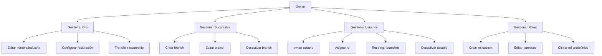

# 0006 — Core Platform

---

## 1. Descripción y Alcance

Módulo fundacional que gestiona: Organizations, Branches, Users, Roles, Permissions, Settings, Invitations, y Ownership. Todo lo demás cuelga de este módulo.

### Alcance
- Organizations CRUD (con settings, billing config)
- Branches CRUD (con scope de permisos)
- Users CRUD (con memberships)
- Roles CRUD (predefinidos + custom)
- Permissions (catálogo global)
- Invitations (invitar usuarios)
- Ownership transfer
- Member Branch Access (scope por branch)

---

## 2. Diagrama de Flujo



---

## 3. Pantallas

### 3.1 Organización - General

**Qué ve el usuario** (Settings > General):
- Nombre de la organización
- Industria
- País
- Moneda default
- Zona horaria
- Rango de empleados
- Logo
- Fecha de creación
- Botón: "Guardar cambios"

---

### 3.2 Sucursales

**Qué ve el usuario** (Settings > Sucursales):
- Lista de sucursales con: nombre, dirección, estado, usuarios asignados
- Badge: "Sede Principal" para la headquarters
- Botón: "+ Nueva sucursal"
- Acciones por sucursal: Editar, Desactivar

**Crear sucursal**:
- Campo: Nombre
- Campo: Dirección (JSON: calle, ciudad, estado, país, código postal)
- Campo: Teléfono
- Campo: Email
- Select: Zona horaria
- Select: Moneda
- Toggle: "Es sede principal"
- Botón: "Crear sucursal"

---

### 3.3 Usuarios

**Qué ve el usuario** (Settings > Usuarios):
- Tabla: Nombre, Email, Rol, Último acceso, Estado, Acciones
- Filtros: Por rol, por estado, por branch
- Búsqueda por nombre/email
- Botón: "+ Invitar usuario"
- Acciones: Editar rol, Restringir branches, Desactivar

**Invitar usuario**:
- Campo: Email
- Select: Rol
- Multi-select: Sucursales (opcional, vacío = todas)
- Botón: "Enviar invitación"

---

### 3.4 Roles

**Qué ve el usuario** (Settings > Roles):
- Lista de roles: Predefinidos (Owner, Admin, Manager, Employee, Viewer) + Custom
- Badge: "Sistema" para predefinidos (no editables en permisos, solo clonables)
- Botón: "+ Crear rol"
- Acciones por rol: Editar (custom), Clonar, Eliminar (custom)

**Crear/editar rol**:
- Campo: Nombre del rol
- Campo: Descripción
- Árbol de permisos agrupados por módulo:
  - Core: organization, branch, user, role, settings, audit
  - CRM: lead, contact, pipeline
  - Sales: quotation, order, invoice, payment, product
  - Inventory: product, stock, warehouse
- Toggle por permiso: create, read, update, delete, approve, export
- Botón: "Guardar rol"

---

### 3.5 Transferir Ownership

**Qué ve el usuario** (Settings > General > Transferir ownership):
- Warning: "Esta acción es irreversible"
- Select: Usuario actual Owner
- Select: Nuevo Owner (debe ser miembro de la organización)
- Campo: Confirmar con contraseña
- Botón: "Transferir ownership"

---

## 4. Backend

### 4.1 Use Cases

#### UpdateOrganizationUseCase
```typescript
class UpdateOrganizationUseCase {
  async execute(orgId: string, dto: UpdateOrganizationDto, userId: string): Promise<Organization> {
    // 1. Verificar permiso: core.organization.update
    // 2. Actualizar organización
    // 3. Audit log
    // 4. Event: OrganizationUpdated
    return org;
  }
}
```

#### CreateBranchUseCase
```typescript
class CreateBranchUseCase {
  async execute(dto: CreateBranchDto, userId: string): Promise<Branch> {
    // 1. Verificar permiso: core.branch.create
    // 2. Validar nombre único por organización
    // 3. Si es headquarter, desmarcar las demás
    // 4. Crear branch
    // 5. Audit log
    // 6. Event: BranchCreated
    return branch;
  }
}
```

#### InviteUserUseCase
```typescript
class InviteUserUseCase {
  async execute(dto: InviteUserDto, userId: string): Promise<Invitation> {
    // 1. Verificar permiso: core.user.create
    // 2. Verificar que el email no esté ya en la organización
    // 3. Crear invitación con expiración (7 días)
    // 4. Enviar email de invitación
    // 5. Audit log
    // 6. Event: UserInvited
    return invitation;
  }
}
```

#### CreateCustomRoleUseCase
```typescript
class CreateCustomRoleUseCase {
  async execute(dto: CreateRoleDto, userId: string): Promise<Role> {
    // 1. Verificar permiso: core.role.create
    // 2. Validar que el nombre sea único en la organización
    // 3. Validar que el usuario tenga TODOS los permisos que está asignando (RN-CORE-05)
    // 4. Crear rol
    // 5. Asignar permisos
    // 6. Audit log
    // 7. Event: RoleCreated
    return role;
  }
}
```

#### TransferOwnershipUseCase
```typescript
class TransferOwnershipUseCase {
  async execute(dto: TransferOwnershipDto, currentOwnerId: string): Promise<void> {
    // 1. Verificar que el usuario actual sea Owner
    // 2. Verificar que el nuevo Owner sea miembro de la organización
    // 3. Asignar rol Owner al nuevo usuario
    // 4. Degradar al usuario actual a Admin
    // 5. Audit log
    // 6. Event: OwnershipTransferred
  }
}
```

---

## 5. Frontend

### 5.1 Components

- `OrganizationSettings` - Tabs container
- `BranchList` - Lista de sucursales
- `BranchForm` - Formulario crear/editar
- `UserList` - Lista de usuarios
- `InviteUserDialog` - Dialog de invitación
- `RoleList` - Lista de roles
- `RoleForm` - Formulario crear/editar con árbol de permisos
- `PermissionTree` - Árbol de permisos expandible
- `TransferOwnershipDialog` - Dialog de transferencia
- `MemberBranchAccess` - Selector de branches por miembro

### 5.2 Hooks

```typescript
useOrganization()           // GET /api/v1/organizations/me
useUpdateOrganization()     // PATCH /api/v1/organizations/:id
useBranches()               // GET /api/v1/branches
useCreateBranch()           // POST /api/v1/branches
useUpdateBranch()           // PATCH /api/v1/branches/:id
useDeleteBranch()           // DELETE /api/v1/branches/:id
useUsers()                  // GET /api/v1/users
useInviteUser()             // POST /api/v1/users/invite
useUpdateUserRole()         // PATCH /api/v1/users/:id/role
useDeactivateUser()         // PATCH /api/v1/users/:id/deactivate
useRoles()                  // GET /api/v1/roles
useCreateRole()             // POST /api/v1/roles
useUpdateRole()             // PATCH /api/v1/roles/:id
useDeleteRole()             // DELETE /api/v1/roles/:id
usePermissions()            // GET /api/v1/permissions
useTransferOwnership()      // POST /api/v1/organizations/transfer-ownership
```

---

## 6. API REST

### Organizations
```http
GET    /api/v1/organizations/me
PATCH  /api/v1/organizations/:id
POST   /api/v1/organizations/transfer-ownership
```

### Branches
```http
POST   /api/v1/branches
GET    /api/v1/branches
GET    /api/v1/branches/:id
PATCH  /api/v1/branches/:id
DELETE /api/v1/branches/:id
```

### Users
```http
POST   /api/v1/users/invite
GET    /api/v1/users
GET    /api/v1/users/:id
PATCH  /api/v1/users/:id/role
PATCH  /api/v1/users/:id/deactivate
PATCH  /api/v1/users/:id/branch-access
```

### Roles
```http
POST   /api/v1/roles
GET    /api/v1/roles
GET    /api/v1/roles/:id
PATCH  /api/v1/roles/:id
DELETE /api/v1/roles/:id
POST   /api/v1/roles/:id/clone
```

### Permissions
```http
GET    /api/v1/permissions
```

---

## 7. Base de Datos

(Ver `0004-database-design.md` sección Core Platform)

### Tablas principales
- `organizations`
- `branches`
- `users`
- `organization_members`
- `roles`
- `permissions` (catálogo global)
- `role_permissions`
- `member_branch_access`

---

## 8. Eventos

```
OrganizationUpdated { organizationId, changes, updatedBy }
BranchCreated { branchId, organizationId, name, isHeadquarter }
BranchUpdated { branchId, changes }
BranchDeactivated { branchId, organizationId }
UserInvited { invitationId, email, organizationId, roleId, invitedBy, expiresAt }
UserJoinedOrganization { memberId, userId, organizationId, roleId }
UserRoleChanged { memberId, userId, organizationId, fromRoleId, toRoleId }
UserDeactivated { memberId, userId, organizationId }
RoleCreated { roleId, organizationId, name, isSystemDefault }
RoleUpdated { roleId, changes }
RoleDeleted { roleId, organizationId }
OwnershipTransferred { organizationId, fromUserId, toUserId }
```

---

## 9. Permisos

| Recurso | Acciones disponibles |
|---------|---------------------|
| `core.organization` | update, delete |
| `core.branch` | create, read, update, delete |
| `core.user` | create, read, update, delete |
| `core.role` | create, read, update, delete |
| `core.settings` | update |
| `core.audit` | read |

### Roles predefinidos
| Rol | Permisos |
|-----|----------|
| Owner | Todos |
| Admin | Todos excepto `core.organization.delete` |
| Manager | CRUD en módulos asignados, sin delete en configs |
| Employee | Create/Read/Update en su scope, sin Delete |
| Viewer | Read only |

---

## 10. Validaciones

### Organization
- `name`: 2-255 chars
- `industry`: enum válido
- `countryCode`: ISO 3166-1 alpha-2
- `defaultCurrency`: ISO 4217

### Branch
- `name`: 2-100 chars, único por organización
- `timezone`: timezone válido
- `currency`: ISO 4217

### Role
- `name`: 2-50 chars, único por organización
- `permissions`: array de códigos de permiso válidos
- No puede asignar permisos que el creador no posee (RN-CORE-05)

---

## 11. Nova Tools

Ninguno directo. Nova accede a estos datos a través de otros módulos.

---

## 12. Notificaciones

```
UserInvited → email al invitado
OwnershipTransferred → email al nuevo Owner
UserRoleChanged → in-app al usuario afectado
```

---

## 13. Auditoría

Todas las operaciones CRUD en Organizations, Branches, Users, Roles se auditan.

---

## 14. Criterios de Aceptación

### US-CORE-01: Crear organización
```
Given un Owner autenticado
When crea una organización con datos válidos
Then se crea la organización
And se crea branch principal
And se crean roles predefinidos
And el usuario recibe rol Owner
```

### US-CORE-02: Invitar usuario
```
Given un Admin autenticado
When invita a un usuario con email y rol
Then se crea la invitación
And se envía email
And la invitación expira en 7 días
```

### US-CORE-03: Crear rol custom
```
Given un Admin con permisos {A, B, C}
When crea un rol con permisos {A, B, C}
Then el rol se crea exitosamente

When intenta crear un rol con permiso {D} que no posee
Then recibe error PERMISSION_ESCALATION_DENIED
```

### US-CORE-04: Transferir ownership
```
Given el Owner actual
When transfiere ownership a otro miembro
Then el nuevo miembro recibe rol Owner
And el usuario actual se degrada a Admin
And la acción queda en auditoría
```

---

## 15. Dependencias

| Módulo | Relación |
|--------|----------|
| Auth (004) | Usuarios, sesiones |
| Onboarding (005) | Creación inicial |
| Todos los módulos | Organizaciones, branches, roles, permisos |

---

## 16. Checklist

- [ ] Organization CRUD
- [ ] Branch CRUD
- [ ] User CRUD con invitations
- [ ] Role CRUD con permissions tree
- [ ] Predefined roles seed
- [ ] Member Branch Access
- [ ] Ownership transfer
- [ ] Audit logging
- [ ] Event publishing
- [ ] Permission guards
- [ ] Tenant isolation middleware
