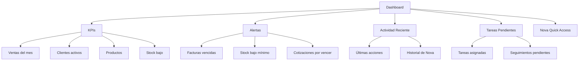

# 0007 — Dashboard

---

## 1. Descripción y Alcance

Centro de decisiones del usuario. Muestra KPIs, alertas, actividad reciente, tareas pendientes, y acceso rápido a Nova. Configurable por rol.

---

## 2. Diagrama de Flujo



---

## 3. Pantallas

### 3.1 Dashboard Principal

**Qué ve el usuario**:
- **Header**: Organization name, branch selector, notifications bell, user avatar
- **Sidebar**: Navegación de módulos (CRM, Sales, Inventory, etc.)
- **Main content**:
  - KPI cards (4 cards en grid)
  - Chart de ventas (últimos 30 días)
  - Alertas (lista priorizada)
  - Actividad reciente (timeline)
  - Tareas pendientes
  - Nova quick access button

**Wireframe**:
```
┌─────────────────────────────────────────────────────┐
│ [Logo] Mi Empresa ▼  [Branch: Principal ▼]  🔔  👤  │
├────────┬────────────────────────────────────────────┤
│        │                                            │
│ 📊 Dash│  ┌──────┐ ┌──────┐ ┌──────┐ ┌──────┐      │
│ 👥 CRM │  │Ventas│ │Client│ │Produc│ │Stock │      │
│ 💰 Sales│ │ $15M │ │  45  │ │ 120  │ │  ⚠3  │      │
│ 📦 Inv │  │ +12% │ │ +8%  │ │      │ │      │      │
│ ⚙️ Set │  └──────┘ └──────┘ └──────┘ └──────┘      │
│        │                                            │
│        │  ┌──────────────────┐ ┌─────────────────┐  │
│        │  │ 📈 Ventas 30 días│ │ ⚠️ Alertas      │  │
│        │  │ [chart]          │ │ • FAC vencida   │  │
│        │  │                  │ │ • Stock bajo    │  │
│        │  │                  │ │ • QT por vencer │  │
│        │  └──────────────────┘ └─────────────────┘  │
│        │                                            │
│        │  ┌──────────────────┐ ┌─────────────────┐  │
│        │  │ 🕐 Actividad     │ │ 📋 Tareas       │  │
│        │  │ • Juan creó FAC  │ │ • Llamar cliente│  │
│        │  │ • María pagó     │ │ • Revisar stock │  │
│        │  │ • Nova creó lead │ │ • Enviar QT     │  │
│        │  └──────────────────┘ └─────────────────┘  │
│        │                                            │
│        │  ┌─────────────────────────────────────┐   │
│        │  │ 🤖 Nova: "¿En qué puedo ayudarte?" │   │
│        │  └─────────────────────────────────────┘   │
└────────┴────────────────────────────────────────────┘
```

---

### 3.2 KPI Cards

| Card | Fórmula | Fuente |
|------|---------|--------|
| Ventas del mes | SUM(payments.amount) WHERE paid_at THIS_MONTH | Sales |
| Clientes activos | COUNT(contacts WHERE type='client') | CRM |
| Productos | COUNT(products WHERE is_active=true) | Inventory |
| Stock bajo | COUNT(stock_levels WHERE quantity < minimum_quantity) | Inventory |

**Componente**: `KpiCard`
- Props: `title`, `value`, `change` (percentage), `icon`, `severity` (normal, warning, danger)
- Trend arrow: ↑ (positive) / ↓ (negative) / → (neutral)

---

### 3.3 Chart de Ventas

**Componente**: `SalesChart`
- Type: Line chart (30 días) o Bar chart (12 meses)
- Data: Ventas diarias/mensuales
- Tooltip: Fecha, monto
- Toggle: Días / Meses

---

### 3.4 Alertas

**Componente**: `AlertList`
- Cada alerta: icono, título, mensaje, monto (si aplica), tiempo, link al módulo
- Prioridad visual: 🔴 Alta, 🟡 Media, 🟢 Baja
- Orden: Por urgencia (monto × proximidad a deadline)

**Tipos de alertas MVP**:
| Alerta | Fuente | Prioridad |
|--------|--------|-----------|
| Factura vencida | Sales | Alta |
| Stock bajo mínimo | Inventory | Media |
| Cotización por vencer | Sales | Media |
| Invitación pendiente | Core | Baja |
| Nova action executed | Nova | Baja |

---

### 3.5 Actividad Reciente

**Componente**: `ActivityTimeline`
- Timeline vertical con iconos
- Cada item: icono de módulo, descripción, usuario, timestamp
- Últimas 20 acciones
- Link "Ver más" → Audit log

---

### 3.6 Tareas Pendientes

**Componente**: `PendingTasks`
- Lista de tareas asignadas al usuario
- Cada tarea: título, prioridad, fecha límite, entidad relacionada
- Acción: Marcar como completada
- Link "Ver todas" → Module tasks

---

### 3.7 Nova Quick Access

**Componente**: `NovaQuickAccess`
- Botón flotante o barra en la parte inferior del dashboard
- Click abre Nova side panel (Cmd+K)
- Sugerencias basadas en contexto

---

## 4. Backend

### 4.1 Use Cases

#### GetDashboardUseCase
```typescript
class GetDashboardUseCase {
  async execute(userId: string, organizationId: string, branchId?: string): Promise<DashboardData> {
    // 1. Resolver contexto (org, branch, user, permissions)
    const context = await this.contextResolver.resolve(userId, organizationId, branchId);
    
    // 2. Calcular KPIs en paralelo
    const [salesKpi, clientsKpi, productsKpi, stockKpi] = await Promise.all([
      this.salesService.getMonthlySales(organizationId, branchId),
      this.crmService.getActiveClientsCount(organizationId, branchId),
      this.inventoryService.getProductsCount(organizationId),
      this.inventoryService.getLowStockCount(organizationId, branchId)
    ]);
    
    // 3. Obtener alertas
    const alerts = await this.alertService.getActive(organizationId, branchId, context.permissions);
    
    // 4. Obtener actividad reciente
    const activity = await this.auditService.getRecent(organizationId, 20);
    
    // 5. Obtener tareas pendientes
    const tasks = await this.taskService.getPending(userId, organizationId);
    
    // 6. Construir dashboard
    return {
      kpis: {
        monthlySales: salesKpi,
        activeClients: clientsKpi,
        totalProducts: productsKpi,
        lowStock: stockKpi
      },
      salesChart: await this.salesService.getChart(organizationId, 30),
      alerts,
      recentActivity: activity,
      pendingTasks: tasks
    };
  }
}
```

### 4.2 Repository Interfaces

```typescript
interface DashboardRepository {
  getMonthlySales(orgId: string, branchId?: string): Promise<KpiData>;
  getActiveClientsCount(orgId: string, branchId?: string): Promise<number>;
  getProductsCount(orgId: string): Promise<number>;
  getLowStockCount(orgId: string, branchId?: string): Promise<number>;
  getSalesChart(orgId: string, days: number): Promise<ChartData[]>;
}
```

---

## 5. Frontend

### 5.1 Components

- `DashboardPage` - Container principal
- `KpiCard` - Card de KPI individual
- `SalesChart` - Gráfico de ventas
- `AlertList` - Lista de alertas
- `AlertItem` - Item individual de alerta
- `ActivityTimeline` - Timeline de actividad
- `ActivityItem` - Item individual
- `PendingTasks` - Lista de tareas
- `TaskItem` - Item individual de tarea
- `NovaQuickAccess` - Botón de acceso rápido a Nova
- `WidgetConfigDialog` - Configurar widgets (por rol)

### 5.2 Hooks

```typescript
useDashboard()           // GET /api/v1/dashboard
useDashboardKpis()       // GET /api/v1/dashboard/kpis
useDashboardAlerts()     // GET /api/v1/dashboard/alerts
useDashboardActivity()   // GET /api/v1/dashboard/activity
useDashboardTasks()      // GET /api/v1/dashboard/tasks
```

### 5.3 Widget Configuration

```typescript
// Configuración declarativa por rol
const widgetConfig: Record<string, Widget[]> = {
  owner: ['kpi_sales', 'kpi_clients', 'kpi_products', 'kpi_stock', 
          'chart_sales', 'alerts', 'activity', 'tasks', 'nova'],
  admin: ['kpi_sales', 'kpi_clients', 'kpi_products', 'kpi_stock',
          'chart_sales', 'alerts', 'activity', 'tasks'],
  manager: ['kpi_sales', 'kpi_clients', 'chart_sales', 'alerts', 'tasks'],
  employee: ['kpi_sales', 'alerts', 'tasks'],
  viewer: ['kpi_sales', 'chart_sales']
};
```

---

## 6. API REST

```http
GET /api/v1/dashboard
Authorization: Bearer <token>
X-Organization-ID: org_abc123
X-Branch-ID: br_abc123 (optional)

Response 200:
{
  "data": {
    "kpis": {
      "monthlySales": { "value": 15000000, "currency": "COP", "change": 12.5 },
      "activeClients": { "value": 45, "change": 8.0 },
      "totalProducts": { "value": 120 },
      "lowStock": { "value": 3, "severity": "warning" }
    },
    "salesChart": [
      { "date": "2026-01-01", "value": 500000 },
      { "date": "2026-01-02", "value": 750000 }
    ],
    "alerts": [
      {
        "id": "alert_001",
        "type": "invoice_overdue",
        "title": "Factura vencida",
        "message": "FAC-2026-00042 venció hace 3 días",
        "severity": "high",
        "amount": 595000,
        "link": "/sales/invoices/inv_abc123"
      }
    ],
    "recentActivity": [
      {
        "id": "act_001",
        "module": "sales",
        "action": "create",
        "entity": "invoice",
        "description": "Juan creó factura FAC-2026-00042",
        "user": { "id": "usr_001", "name": "Juan" },
        "timestamp": "2026-01-15T10:30:00Z"
      }
    ],
    "pendingTasks": [
      {
        "id": "task_001",
        "title": "Llamar a Juan Pérez",
        "priority": "medium",
        "dueDate": "2026-01-20",
        "relatedTo": { "type": "contact", "id": "contact_001" }
      }
    ]
  }
}
```

---

## 7. Base de Datos

No hay tabla dedicada. El dashboard se calcula en tiempo real consultando:
- Sales (payments, invoices)
- CRM (contacts, leads)
- Inventory (products, stock_levels)
- Audit (audit_logs)
- Tasks (tasks)

---

## 8. Eventos

Ninguno propio. El dashboard escucha eventos de otros módulos para actualizar alertas.

---

## 9. Permisos

| Permiso | Acceso |
|---------|--------|
| `analytics.dashboard.read` | Ver dashboard |
| `core.audit.read` | Ver actividad completa |

### Widget visibility por permiso
- KPIs: Requiere permisos de lectura del módulo correspondiente
- Alertas: Requiere permisos del módulo
- Activity: Requiere `core.audit.read`
- Tasks: Propias del usuario

---

## 10. Validaciones

- `branchId`: opcional, debe pertenecer a la organización
- Filtros de fecha: formato ISO 8601

---

## 11. Nova Tools

- `get_dashboard_summary` → Resumen del dashboard
- `get_sales_summary` → Detalle de ventas
- `get_inventory_alerts` → Alertas de stock

---

## 12. Notificaciones

Las alertas del dashboard se generan internamente, no como notificaciones push.

---

## 13. Auditoría

Las consultas del dashboard NO se auditan (solo reads).

---

## 14. Criterios de Aceptación

### US-DASH-01: Dashboard carga correctamente
```
Given un usuario autenticado con permisos de dashboard
When navega al dashboard
Then ve los 4 KPI cards
And ve el gráfico de ventas
And ve las alertas activas
And ve la actividad reciente
And ve las tareas pendientes
```

### US-DASH-02: Dashboard filtrado por branch
```
Given un usuario con acceso a múltiples branches
When selecciona un branch específico
Then todos los datos se filtran por ese branch
And los KPIs reflejan solo datos de ese branch
```

### US-DASH-03: Widget config por rol
```
Given un Employee
When carga el dashboard
Then ve solo los widgets configurados para su rol
And no ve widgets que no le corresponden
```

---

## 15. Dependencias

| Módulo | Relación |
|--------|----------|
| Sales (010) | KPIs de ventas, alertas de facturas |
| CRM (009) | KPIs de clientes |
| Inventory (011) | KPIs de productos, alertas de stock |
| Audit (013) | Actividad reciente |
| Nova (008) | Quick access |

---

## 16. Checklist

- [ ] DashboardPage container
- [ ] KpiCard component
- [ ] SalesChart component
- [ ] AlertList component
- [ ] ActivityTimeline component
- [ ] PendingTasks component
- [ ] NovaQuickAccess button
- [ ] GetDashboardUseCase
- [ ] Role-based widget config
- [ ] Branch filtering
- [ ] Loading states (skeleton)
- [ ] Empty states
- [ ] Responsive layout
- [ ] Real-time updates (WebSocket optional)
