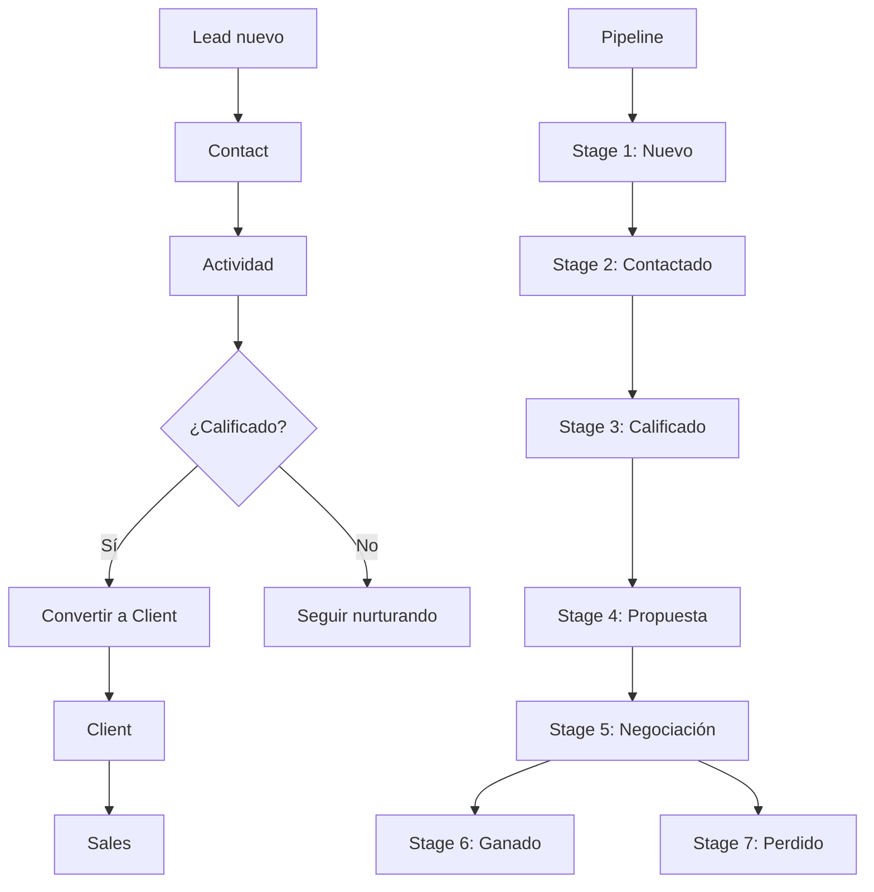
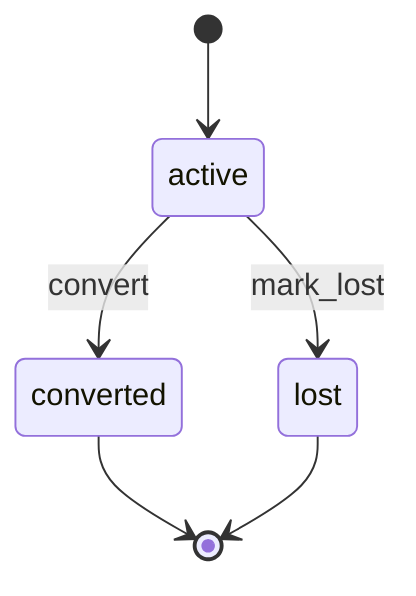

# 0009 — CRM (Customer Relationship Management)

---

## 1. Descripción y Alcance

Gestión completa de relaciones con clientes: Leads, Contacts, Companies, Pipeline, y Activities. Incluye flujo de conversión de lead a client.

### Entidades principales
- **Lead**: Prospecto potencial, en un stage del pipeline
- **Contact**: Persona física (puede ser lead o client)
- **Company**: Empresa/organización del contacto
- **Pipeline Stage**: Etapa del funnel de ventas
- **Lead Activity**: Interacción registrada (nota, llamada, email, reunión)

---

## 2. Diagrama de Flujo



---

## 3. Pantallas

### 3.1 Pipeline Board (Kanban)

**Qué ve el usuario**:
- Board con columnas por stage
- Cada card: nombre del lead, empresa, valor estimado, tiempo en stage
- Drag & drop para mover leads entre stages
- Filtros: por source, rango de fechas, valor estimado
- Búsqueda por nombre/empresa

**Wireframe**:
```
┌─────────────────────────────────────────────────────┐
│ Pipeline  [+ Nuevo Lead]  [Filtros]  [Búsqueda]     │
├─────────┬─────────┬─────────┬─────────┬────────────┤
│ Nuevo   │Contacta│Calific. │Propuesta│Negociación │
│         │do      │do       │         │            │
│ ┌─────┐ │ ┌─────┐ │ ┌─────┐ │         │ ┌─────┐    │
│ │Juan │ │ │María│ │ │Pedro│ │         │ │Ana  │    │
│ │$5M  │ │ │$3M  │ │ │$8M  │ │         │ │$12M │    │
│ └─────┘ │ └─────┘ │ └─────┘ │         │ └─────┘    │
│ ┌─────┐ │         │         │         │            │
│ │Carlos│ │         │         │         │            │
│ │$2M  │ │         │         │         │            │
│ └─────┘ │         │         │         │            │
├─────────┴─────────┴─────────┴─────────┴────────────┤
│ Total: 5 leads  │  Valor: $30M  │  Promedio: $6M   │
└─────────────────────────────────────────────────────┘
```

---

### 3.2 Lista de Leads

**Qué ve el usuario**:
- Tabla: Nombre, Email, Teléfono, Empresa, Stage, Fuente, Valor estimado, Última actividad, Creado
- Filtros: Stage, Fuente, Rango de fechas, Rango de valor
- Ordenamiento: Cualquier columna
- Paginación: Cursor-based
- Acciones: Ver, Editar, Mover a stage, Convertir, Eliminar

---

### 3.3 Crear/Edit Lead

**Qué ve el usuario**:
- Select: Contacto existente o crear nuevo
- Si crear nuevo:
  - Campo: Nombre completo
  - Campo: Email
  - Campo: Teléfono
  - Select: Company existente o crear nueva
- Select: Pipeline stage
- Select: Fuente (Web, Referido, Publicidad, Evento, Otro)
- Campo: Valor estimado
- Textarea: Notas
- Botón: "Guardar"

---

### 3.4 Detalle de Lead

**Qué ve el usuario**:
- Header: Nombre, badge de stage, valor estimado
- Info: Contacto, Company, Fuente, Creado por
- Timeline de actividades
- Botón: "Mover a stage"
- Botón: "Registrar actividad"
- Botón: "Convertir a client" (si está en stage calificado)

---

### 3.5 Actividades

**Qué ve el usuario**:
- Timeline vertical
- Cada actividad: tipo (nota/llamada/email/reunión), contenido, fecha, usuario
- Botón: "+ Nueva actividad"

**Formulario de actividad**:
- Select: Tipo (Nota, Llamada, Email, Reunión)
- Textarea: Contenido
- Date: Fecha de la actividad
- Botón: "Guardar"

---

### 3.6 Pipeline Stages (Configuración)

**Qué ve el usuario**:
- Lista de stages con posición y color
- Drag & drop para reordenar
- Botón: "+ Nuevo stage"
- Acciones: Editar, Eliminar (si no tiene leads activos)

---

## 4. Backend

### 4.1 Use Cases

#### CreateLeadUseCase
```typescript
class CreateLeadUseCase {
  async execute(dto: CreateLeadDto, userId: string): Promise<Lead> {
    // 1. Validar contacto
    let contact = await this.contactRepository.findById(dto.contactId);
    if (!contact) {
      contact = await this.contactRepository.create({
        organizationId: dto.organizationId,
        fullName: dto.fullName,
        email: dto.email,
        phone: dto.phone,
        type: 'lead'
      });
    }
    
    // 2. Asignar stage inicial
    const initialStage = await this.pipelineStageRepository.getFirst(dto.organizationId);
    
    // 3. Crear lead
    const lead = await this.leadRepository.create({
      organizationId: dto.organizationId,
      contactId: contact.id,
      pipelineStageId: initialStage.id,
      source: dto.source,
      estimatedValue: dto.estimatedValue,
      notes: dto.notes,
      createdBy: userId
    });
    
    // 4. Audit log
    await this.auditService.log({
      action: 'create',
      module: 'crm',
      entity: 'lead',
      entityId: lead.id,
      actorType: 'human',
      afterState: { contactId: contact.id, source: dto.source }
    });
    
    // 5. Event
    this.eventBus.emit('LeadCreated', {
      leadId: lead.id,
      contactId: contact.id,
      organizationId: dto.organizationId,
      source: dto.source
    });
    
    return lead;
  }
}
```

#### ConvertLeadUseCase
```typescript
class ConvertLeadUseCase {
  async execute(leadId: string, userId: string): Promise<Contact> {
    return this.prisma.$transaction(async (tx) => {
      // 1. Obtener lead
      const lead = await this.leadRepository.findById(leadId);
      if (!lead) throw new ResourceNotFoundException('Lead');
      
      // 2. Validar que no esté ya convertido (RN-CRM-01)
      if (lead.status === 'converted') {
        throw new LeadAlreadyConvertedException();
      }
      
      // 3. Actualizar contact type a 'client'
      const contact = await this.contactRepository.update(lead.contactId, {
        type: 'client'
      });
      
      // 4. Actualizar lead status
      await this.leadRepository.update(leadId, {
        status: 'converted',
        convertedAt: new Date()
      });
      
      // 5. Audit log
      await this.auditService.log({
        action: 'update',
        module: 'crm',
        entity: 'lead',
        entityId: leadId,
        actorType: 'human',
        beforeState: { status: 'active' },
        afterState: { status: 'converted' }
      });
      
      // 6. Event
      this.eventBus.emit('LeadConverted', {
        leadId: lead.id,
        contactId: lead.contactId,
        organizationId: lead.organizationId
      });
      
      return contact;
    });
  }
}
```

### 4.2 State Machine del Lead



---

## 5. Frontend

### 5.1 Components
- `PipelineBoard` - Kanban board con drag & drop
- `LeadCard` - Card individual en el pipeline
- `LeadList` - Tabla de leads
- `LeadForm` - Formulario crear/editar
- `LeadDetail` - Detalle del lead
- `ContactList` - Lista de contacts
- `ContactDetail` - Detalle del contacto
- `CompanyList` - Lista de empresas
- `ActivityTimeline` - Timeline de actividades
- `ActivityForm` - Formulario de actividad
- `PipelineConfig` - Configuración de stages

### 5.2 Hooks
```typescript
useLeads()              // GET /api/v1/leads
useCreateLead()         // POST /api/v1/leads
useUpdateLead()         // PATCH /api/v1/leads/:id
useDeleteLead()         // DELETE /api/v1/leads/:id
useConvertLead()        // POST /api/v1/leads/:id/convert
useMoveLeadStage()      // PATCH /api/v1/leads/:id/stage
useContacts()           // GET /api/v1/contacts
useCompanies()          // GET /api/v1/companies
useLeadActivities()     // GET /api/v1/leads/:id/activities
useCreateActivity()     // POST /api/v1/leads/:id/activities
usePipelineStages()     // GET /api/v1/pipeline-stages
useCreatePipelineStage() // POST /api/v1/pipeline-stages
useReorderPipeline()    // PATCH /api/v1/pipeline-stages/reorder
```

---

## 6. API REST

```http
POST   /api/v1/leads                    # Create lead
GET    /api/v1/leads                    # List leads (filterable)
GET    /api/v1/leads/:id                # Get lead detail
PATCH  /api/v1/leads/:id                # Update lead
DELETE /api/v1/leads/:id                # Delete lead
POST   /api/v1/leads/:id/convert        # Convert lead to client
PATCH  /api/v1/leads/:id/stage          # Move lead to stage

POST   /api/v1/contacts                 # Create contact
GET    /api/v1/contacts                 # List contacts
GET    /api/v1/contacts/:id             # Get contact
PATCH  /api/v1/contacts/:id             # Update contact
DELETE /api/v1/contacts/:id             # Delete contact (soft)

POST   /api/v1/companies                # Create company
GET    /api/v1/companies                # List companies
GET    /api/v1/companies/:id            # Get company
PATCH  /api/v1/companies/:id            # Update company

POST   /api/v1/leads/:id/activities     # Create activity
GET    /api/v1/leads/:id/activities     # List activities

POST   /api/v1/pipeline-stages          # Create stage
GET    /api/v1/pipeline-stages          # List stages
PATCH  /api/v1/pipeline-stages/reorder  # Reorder stages
DELETE /api/v1/pipeline-stages/:id      # Delete stage
```

---

## 7. Base de Datos

(Ver `0004-database-design.md` sección CRM)

```sql
CREATE TABLE companies (
  id UUID PRIMARY KEY DEFAULT gen_random_uuid(),
  organization_id UUID NOT NULL REFERENCES organizations(id),
  name VARCHAR(255) NOT NULL,
  tax_id VARCHAR(50),
  industry VARCHAR(100),
  website VARCHAR(255),
  phone VARCHAR(20),
  email VARCHAR(255),
  address JSONB,
  notes TEXT,
  created_by UUID REFERENCES users(id),
  created_at TIMESTAMPTZ DEFAULT NOW(),
  updated_at TIMESTAMPTZ DEFAULT NOW(),
  deleted_at TIMESTAMPTZ
);

CREATE TABLE contacts (
  id UUID PRIMARY KEY DEFAULT gen_random_uuid(),
  organization_id UUID NOT NULL REFERENCES organizations(id),
  company_id UUID REFERENCES companies(id),
  full_name VARCHAR(255) NOT NULL,
  email VARCHAR(255),
  phone VARCHAR(20),
  type VARCHAR(20) NOT NULL, -- 'lead' | 'client'
  position VARCHAR(100),
  notes TEXT,
  created_by UUID REFERENCES users(id),
  created_at TIMESTAMPTZ DEFAULT NOW(),
  updated_at TIMESTAMPTZ DEFAULT NOW(),
  deleted_at TIMESTAMPTZ
);

CREATE TABLE pipeline_stages (
  id UUID PRIMARY KEY DEFAULT gen_random_uuid(),
  organization_id UUID NOT NULL REFERENCES organizations(id),
  name VARCHAR(100) NOT NULL,
  position INTEGER NOT NULL,
  color VARCHAR(7), -- hex color
  created_at TIMESTAMPTZ DEFAULT NOW(),
  UNIQUE(organization_id, position)
);

CREATE TABLE leads (
  id UUID PRIMARY KEY DEFAULT gen_random_uuid(),
  organization_id UUID NOT NULL REFERENCES organizations(id),
  contact_id UUID NOT NULL REFERENCES contacts(id),
  pipeline_stage_id UUID NOT NULL REFERENCES pipeline_stages(id),
  status VARCHAR(20) DEFAULT 'active',
  source VARCHAR(50),
  estimated_value BIGINT, -- cents
  converted_at TIMESTAMPTZ,
  lost_reason TEXT,
  created_by UUID REFERENCES users(id),
  created_at TIMESTAMPTZ DEFAULT NOW(),
  updated_at TIMESTAMPTZ DEFAULT NOW()
);

CREATE TABLE lead_activities (
  id UUID PRIMARY KEY DEFAULT gen_random_uuid(),
  lead_id UUID NOT NULL REFERENCES leads(id) ON DELETE CASCADE,
  type VARCHAR(20) NOT NULL, -- 'note' | 'call' | 'email' | 'meeting'
  content TEXT NOT NULL,
  occurred_at TIMESTAMPTZ NOT NULL,
  created_by UUID REFERENCES users(id),
  created_at TIMESTAMPTZ DEFAULT NOW()
);
```

---

## 8. Eventos

```
LeadCreated { leadId, contactId, organizationId, source }
LeadConverted { leadId, contactId, organizationId }
LeadMovedStage { leadId, fromStageId, toStageId }
LeadLost { leadId, reason }
ContactCreated { contactId, organizationId }
ContactTypeChanged { contactId, fromType, toType }
CompanyCreated { companyId, organizationId }
ActivityCreated { activityId, leadId, type }
```

---

## 9. Permisos

| Recurso | Acciones |
|---------|----------|
| `crm.lead` | create, read, update, delete |
| `crm.contact` | create, read, update, delete |
| `crm.pipeline` | create, read, update, delete |

---

## 10. Validaciones

### Lead
- `contactId` o (`fullName` + `email`): uno de los dos requerido
- `pipelineStageId`: debe existir en la organización
- `source`: enum válido
- `estimatedValue`: opcional, entero positivo (cents)

### Contact
- `fullName`: obligatorio, 1-255 chars
- `email`: opcional, formato email
- `phone`: opcional, formato teléfono
- `type`: 'lead' | 'client'

### Pipeline Stage
- `name`: obligatorio, 1-100 chars
- `position`: entero positivo, único por organización

---

## 11. Nova Tools

| Tool | Descripción | Risk Flag | Permiso |
|------|-------------|-----------|---------|
| `create_client` | Crear cliente desde Nova | normal | `crm.contact.create` |
| `find_customer` | Buscar cliente/lead | - | `crm.contact.read` |
| `move_lead_stage` | Mover lead a stage | normal | `crm.lead.update` |

---

## 12. Notificaciones

```
LeadCreated → in-app al equipo de ventas
LeadConverted → in-app al vendedor asignado
```

---

## 13. Auditoría

Todas las operaciones CRUD en leads, contacts, companies se auditan.

---

## 14. Criterios de Aceptación

### US-CRM-01: Crear lead
```
Given un usuario con permiso crm.lead.create
When crea un lead con datos válidos
Then se crea el lead en el stage "Nuevo"
And se crea o vincula el contacto
And se registra en auditoría
```

### US-CRM-02: Convertir lead
```
Given un lead en stage "Calificado"
When el usuario hace click en "Convertir a client"
Then el contact.type cambia a 'client'
And el lead.status cambia a 'converted'
And se preserva el historial de actividades
```

### US-CRM-03: Doble conversión
```
Given un lead ya convertido
When intenta convertirlo nuevamente
Then recibe error LEAD_ALREADY_CONVERTED
```

### US-CRM-04: Eliminar contacto con transacciones
```
Given un contacto que tiene facturas asociadas
When intenta eliminarlo
Then recibe error CONTACT_HAS_TRANSACTIONS
And solo puede archivar, no eliminar
```

---

## 15. Dependencias

| Módulo | Relación |
|--------|----------|
| Core (006) | Organizations, branches, users |
| Sales (010) | Conversión lead → client → quotation |
| Nova (008) | Tools de CRM |
| Dashboard (007) | KPIs de clientes |

---

## 16. Checklist

- [ ] PipelineBoard con drag & drop
- [ ] LeadCard component
- [ ] LeadList con filtros
- [ ] LeadForm con validación
- [ ] LeadDetail con timeline
- [ ] ContactList y ContactDetail
- [ ] CompanyList y CompanyDetail
- [ ] ActivityTimeline
- [ ] ActivityForm
- [ ] PipelineConfig
- [ ] CreateLeadUseCase
- [ ] ConvertLeadUseCase
- [ ] MoveLeadStageUseCase
- [ ] CRUD Use Cases completos
- [ ] Event publishing
- [ ] Audit logging
- [ ] Permission guards
- [ ] Nova tools
- [ ] Responsive mobile
