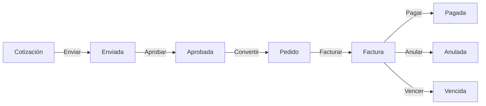
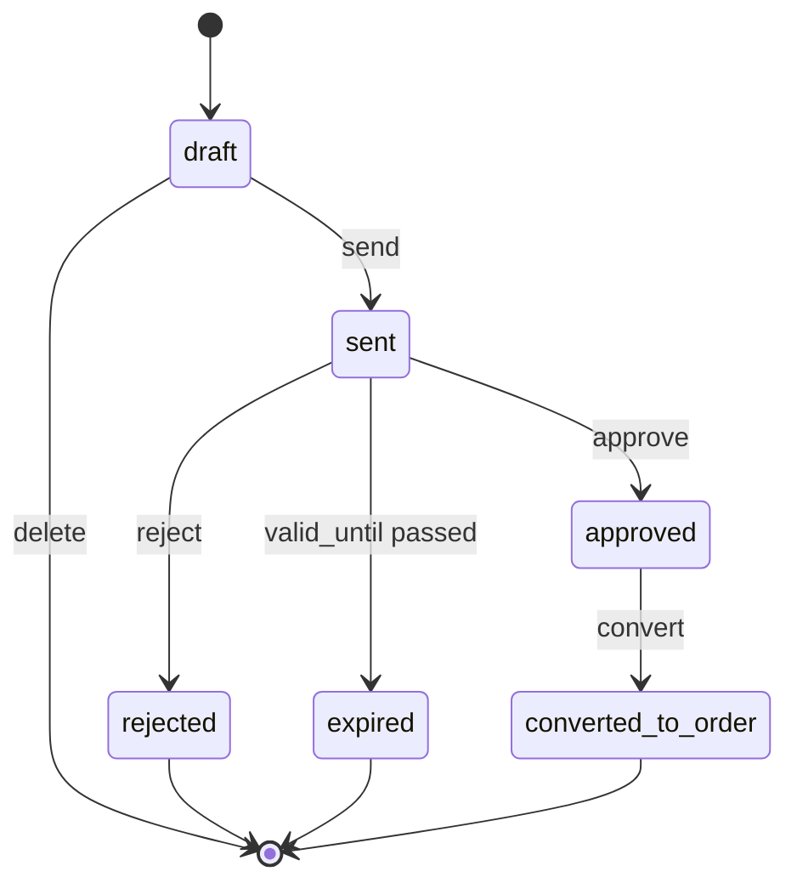
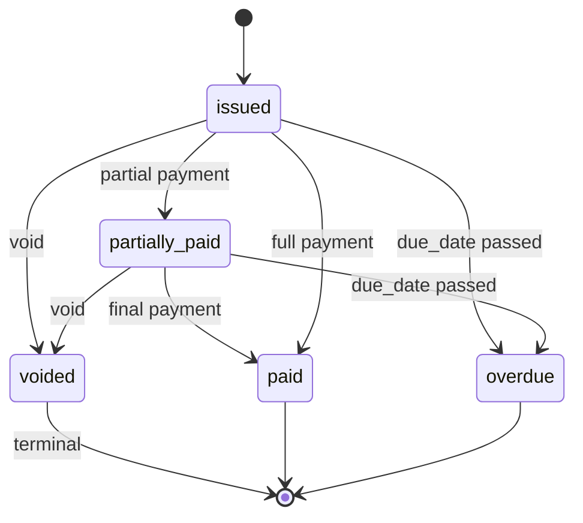
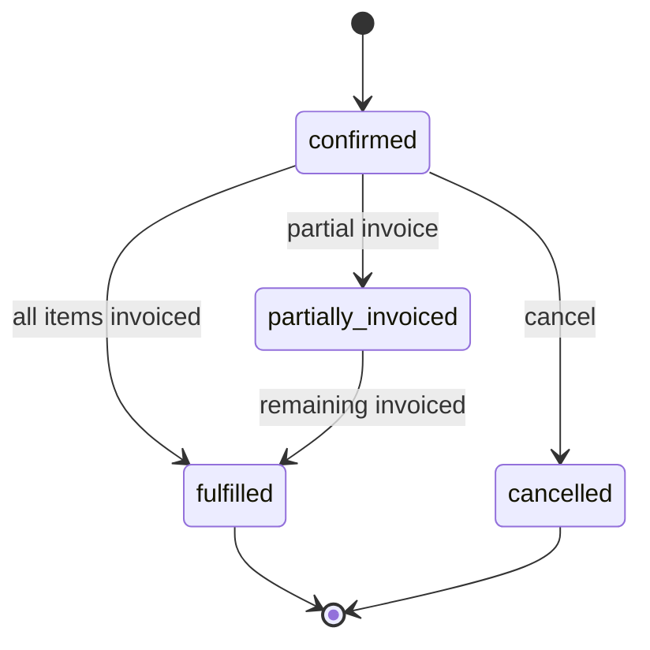

# 0010 — Sales (Ventas)

---

## 1. Descripción y Alcance

Módulo de ventas completo: Cotizaciones, Pedidos, Facturas, Pagos, y Productos. Incluye state machines completas, cálculo de impuestos, numeración secuencial de facturas, y pagos parciales.

---

## 2. Diagrama de Flujo Principal



---

## 3. State Machines

### Quotation


### Invoice


### Order


---

## 4. Pantallas

### 4.1 Lista de Cotizaciones

**Tabla**: ID, Cliente, Fecha, Válido hasta, Total, Estado, Acciones
**Filtros**: Estado, Cliente, Rango de fechas
**Acciones**: Ver, Editar, Enviar, Convertir, Eliminar

### 4.2 Crear Cotización

**Formulario**:
- Select: Cliente (existente o crear nuevo)
- Tabla de items:
  - Select: Producto
  - Cantidad (min: 1)
  - Precio unitario (auto-del producto, editable)
  - Subtotal (calculado)
- Botón: "+ Agregar item"
- Campo: Fecha de validez
- Textarea: Notas
- Resumen: Subtotal, Impuesto (19% default), Total
- Botón: "Guardar borrador"

### 4.3 Detalle de Cotización

**Header**: ID, badge de estado, acciones contextuales
**Info**: Cliente, Fechas, Notas
**Tabla**: Items con cantidades, precios, subtotales
**Resumen**: Subtotal, Impuesto, Total
**Timeline**: Historial de cambios

### 4.4 Lista de Facturas

**Tabla**: Número, Cliente, Fecha emisión, Vencimiento, Total, Pagado, Balance, Estado
**Filtros**: Estado, Cliente, Rango de fechas

### 4.5 Detalle de Factura

**Header**: Número de factura, badge de estado, acciones
**Info**: Cliente, Fechas,蒙太奇
**Tabla**: Items
**Resumen**: Subtotal, Impuesto, Total, Pagado, Balance
**Pagos**: Lista de pagos registrados
**Timeline**: Historial

### 4.6 Registrar Pago

**Formulario**:
- Campo: Monto (no puede exceder balance)
- Select: Método (Efectivo, Tarjeta, Transferencia, Otro)
- Date: Fecha de pago
- Campo: Referencia
- Botón: "Registrar pago"

---

## 5. Backend

### 5.1 Use Cases

#### CreateQuotationUseCase
```typescript
class CreateQuotationUseCase {
  async execute(dto: CreateQuotationDto, userId: string): Promise<Quotation> {
    // 1. Validar cliente
    // 2. Validar items (productos existen, cantidades > 0)
    // 3. Calcular subtotales, impuestos, total
    // 4. Crear quotation con status 'draft'
    // 5. Audit log + Event
    return quotation;
  }
}
```

#### ConvertQuotationToOrderUseCase
```typescript
class ConvertQuotationToOrderUseCase {
  async execute(quotationId: string, userId: string): Promise<Order> {
    // 1. Validar status = 'approved'
    // 2. Validar que no esté expirada (RN-SALES-03)
    // 3. Crear order con mismos items
    // 4. Actualizar quotation.status = 'converted_to_order'
    // 5. Audit log + Event
    return order;
  }
}
```

#### CreateInvoiceFromOrderUseCase
```typescript
class CreateInvoiceFromOrderUseCase {
  async execute(dto: CreateInvoiceDto, userId: string): Promise<Invoice> {
    // 1. Validar order status = 'confirmed'
    // 2. Validar que no esté totalmente facturada (RN-SALES-04)
    // 3. Generar número de factura secuencial (RN-GLOBAL-09)
    // 4. Calcular monto (total o parcial)
    // 5. Crear invoice
    // 6. Actualizar order status
    // 7. Audit log + Event
    return invoice;
  }
}
```

#### RegisterPaymentUseCase
```typescript
class RegisterPaymentUseCase {
  async execute(dto: RegisterPaymentDto, userId: string): Promise<Payment> {
    // 1. Validar invoice status = 'issued' o 'partially_paid'
    // 2. Validar que pago no exceda balance (RN-SALES-05)
    // 3. Crear payment
    // 4. Actualizar invoice.paid_amount
    // 5. Si paid_amount >= total → status = 'paid'
    // 6. Audit log + Event
    return payment;
  }
}
```

#### VoidInvoiceUseCase
```typescript
class VoidInvoiceUseCase {
  async execute(invoiceId: string, reason: string, userId: string): Promise<void> {
    // 1. Validar que NO esté 'voided' (RN-SALES-01)
    // 2. Validar que NO esté 'paid' (requiere nota crédito)
    // 3. Actualizar status = 'voided'
    // 4. Audit log + Event
  }
}
```

### 5.2 Invoice Number Generation

```typescript
class InvoiceNumberGenerator {
  async generate(organizationId: string): Promise<string> {
    // 1. Obtener secuencia de la organización
    const sequence = await this.sequenceRepository.findByOrg(organizationId);
    
    // 2. Incrementar número
    const newNumber = sequence.currentNumber + 1;
    
    // 3. Actualizar secuencia
    await this.sequenceRepository.update(sequence.id, {
      currentNumber: newNumber
    });
    
    // 4. Formatear: PREFIX-YEAR-SEQUENTIAL (ej: FAC-2026-00001)
    const year = new Date().getFullYear();
    const paddedNumber = String(newNumber).padStart(sequence.length, '0');
    return `${sequence.prefix}-${year}-${paddedNumber}`;
  }
}
```

---

## 6. API REST

```http
POST   /api/v1/quotations                    # Create quotation
GET    /api/v1/quotations                    # List quotations
GET    /api/v1/quotations/:id                # Get quotation
PATCH  /api/v1/quotations/:id                # Update quotation
DELETE /api/v1/quotations/:id                # Delete quotation (draft only)
POST   /api/v1/quotations/:id/send           # Send quotation
POST   /api/v1/quotations/:id/approve        # Approve quotation
POST   /api/v1/quotations/:id/convert-to-order  # Convert to order

POST   /api/v1/orders                        # Create order
GET    /api/v1/orders                        # List orders
GET    /api/v1/orders/:id                    # Get order
PATCH  /api/v1/orders/:id                    # Update order
POST   /api/v1/orders/:id/cancel             # Cancel order
POST   /api/v1/orders/:id/invoices           # Generate invoice

POST   /api/v1/invoices                      # Create invoice
GET    /api/v1/invoices                      # List invoices
GET    /api/v1/invoices/:id                  # Get invoice
POST   /api/v1/invoices/:id/payments         # Register payment
POST   /api/v1/invoices/:id/void             # Void invoice

GET    /api/v1/products                      # List products
POST   /api/v1/products                      # Create product
GET    /api/v1/products/:id                  # Get product
PATCH  /api/v1/products/:id                  # Update product
```

---

## 7. Base de Datos

```sql
CREATE TABLE quotations (
  id UUID PRIMARY KEY DEFAULT gen_random_uuid(),
  organization_id UUID NOT NULL REFERENCES organizations(id),
  branch_id UUID REFERENCES branches(id),
  client_id UUID NOT NULL REFERENCES contacts(id),
  status VARCHAR(30) DEFAULT 'draft',
  total_amount BIGINT NOT NULL, -- cents
  tax_rate DECIMAL(5,2) DEFAULT 19.00,
  currency_code CHAR(3) DEFAULT 'COP',
  valid_until DATE NOT NULL,
  notes TEXT,
  sent_at TIMESTAMPTZ,
  approved_at TIMESTAMPTZ,
  converted_at TIMESTAMPTZ,
  created_by UUID REFERENCES users(id),
  created_at TIMESTAMPTZ DEFAULT NOW(),
  updated_at TIMESTAMPTZ DEFAULT NOW(),
  deleted_at TIMESTAMPTZ
);

CREATE TABLE quotation_items (
  id UUID PRIMARY KEY DEFAULT gen_random_uuid(),
  quotation_id UUID NOT NULL REFERENCES quotations(id) ON DELETE CASCADE,
  product_id UUID NOT NULL REFERENCES products(id),
  quantity INTEGER NOT NULL,
  unit_price BIGINT NOT NULL, -- cents
  subtotal BIGINT NOT NULL, -- cents
  created_at TIMESTAMPTZ DEFAULT NOW()
);

CREATE TABLE orders (
  id UUID PRIMARY KEY DEFAULT gen_random_uuid(),
  organization_id UUID NOT NULL REFERENCES organizations(id),
  branch_id UUID REFERENCES branches(id),
  quotation_id UUID REFERENCES quotations(id),
  client_id UUID NOT NULL REFERENCES contacts(id),
  status VARCHAR(30) DEFAULT 'confirmed',
  total_amount BIGINT NOT NULL,
  currency_code CHAR(3) DEFAULT 'COP',
  created_by UUID REFERENCES users(id),
  created_at TIMESTAMPTZ DEFAULT NOW(),
  updated_at TIMESTAMPTZ DEFAULT NOW()
);

CREATE TABLE order_items (
  id UUID PRIMARY KEY DEFAULT gen_random_uuid(),
  order_id UUID NOT NULL REFERENCES orders(id) ON DELETE CASCADE,
  product_id UUID NOT NULL REFERENCES products(id),
  quantity INTEGER NOT NULL,
  unit_price BIGINT NOT NULL,
  subtotal BIGINT NOT NULL,
  created_at TIMESTAMPTZ DEFAULT NOW()
);

CREATE TABLE invoices (
  id UUID PRIMARY KEY DEFAULT gen_random_uuid(),
  organization_id UUID NOT NULL REFERENCES organizations(id),
  branch_id UUID REFERENCES branches(id),
  order_id UUID REFERENCES orders(id),
  client_id UUID NOT NULL REFERENCES contacts(id),
  invoice_number VARCHAR(50) NOT NULL,
  status VARCHAR(30) DEFAULT 'issued',
  total_amount BIGINT NOT NULL,
  paid_amount BIGINT DEFAULT 0,
  tax_rate DECIMAL(5,2) DEFAULT 19.00,
  currency_code CHAR(3) DEFAULT 'COP',
  due_date DATE NOT NULL,
  issued_at TIMESTAMPTZ DEFAULT NOW(),
  paid_at TIMESTAMPTZ,
  voided_at TIMESTAMPTZ,
  void_reason TEXT,
  created_by UUID REFERENCES users(id),
  created_at TIMESTAMPTZ DEFAULT NOW(),
  updated_at TIMESTAMPTZ DEFAULT NOW(),
  deleted_at TIMESTAMPTZ, -- always NULL for fiscal traceability
  UNIQUE(organization_id, invoice_number)
);

CREATE TABLE invoice_items (
  id UUID PRIMARY KEY DEFAULT gen_random_uuid(),
  invoice_id UUID NOT NULL REFERENCES invoices(id) ON DELETE CASCADE,
  product_id UUID NOT NULL REFERENCES products(id),
  quantity INTEGER NOT NULL,
  unit_price BIGINT NOT NULL,
  subtotal BIGINT NOT NULL,
  created_at TIMESTAMPTZ DEFAULT NOW()
);

CREATE TABLE payments (
  id UUID PRIMARY KEY DEFAULT gen_random_uuid(),
  organization_id UUID NOT NULL REFERENCES organizations(id),
  invoice_id UUID NOT NULL REFERENCES invoices(id),
  amount BIGINT NOT NULL, -- cents
  method VARCHAR(30) NOT NULL, -- 'cash' | 'card' | 'transfer' | 'other'
  reference TEXT,
  paid_at TIMESTAMPTZ NOT NULL,
  created_by UUID REFERENCES users(id),
  created_at TIMESTAMPTZ DEFAULT NOW()
);

CREATE TABLE products (
  id UUID PRIMARY KEY DEFAULT gen_random_uuid(),
  organization_id UUID NOT NULL REFERENCES organizations(id),
  sku VARCHAR(100) NOT NULL,
  name VARCHAR(255) NOT NULL,
  description TEXT,
  unit_price BIGINT NOT NULL, -- cents
  currency_code CHAR(3) DEFAULT 'COP',
  category_id UUID,
  has_batches BOOLEAN DEFAULT false,
  allow_negative_stock BOOLEAN DEFAULT false,
  is_active BOOLEAN DEFAULT true,
  created_by UUID REFERENCES users(id),
  created_at TIMESTAMPTZ DEFAULT NOW(),
  updated_at TIMESTAMPTZ DEFAULT NOW(),
  deleted_at TIMESTAMPTZ,
  UNIQUE(organization_id, sku)
);

CREATE TABLE invoice_number_sequences (
  id UUID PRIMARY KEY DEFAULT gen_random_uuid(),
  organization_id UUID NOT NULL REFERENCES organizations(id),
  prefix VARCHAR(10) DEFAULT 'FAC',
  length INTEGER DEFAULT 5,
  current_number INTEGER DEFAULT 0,
  reset_annually BOOLEAN DEFAULT true,
  created_at TIMESTAMPTZ DEFAULT NOW(),
  UNIQUE(organization_id, prefix)
);
```

---

## 8. Eventos

```
QuotationCreated { quotationId, clientId, totalAmount, organizationId }
QuotationSent { quotationId, clientId, sentAt }
QuotationApproved { quotationId, approvedAt }
QuotationRejected { quotationId, reason }
QuotationConvertedToOrder { quotationId, orderId, totalAmount }
OrderCreated { orderId, clientId, quotationId, totalAmount }
OrderCancelled { orderId, reason }
InvoiceIssued { invoiceId, invoiceNumber, orderId, clientId, totalAmount, dueDate }
InvoicePaid { invoiceId, invoiceNumber, totalAmount, paidAt }
InvoicePartiallyPaid { invoiceId, paidAmount, remainingBalance }
InvoiceVoided { invoiceId, invoiceNumber, reason, voidedBy }
PaymentRegistered { paymentId, invoiceId, amount, method }
ProductCreated { productId, sku, name, unitPrice }
ProductUpdated { productId, changes }
```

---

## 9. Permisos

| Recurso | Acciones |
|---------|----------|
| `sales.quotation` | create, read, update, delete, send, approve |
| `sales.order` | create, read, update, cancel |
| `sales.invoice` | create, read, void, export (NO delete) |
| `sales.payment` | create, read |
| `sales.product` | create, read, update, delete |

---

## 10. Validaciones

### Quotation
- `clientId`: obligatorio, debe existir
- `items`: array, mínimo 1 item
- `items[].productId`: obligatorio, debe existir
- `items[].quantity`: entero, mínimo 1
- `items[].unitPrice`: entero positivo (cents)
- `validUntil`: fecha futura

### Invoice
- `orderId`: debe existir, status 'confirmed'
- Monto no puede exceder balance del order (RN-SALES-04)

### Payment
- `invoiceId`: debe existir, status 'issued' o 'partially_paid'
- `amount`: entero positivo, no puede exceder balance (RN-SALES-05)
- `method`: enum válido

---

## 11. Nova Tools

| Tool | Descripción | Risk Flag | Permiso |
|------|-------------|-----------|---------|
| `create_invoice` | Crear factura desde pedido | normal | `sales.invoice.create` |
| `register_payment` | Registrar pago | normal | `sales.payment.create` |
| `void_invoice` | Anular factura | destructive | `sales.invoice.void` |
| `get_sales_summary` | Resumen de ventas | - | `analytics.dashboard.read` |

---

## 12. Notificaciones

```
InvoiceIssued → in-app al responsable de la venta
InvoiceOverdue → in-app + email (alta prioridad)
PaymentReceived → in-app al responsable
QuotationSent → in-app al contacto (si email disponible)
```

---

## 13. Auditoría

Todas las operaciones en quotations, orders, invoices, payments se auditan.

---

## 14. Criterios de Aceptación

### US-SALES-01: Crear cotización
```
Given un vendedor con permiso sales.quotation.create
When crea una cotización con items válidos
Then se crea con status 'draft'
And se calculan subtotales e impuestos
```

### US-SALES-02: Convertir cotización a pedido
```
Given una cotización en status 'approved'
When el usuario hace click en "Convertir a pedido"
Then se crea un order con los mismos items
And la cotización cambia a 'converted_to_order'
```

### US-SALES-03: Cotización expirada
```
Given una cotización con valid_until en el pasado
When intenta convertir a pedido
Then recibe error QUOTATION_EXPIRED
And se sugiere renovar la cotización
```

### US-SALES-04: Generar factura desde pedido
```
Given un pedido en status 'confirmed'
When genera una factura por el monto total
Then se crea la factura con número secuencial
And el pedido cambia a 'fulfilled' si está totalmente facturado
```

### US-SALES-05: Pago excede balance
```
Given una factura con balance de $40,000
When intenta registrar un pago de $50,000
Then recibe error PAYMENT_EXCEEDS_BALANCE
```

### US-SALES-06: Anular factura
```
Given una factura en status 'issued'
When la anula con razón
Then cambia a status 'voided'
And es terminal (no puede cambiar a otro estado)
```

---

## 15. Dependencias

| Módulo | Relación |
|--------|----------|
| CRM (009) | Datos de cliente |
| Inventory (011) | Datos de producto, stock |
| Notifications (012) | Emails de facturas |
| Finance (017) | Cash flow |
| Nova (008) | Tools de ventas |

---

## 16. Checklist

- [ ] Quotation CRUD completo
- [ ] Order CRUD
- [ ] Invoice CRUD con numeración secuencial
- [ ] Payment CRUD
- [ ] Product CRUD
- [ ] State machines (quotation, invoice, order)
- [ ] Tax calculation
- [ ] Invoice number generation
- [ ] Partial payments
- [ ] Void invoice flow
- [ ] Event publishing
- [ ] Audit logging
- [ ] Permission guards
- [ ] Nova tools
- [ ] Responsive mobile
