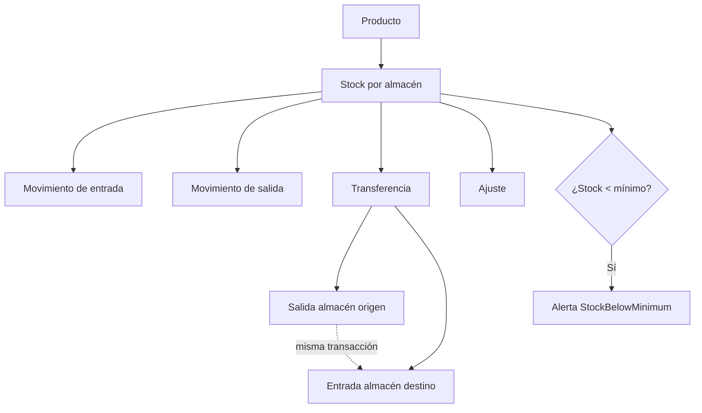

# 0011 — Inventory (Inventario)

---

## 1. Descripción y Alcance

Gestión completa de inventario: Products, Categories, Warehouses, Stock Levels, Stock Movements, Stock Transfers (atómicas), y Product Batches.

---

## 2. Diagrama de Flujo



---

## 3. Pantallas

### 3.1 Lista de Productos

**Tabla**: SKU, Nombre, Categoría, Precio, Stock total, Estado, Acciones
**Filtros**: Categoría, Estado (activo/inactivo), Con stock bajo
**Acciones**: Ver, Editar, Desactivar

### 3.2 Crear Producto

**Formulario**:
- Campo: SKU (único por organización)
- Campo: Nombre
- Textarea: Descripción
- Select: Categoría
- Campo: Precio unitario
- Select: Moneda
- Toggle: Requiere lotes (hasBatches)
- Toggle: Permitir stock negativo
- Botón: "Crear producto"

### 3.3 Detalle de Producto

**Header**: SKU, Nombre, badge de estado
**Info**: Precio, Categoría, Configuración
**Stock por almacén**:
| Almacén | Stock | Mínimo | Estado |
|---------|-------|--------|--------|
| Principal | 150 | 20 | ✅ OK |
| Sucursal Norte | 8 | 15 | ⚠️ Bajo |

**Movimientos recientes**: Timeline de movimientos
**Lotes** (si aplica): Lista de lotes con vencimiento

### 3.4 Almacenes

**Tabla**: Nombre, Dirección, Sucursal, Stock items, Estado
**Crear**: Nombre, Sucursal, Dirección

### 3.5 Registrar Movimiento

**Formulario**:
- Select: Producto
- Select: Almacén
- Select: Tipo (Entrada, Salida, Ajuste)
- Campo: Cantidad
- Campo: Costo unitario (para entradas)
- Textarea: Razón
- Botón: "Registrar"

### 3.6 Transferir Stock

**Formulario**:
- Select: Producto
- Select: Almacén origen
- Select: Almacén destino
- Campo: Cantidad
- Textarea: Razón
- Botón: "Transferir"

**Validación en tiempo real**: Stock disponible en origen

---

## 4. Backend

### 4.1 Use Cases

#### CreateProductUseCase
```typescript
class CreateProductUseCase {
  async execute(dto: CreateProductDto, userId: string): Promise<Product> {
    // 1. Validar SKU único por organización (RN-INV-05)
    const existing = await this.productRepository.findBySku(
      dto.organizationId, dto.sku
    );
    if (existing) throw new DuplicateSkuException();
    
    // 2. Crear producto
    const product = await this.productRepository.create({
      ...dto,
      createdBy: userId
    });
    
    // 3. Audit log + Event
    return product;
  }
}
```

#### RegisterStockMovementUseCase
```typescript
class RegisterStockMovementUseCase {
  async execute(dto: CreateStockMovementDto, userId: string): Promise<StockMovement> {
    return this.prisma.$transaction(async (tx) => {
      // 1. Validar producto y almacén
      // 2. Para salidas: validar stock suficiente (RN-INV-02)
      if (dto.type === 'out' || dto.type === 'transfer') {
        const stock = await this.stockLevelRepository.get(
          dto.organizationId, dto.productId, dto.warehouseId
        );
        if (stock.quantity < dto.quantity && !dto.allowNegativeStock) {
          throw new InsufficientStockException();
        }
      }
      
      // 3. Crear movimiento
      const movement = await this.stockMovementRepository.create(tx, {
        ...dto,
        createdBy: userId
      });
      
      // 4. Actualizar stock_level
      await this.stockLevelRepository.update(tx, {
        organizationId: dto.organizationId,
        productId: dto.productId,
        warehouseId: dto.warehouseId,
        quantityChange: dto.type === 'in' ? dto.quantity : -dto.quantity
      });
      
      // 5. Verificar stock mínimo
      const newStock = await this.stockLevelRepository.get(
        dto.organizationId, dto.productId, dto.warehouseId
      );
      if (newStock.quantity < newStock.minimumQuantity) {
        this.eventBus.emit('StockBelowMinimum', {
          productId: dto.productId,
          warehouseId: dto.warehouseId,
          currentStock: newStock.quantity,
          minimumQuantity: newStock.minimumQuantity,
          organizationId: dto.organizationId
        });
      }
      
      // 6. Audit log + Event
      return movement;
    });
  }
}
```

#### TransferStockUseCase
```typescript
class TransferStockUseCase {
  async execute(dto: TransferStockDto, userId: string): Promise<StockTransfer> {
    return this.prisma.$transaction(async (tx) => {
      // 1. Validar stock suficiente en origen (RN-INV-02)
      const stockOrigin = await this.stockLevelRepository.get(
        dto.organizationId, dto.productId, dto.fromWarehouseId
      );
      if (stockOrigin.quantity < dto.quantity) {
        throw new InsufficientStockException();
      }
      
      // 2. Crear transfer_id
      const transferId = generateUUID();
      
      // 3. Crear movimiento de SALIDA
      const outMovement = await this.stockMovementRepository.create(tx, {
        organizationId: dto.organizationId,
        productId: dto.productId,
        warehouseId: dto.fromWarehouseId,
        type: 'transfer',
        quantity: -dto.quantity,
        transferId,
        reason: dto.reason,
        createdBy: userId
      });
      
      // 4. Crear movimiento de ENTRADA
      const inMovement = await this.stockMovementRepository.create(tx, {
        organizationId: dto.organizationId,
        productId: dto.productId,
        warehouseId: dto.toWarehouseId,
        type: 'transfer',
        quantity: dto.quantity,
        transferId,
        reason: dto.reason,
        createdBy: userId
      });
      
      // 5. Actualizar stock en ambos almacenes
      await this.stockLevelRepository.update(tx, {
        organizationId: dto.organizationId,
        productId: dto.productId,
        warehouseId: dto.fromWarehouseId,
        quantityChange: -dto.quantity
      });
      
      await this.stockLevelRepository.update(tx, {
        organizationId: dto.organizationId,
        productId: dto.productId,
        warehouseId: dto.toWarehouseId,
        quantityChange: dto.quantity
      });
      
      // 6. Verificar stock mínimo en origen
      // 7. Audit log + Event
      return { transferId, movements: [outMovement, inMovement] };
    });
  }
}
```

---

## 5. Frontend

### 5.1 Components
- `ProductList` - Tabla de productos
- `ProductForm` - Formulario crear/editar
- `ProductDetail` - Detalle con stock
- `StockByWarehouse` - Tabla de stock por almacén
- `StockMovementForm` - Formulario de movimiento
- `StockTransferForm` - Formulario de transferencia
- `WarehouseList` - Lista de almacenes
- `WarehouseForm` - Formulario de almacén
- `BatchList` - Lista de lotes
- `LowStockAlert` - Alerta de stock bajo

### 5.2 Hooks
```typescript
useProducts()              // GET /api/v1/products
useCreateProduct()         // POST /api/v1/products
useUpdateProduct()         // PATCH /api/v1/products/:id
useDeleteProduct()         // DELETE /api/v1/products/:id
useStockByWarehouse()      // GET /api/v1/products/:id/stock
useStockMovements()        // GET /api/v1/stock-movements
useRegisterMovement()      // POST /api/v1/stock-movements
useTransferStock()         // POST /api/v1/stock-transfers
useWarehouses()            // GET /api/v1/warehouses
useCreateWarehouse()       // POST /api/v1/warehouses
useBatches()               // GET /api/v1/products/:id/batches
```

---

## 6. API REST

```http
POST   /api/v1/products                  # Create product
GET    /api/v1/products                  # List products
GET    /api/v1/products/:id              # Get product
PATCH  /api/v1/products/:id              # Update product
DELETE /api/v1/products/:id              # Delete product (soft)

GET    /api/v1/products/:id/stock        # Stock by warehouse
GET    /api/v1/products/:id/batches      # List batches

POST   /api/v1/stock-movements           # Register movement
GET    /api/v1/stock-movements           # List movements

POST   /api/v1/stock-transfers           # Transfer stock

POST   /api/v1/warehouses                # Create warehouse
GET    /api/v1/warehouses                # List warehouses
GET    /api/v1/warehouses/:id            # Get warehouse
PATCH  /api/v1/warehouses/:id            # Update warehouse
```

---

## 7. Base de Datos

```sql
CREATE TABLE categories (
  id UUID PRIMARY KEY DEFAULT gen_random_uuid(),
  organization_id UUID NOT NULL REFERENCES organizations(id),
  name VARCHAR(100) NOT NULL,
  parent_id UUID REFERENCES categories(id),
  created_at TIMESTAMPTZ DEFAULT NOW(),
  UNIQUE(organization_id, name)
);

CREATE TABLE warehouses (
  id UUID PRIMARY KEY DEFAULT gen_random_uuid(),
  organization_id UUID NOT NULL REFERENCES organizations(id),
  branch_id UUID REFERENCES branches(id),
  name VARCHAR(100) NOT NULL,
  address JSONB,
  is_active BOOLEAN DEFAULT true,
  created_at TIMESTAMPTZ DEFAULT NOW(),
  UNIQUE(organization_id, name)
);

CREATE TABLE stock_levels (
  id UUID PRIMARY KEY DEFAULT gen_random_uuid(),
  organization_id UUID NOT NULL REFERENCES organizations(id),
  product_id UUID NOT NULL REFERENCES products(id),
  warehouse_id UUID NOT NULL REFERENCES warehouses(id),
  quantity INTEGER DEFAULT 0,
  minimum_quantity INTEGER DEFAULT 0,
  updated_at TIMESTAMPTZ DEFAULT NOW(),
  UNIQUE(organization_id, product_id, warehouse_id)
);

CREATE TABLE stock_movements (
  id UUID PRIMARY KEY DEFAULT gen_random_uuid(),
  organization_id UUID NOT NULL REFERENCES organizations(id),
  product_id UUID NOT NULL REFERENCES products(id),
  warehouse_id UUID NOT NULL REFERENCES warehouses(id),
  type VARCHAR(20) NOT NULL, -- 'in' | 'out' | 'transfer' | 'adjustment'
  quantity INTEGER NOT NULL, -- positive for in, negative for out
  unit_cost BIGINT, -- cents, for in movements
  transfer_id UUID, -- links paired movements
  reason TEXT,
  batch_id UUID REFERENCES product_batches(id),
  created_by UUID REFERENCES users(id),
  created_at TIMESTAMPTZ DEFAULT NOW()
);

CREATE TABLE product_batches (
  id UUID PRIMARY KEY DEFAULT gen_random_uuid(),
  organization_id UUID NOT NULL REFERENCES organizations(id),
  product_id UUID NOT NULL REFERENCES products(id),
  batch_code VARCHAR(100) NOT NULL,
  expiration_date DATE,
  quantity INTEGER DEFAULT 0,
  created_at TIMESTAMPTZ DEFAULT NOW(),
  UNIQUE(organization_id, product_id, batch_code)
);
```

---

## 8. Eventos

```
ProductCreated { productId, sku, name, unitPrice, organizationId }
ProductUpdated { productId, changes }
StockUpdated { productId, warehouseId, oldQuantity, newQuantity }
StockBelowMinimum { productId, warehouseId, currentStock, minimumQuantity, organizationId }
StockTransferred { transferId, productId, fromWarehouseId, toWarehouseId, quantity, organizationId }
StockAdjusted { productId, warehouseId, oldQuantity, newQuantity, reason }
BatchCreated { batchId, productId, batchCode, expirationDate }
BatchExpired { batchId, productId, batchCode }
```

---

## 9. Permisos

| Recurso | Acciones |
|---------|----------|
| `inventory.product` | create, read, update, delete |
| `inventory.stock` | read, update, transfer |
| `inventory.warehouse` | create, read, update, delete |

---

## 10. Validaciones

### Product
- `sku`: obligatorio, 1-100 chars, único por organización
- `name`: obligatorio, 1-255 chars
- `unitPrice`: entero positivo (cents)
- `categoryId`: opcional, debe existir

### Stock Movement
- `productId`: obligatorio, debe existir
- `warehouseId`: obligatorio, debe existir
- `type`: enum válido
- `quantity`: entero, positivo para in, puede ser negativo para out
- Para salidas: validar stock suficiente

### Transfer
- `fromWarehouseId` ≠ `toWarehouseId`
- `quantity`: entero positivo
- Stock suficiente en origen

---

## 11. Nova Tools

| Tool | Descripción | Risk Flag | Permiso |
|------|-------------|-----------|---------|
| `find_product` | Buscar producto | - | `inventory.product.read` |
| `get_inventory_report` | Reporte de inventario | - | `inventory.stock.read` |
| `transfer_stock` | Transferir stock | high_impact | `inventory.stock.transfer` |

---

## 12. Notificaciones

```
StockBelowMedium → in-app a usuarios con acceso al almacén
BatchExpired → in-app (configurable si bloquea venta)
```

---

## 13. Auditoría

Todas las operaciones CRUD y movimientos de stock se auditan.

---

## 14. Criterios de Aceptación

### US-INV-01: Crear producto
```
Given un usuario con permiso inventory.product.create
When crea un producto con SKU único
Then se crea el producto
Y se puede buscar y facturar
```

### US-INV-02: Transferencia atómica
```
Given stock de 100 unidades en almacén A
When transfiere 50 a almacén B
Then almacén A queda con 50
And almacén B queda con 50
And ambos movimientos comparten transfer_id
And todo ocurre en una transacción
```

### US-INV-03: Stock insuficiente
```
Given stock de 10 unidades
When intenta transferir 20
Then recibe error INSUFFICIENT_STOCK
And no se modifica ningún stock
```

### US-INV-04: Alerta stock bajo
```
Given producto con minimum_quantity = 10
When el stock cae a 9
Then se emite evento StockBelowMinimum
And aparece alerta en dashboard
```

---

## 15. Dependencias

| Módulo | Relación |
|--------|----------|
| Sales (010) | Datos de producto para facturación |
| Dashboard (007) | KPIs de stock |
| Nova (008) | Tools de inventario |
| Notifications (012) | Alertas de stock |

---

## 16. Checklist

- [ ] Product CRUD
- [ ] Category CRUD
- [ ] Warehouse CRUD
- [ ] Stock Levels management
- [ ] Stock Movement registration
- [ ] Stock Transfer (atómica)
- [ ] Batch management
- [ ] Low stock alerts
- [ ] SKU uniqueness validation
- [ ] Event publishing
- [ ] Audit logging
- [ ] Permission guards
- [ ] Nova tools
- [ ] Responsive mobile
