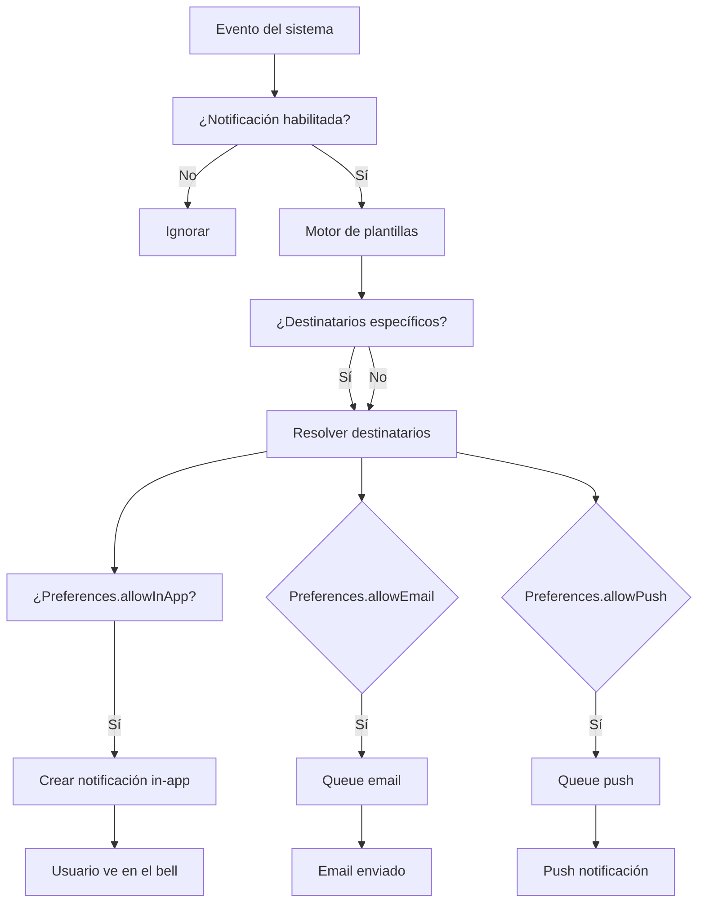

# 0012 — Notificaciones

---

## 1. Descripción y Alcance

Sistema unificado de notificaciones: in-app, email, push. Motor de plantillas configurable por evento, preferencias por usuario, batching inteligente, y métricas.

---

## 2. Diagrama de Flujo



---

## 3. Pantallas

### 3.1 Bell de Notificaciones

**Posición**: Header derecha (junto a avatar)
**Badge**: Número de no leídas
**Dropdown**:
- Lista de notificaciones (últimas 20)
- Cada una: icono, título, preview, timestamp
- Acción: Marcar leída, Marcar todas leídas
- Footer: "Ver todas" → modal completo

### 3.2 Centro de Notificaciones (Modal)

**Pestañas**: Todas | No leídas | Leídas
**Filtros**: Módulo (CRM, Sales, etc.), Fecha
**Paginación**: 20 por página

### 3.3 Preferencias de Notificación

**Tabla por módulo**:
| Módulo | Evento | In-App | Email | Push |
|--------|--------|--------|-------|------|
| Ventas | Nueva venta | ✅ | ✅ | ❌ |
| Inventario | Stock bajo | ✅ | ✅ | ✅ |

**Botón**: "Guardar preferencias"

---

## 4. Backend

### 4.1 Use Cases

#### CreateNotificationUseCase
```typescript
class CreateNotificationUseCase {
  async execute(dto: CreateNotificationDto): Promise<void> {
    // 1. Resolver destinatarios
    const recipients = await this.resolveRecipients(dto);
    
    for (const recipient of recipients) {
      // 2. Verificar preferencias del usuario
      const prefs = await this.preferenceRepository.get(
        recipient.id, dto.eventType
      );
      
      // 3. Crear in-app si habilitado
      if (prefs.allowInApp) {
        await this.notificationRepository.create({
          recipientId: recipient.id,
          title: dto.title,
          message: dto.message,
          icon: dto.icon,
          link: dto.link,
          module: dto.module,
          eventType: dto.eventType,
          metadata: dto.metadata
        });
      }
      
      // 4. Queue email si habilitado
      if (prefs.allowEmail) {
        await this.emailQueue.add('send-notification', {
          recipientId: recipient.id,
          template: dto.emailTemplate,
          data: dto.metadata
        });
      }
      
      // 5. Queue push si habilitado
      if (prefs.allowPush) {
        await this.pushQueue.add('send-notification', {
          recipientId: recipient.id,
          title: dto.title,
          body: dto.message,
          link: dto.link
        });
      }
    }
  }
  
  private async resolveRecipients(dto: CreateNotificationDto) {
    if (dto.recipientIds?.length) {
      return dto.recipientIds;
    }
    // Resolver por rol + organización
    return this.userRepository.findByRole(
      dto.organizationId, dto.requiredRole
    );
  }
}
```

#### MarkAsReadUseCase
```typescript
class MarkAsReadUseCase {
  async execute(notificationId: string, userId: string): Promise<void> {
    await this.notificationRepository.markAsRead(notificationId, userId);
    // Evento: NotificationRead
  }
}
```

#### MarkAllAsReadUseCase
```typescript
class MarkAllAsReadUseCase {
  async execute(userId: string, organizationId: string): Promise<void> {
    await this.notificationRepository.markAllAsRead(userId, organizationId);
  }
}
```

---

## 5. Frontend

### 5.1 Components
- `NotificationBell` - Icono con badge en header
- `NotificationDropdown` - Lista reciente en dropdown
- `NotificationCenter` - Modal completo con filtros
- `NotificationItem` - Item individual
- `NotificationPreferences` - Formulario de preferencias
- `NotificationToast` - Toast temporal para notificaciones en tiempo real

### 5.2 Hooks
```typescript
useNotifications()          // GET /api/v1/notifications
useUnreadCount()            // GET /api/v1/notifications/unread-count
useMarkAsRead()             // PATCH /api/v1/notifications/:id/read
useMarkAllAsRead()          // PATCH /api/v1/notifications/read-all
useNotificationPrefs()      // GET /api/v1/notification-preferences
useUpdateNotificationPrefs() // PATCH /api/v1/notification-preferences
```

---

## 6. API REST

```http
GET    /api/v1/notifications                 # List notifications
GET    /api/v1/notifications/unread-count     # Get unread count
PATCH  /api/v1/notifications/:id/read         # Mark as read
PATCH  /api/v1/notifications/read-all         # Mark all as read

GET    /api/v1/notification-preferences       # Get preferences
PATCH  /api/v1/notification-preferences       # Update preferences
```

---

## 7. Base de Datos

```sql
CREATE TABLE notifications (
  id UUID PRIMARY KEY DEFAULT gen_random_uuid(),
  recipient_id UUID NOT NULL REFERENCES users(id),
  organization_id UUID NOT NULL REFERENCES organizations(id),
  title VARCHAR(255) NOT NULL,
  message TEXT NOT NULL,
  icon VARCHAR(50), -- lucide icon name
  link VARCHAR(500), -- deep link to entity
  module VARCHAR(50) NOT NULL,
  event_type VARCHAR(100) NOT NULL,
  is_read BOOLEAN DEFAULT false,
  metadata JSONB,
  created_at TIMESTAMPTZ DEFAULT NOW(),
  read_at TIMESTAMPTZ
);

CREATE TABLE notification_preferences (
  id UUID PRIMARY KEY DEFAULT gen_random_uuid(),
  user_id UUID NOT NULL REFERENCES users(id),
  event_type VARCHAR(100) NOT NULL,
  allow_in_app BOOLEAN DEFAULT true,
  allow_email BOOLEAN DEFAULT true,
  allow_push BOOLEAN DEFAULT false,
  UNIQUE(user_id, event_type)
);
```

---

## 8. Eventos

```
NotificationCreated { notificationId, recipientId, title, module }
NotificationRead { notificationId, recipientId }
AllNotificationsRead { recipientId, organizationId, count }
NotificationPreferenceUpdated { userId, eventType, preferences }
```

---

## 9. Permisos

| Recurso | Acciones |
|---------|----------|
| `notification` | read, update (own) |

Los usuarios solo ven sus propias notificaciones.

---

## 10. Validaciones

### Notification
- `title`: obligatorio, 1-255 chars
- `message`: obligatorio
- `module`: enum válido
- `eventType`: string válido
- `recipientIds` o `requiredRole`: al menos uno

### Preferences
- `eventType`: enum válido
- `allowInApp`/`allowEmail`/`allowPush`: boolean

---

## 11. Nova Tools

| Tool | Descripción | Risk Flag | Permiso |
|------|-------------|-----------|---------|
| `read_notifications` | Leer notificaciones | - | `notification.read` |
| `mark_notification_read` | Marcar como leída | - | `notification.update` |

---

## 12. Notificaciones

El sistema notifica a través de:
- **In-app**: Badge en bell, dropdown, modal
- **Email**: Via SendGrid con plantillas
- **Push**: Via Web Push API (futuro)

---

## 13. Auditoría

Las notificaciones NO se auditan (son registros internos del sistema).

---

## 14. Criterios de Aceptación

### US-NOT-01: Recibir notificación in-app
```
Given un usuario con preferencias habilitadas
When ocurre un evento relevante (ej: nueva venta)
Then aparece una notificación en el bell
Y el badge incrementa en 1
```

### US-NOT-02: Marcar como leída
```
Given una notificación no leída
When el usuario hace click en ella
Then se marca como leída
Y el badge decrementa en 1
```

### US-NOT-03: Preferencias por evento
```
Given un usuario desactiva email para "StockBelowMinimum"
When ocurre ese evento
Then recibe notificación in-app
Pero NO recibe email
```

---

## 15. Dependencias

| Módulo | Relación |
|--------|----------|
| Todos los módulos | Emiten eventos que generan notificaciones |
| Auth (004) | Resolución de destinatarios por rol |

---

## 16. Checklist

- [ ] Notification CRUD
- [ ] Bell component con badge
- [ ] Dropdown de notificaciones
- [ ] Modal completo con filtros
- [ ] Marcar leída / todas leídas
- [ ] Preferencias por evento
- [ ] Email templates
- [ ] Queue de emails
- [ ] Push notifications (futuro)
- [ ] Batching inteligente
- [ ] Real-time updates (WebSocket)
- [ ] Responsive mobile
