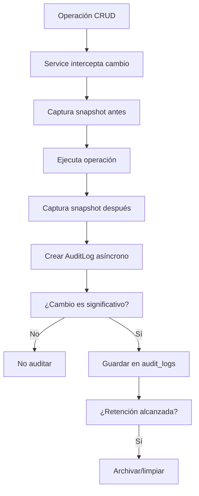

# 0013 — Sistema de Auditoría

---

## 1. Descripción y Alcance

Sistema de auditoría que registra cambios sensibles en la base de datos. Captura quién, qué, cuándo, y los valores antes/después de cada cambio. Optimizado para performance con captura asíncrona y retención configurable.

---

## 2. Diagrama de Flujo



---

## 3. Pantallas

### 3.1 Log de Auditoría (Admin)

**Tabla**: Timestamp, Usuario, Entidad, ID, Operación, IP, Resumen
**Filtros**: Usuario, Entidad, Operación, Rango de fechas, Organización
**Paginación**: 50 por página, cursor-based

### 3.2 Detalle de Auditoría

**Header**: Operación sobre entidad
**Metadata**: Usuario, Timestamp, IP, User Agent
**Changes**: Diff visual antes/después

```diff
- name: "Old Company Name"
+ name: "New Company Name"
  
- revenue: 1000000
+ revenue: 1500000
```

### 3.3 Exportar Auditoría

**Formulario**: Rango de fechas, Entidad, Operación
**Formato**: CSV o JSON
**Descarga**: Archivo generado

---

## 4. Backend

### 4.1 Interceptor de Auditoría

```typescript
@Injectable()
export class AuditInterceptor implements NestInterceptor {
  intercept(context: ExecutionContext, next: CallHandler) {
    const request = context.switchToHttp().getRequest();
    const user = request.user;
    
    return next.handle().pipe(
      tap(async (response) => {
        // Capturar cambios del response
        if (response?.audit) {
          await this.auditService.log({
            userId: user?.sub,
            organizationId: user?.org,
            entityType: response.audit.entityType,
            entityId: response.audit.entityId,
            action: response.audit.action,
            changes: response.audit.changes,
            ipAddress: request.ip,
            userAgent: request.headers['user-agent']
          });
        }
      })
    );
  }
}
```

### 4.2 AuditService

```typescript
class AuditService {
  async log(dto: AuditLogDto): Promise<void> {
    // 1. Calcular diff significativo
    const significantChanges = this.filterSignificantChanges(
      dto.changes.before,
      dto.changes.after
    );
    
    if (Object.keys(significantChanges).length === 0) {
      return; // No auditar cambios no significativos
    }
    
    // 2. Guardar asíncrono (no bloquear response)
    this.auditQueue.add('save-audit-log', {
      ...dto,
      changes: significantChanges
    });
  }
  
  private filterSignificantChanges(before: any, after: any): any {
    const changes: any = {};
    const nonAuditable = ['updated_at', 'created_at', 'metadata'];
    
    for (const key of Object.keys(after)) {
      if (nonAuditable.includes(key)) continue;
      if (before[key] !== after[key]) {
        changes[key] = { before: before[key], after: after[key] };
      }
    }
    
    return changes;
  }
}
```

### 4.3 Use Cases

#### GetAuditLogsUseCase
```typescript
class GetAuditLogsUseCase {
  async execute(filters: AuditLogFilters): Promise<PaginatedResult<AuditLog>> {
    return this.auditRepository.findMany({
      where: {
        organizationId: filters.organizationId,
        entityType: filters.entityType,
        entityId: filters.entityId,
        userId: filters.userId,
        createdAt: {
          gte: filters.startDate,
          lte: filters.endDate
        }
      },
      orderBy: { createdAt: 'desc' },
      take: filters.limit,
      skip: filters.offset
    });
  }
}
```

#### ExportAuditLogsUseCase
```typescript
class ExportAuditLogsUseCase {
  async execute(filters: AuditLogFilters): Promise<string> {
    const logs = await this.auditRepository.findMany(filters);
    
    // Generar CSV
    const csv = this.generateCSV(logs);
    
    // Guardar temporalmente
    const file = await this.fileService.createTemp(csv, 'audit-export.csv');
    
    // Retornar URL de descarga
    return file.url;
  }
}
```

---

## 5. Frontend

### 5.1 Components
- `AuditLogList` - Tabla de logs
- `AuditLogDetail` - Detalle con diff
- `AuditLogFilters` - Filtros de búsqueda
- `AuditLogExport` - Formulario de exportación
- `AuditDiff` - Componente de diff visual

### 5.2 Hooks
```typescript
useAuditLogs()        // GET /api/v1/audit-logs
useAuditLogDetail()   // GET /api/v1/audit-logs/:id
useExportAuditLogs()  // POST /api/v1/audit-logs/export
```

---

## 6. API REST

```http
GET    /api/v1/audit-logs                 # List audit logs
GET    /api/v1/audit-logs/:id             # Get audit log detail
POST   /api/v1/audit-logs/export          # Export logs (CSV/JSON)
GET    /api/v1/audit-logs/stats           # Estadísticas de auditoría
```

---

## 7. Base de Datos

```sql
CREATE TABLE audit_logs (
  id UUID PRIMARY KEY DEFAULT gen_random_uuid(),
  organization_id UUID NOT NULL REFERENCES organizations(id),
  user_id UUID REFERENCES users(id),
  entity_type VARCHAR(100) NOT NULL,
  entity_id UUID NOT NULL,
  action VARCHAR(20) NOT NULL, -- 'create' | 'update' | 'delete'
  changes JSONB, -- { field: { before, after } }
  ip_address INET,
  user_agent TEXT,
  created_at TIMESTAMPTZ DEFAULT NOW()
);

-- Índices para queries frecuentes
CREATE INDEX idx_audit_org ON audit_logs(organization_id);
CREATE INDEX idx_audit_entity ON audit_logs(entity_type, entity_id);
CREATE INDEX idx_audit_user ON audit_logs(user_id);
CREATE INDEX idx_audit_date ON audit_logs(created_at DESC);
```

---

## 8. Eventos

```
AuditLogCreated { logId, entityType, entityId, action, userId }
```

---

## 9. Permisos

| Recurso | Acciones |
|---------|----------|
| `audit` | read, export |

Solo Owner y Admin pueden acceder a la auditoría.

---

## 10. Validaciones

### Filtros de Auditoría
- `startDate`/`endDate`: fechas válidas
- `entityType`: string
- `userId`: UUID válido
- `limit`: 1-100, default 50

### Exportación
- `format`: 'csv' | 'json'
- `startDate`/`endDate`: obligatorios
- Máximo 30 días de rango

---

## 11. Nova Tools

| Tool | Descripción | Risk Flag | Permiso |
|------|-------------|-----------|---------|
| `get_audit_log` | Ver auditoría | - | `audit.read` |
| `get_entity_history` | Historial de entidad | - | `audit.read` |

---

## 12. Notificaciones

La auditoría NO genera notificaciones (es sistema de registro).

---

## 13. Auditoría

El sistema de auditoría NO se audita a sí mismo (evitar loops).

---

## 14. Criterios de Aceptación

### US-AUD-01: Crear registro de auditoría
```
Given una operación de actualización sobre Customer
When se ejecuta la operación
Then se crea un audit_log con:
  - entityType: 'customer'
  - entityId: el ID del customer
  - action: 'update'
  - changes: { name: { before: "Old", after: "New" } }
  - userId: el usuario que ejecutó
  - ipAddress: IP del request
```

### US-AUD-02: Filtrar por entidad
```
Given 100 registros de auditoría
When filtra por entityType='invoice' y entityId='123'
Then ve solo los 5 registros de esa factura
```

### US-AUD-03: Exportar
```
Given registros del último mes
When exporta a CSV
Then recibe un archivo con todos los registros
Y se puede abrir en Excel
```

---

## 15. Dependencias

| Módulo | Relación |
|--------|----------|
| Todos los módulos | Emiten eventos de auditoría |
| Auth (004) | Información de usuario |
| Notifications (012) | No aplica |

---

## 16. Checklist

- [ ] Audit interceptor para NestJS
- [ ] AuditService con diff significativo
- [ ] Cola asíncrona de auditoría
- [ ] Log de auditoría CRUD
- [ ] Vista de log con filtros
- [ ] Detalle con diff visual
- [ ] Exportación CSV/JSON
- [ ] Índices de performance
- [ ] Retención configurable
- [ ] Solo Owner/Admin acceden
- [ ] Responsive mobile
