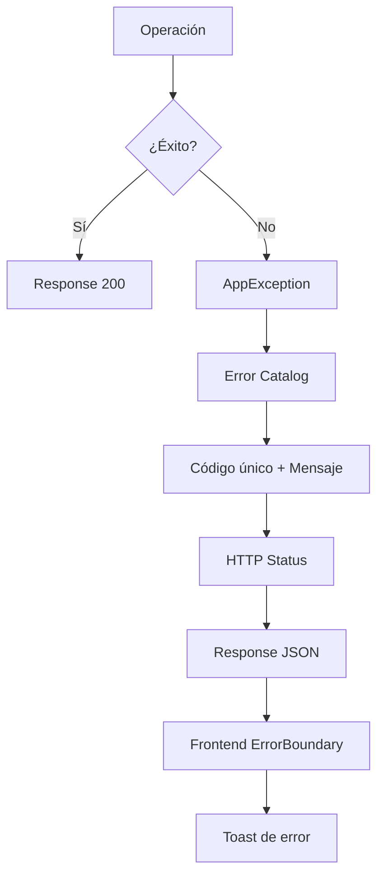

# 0014 — Catálogo de Errores

---

## 1. Descripción y Alcance

Catálogo centralizado de errores con códigos únicos, mensajes localizables, y mapeo a HTTP status codes. Incluye error catalog (configurable), error boundary (frontend), y logging centralizado.

---

## 2. Diagrama de Flujo



---

## 3. Estructura de Error

```typescript
interface AppError {
  code: string;           // Ej: 'CRM_001', 'SALES_003', 'INV_002'
  message: string;        // Mensaje localizable
  httpStatus: number;     // 400, 401, 403, 404, 409, 422, 500
  details?: any;          // Detalles adicionales
  timestamp: string;
  requestId: string;
}
```

---

## 4. Catálogo por Módulo

### 4.1 Auth (AUTH_xxx)

| Código | Mensaje | HTTP |
|--------|---------|------|
| AUTH_001 | Credenciales inválidas | 401 |
| AUTH_002 | Token expirado | 401 |
| AUTH_003 | Token inválido | 401 |
| AUTH_004 | Email ya verificado | 400 |
| AUTH_005 | Token de verificación expirado | 400 |
| AUTH_006 | Token de reseteo expirado | 400 |
| AUTH_007 | Refresh token inválido | 401 |
| AUTH_008 | Refresh token expirado | 401 |
| AUTH_009 | Refresh token ya usado (rotación) | 401 |
| AUTH_010 | Cuenta bloqueada | 403 |
| AUTH_011 | Email no encontrado | 404 |
| AUTH_012 | Email no verificado | 403 |

### 4.2 Core (CORE_xxx)

| Código | Mensaje | HTTP |
|--------|---------|------|
| CORE_001 | Organización no encontrada | 404 |
| CORE_002 | Usuario no encontrado | 404 |
| CORE_003 | Sucursal no encontrada | 404 |
| CORE_004 | Rol no válido | 400 |
| CORE_005 | Invitación expirada | 400 |
| CORE_006 | Invitación ya aceptada | 400 |
| CORE_007 | Miembro no encontrado | 404 |
| CORE_008 | Último Owner no puede ser removido | 400 |
| CORE_009 | Email ya pertenece a la organización | 409 |
| CORE_010 | No tienes acceso a esta organización | 403 |

### 4.3 CRM (CRM_xxx)

| Código | Mensaje | HTTP |
|--------|---------|------|
| CRM_001 | Lead no encontrado | 404 |
| CRM_002 | Contacto no encontrado | 404 |
| CRM_003 | Empresa no encontrada | 404 |
| CRM_004 | Pipeline no encontrado | 404 |
| CRM_005 | Lead ya tiene组织 assignment | 409 |
| CRM_006 | Etapa inválida | 400 |

### 4.4 Sales (SALES_xxx)

| Código | Mensaje | HTTP |
|--------|---------|------|
| SALES_001 | Presupuesto no encontrado | 404 |
| SALES_002 | Pedido no encontrado | 404 |
| SALES_003 | Factura no encontrada | 404 |
| SALES_004 | Pago no encontrado | 404 |
| SALES_005 | Transición de estado inválida | 400 |
| SALES_006 | Stock insuficiente | 400 |
| SALES_007 | Número de factura duplicado | 409 |
| SALES_008 | El pago excede el saldo de la factura | 400 |
| SALES_009 | No se puede anular una factura pagada | 400 |
| SALES_010 | Presupuesto ya convertido | 400 |
| SALES_011 | Pedido ya entregado | 400 |

### 4.5 Inventory (INV_xxx)

| Código | Mensaje | HTTP |
|--------|---------|------|
| INV_001 | Producto no encontrado | 404 |
| INV_002 | SKU duplicado | 409 |
| INV_003 | Almacén no encontrado | 404 |
| INV_004 | Categoría no encontrada | 404 |
| INV_005 | Stock insuficiente | 400 |
| INV_006 | Transferencia a mismo almacén | 400 |
| INV_007 | Producto con movimientos (no se puede eliminar) | 400 |

### 4.6 General (GEN_xxx)

| Código | Mensaje | HTTP |
|--------|---------|------|
| GEN_001 | Datos de entrada inválidos | 400 |
| GEN_002 | Recurso no encontrado | 404 |
| GEN_003 | Conflicto | 409 |
| GEN_004 | Operación no permitida | 403 |
| GEN_005 | Error interno del servidor | 500 |
| GEN_006 | Rate limit excedido | 429 |
| GEN_007 | Tamaño de payload excedido | 413 |
| GEN_008 | Entidad ya existe | 409 |

---

## 5. Backend

### 5.1 AppException

```typescript
class AppException extends Error {
  constructor(
    public readonly code: string,
    public readonly httpStatus: number,
    message: string,
    public readonly details?: any
  ) {
    super(message);
    this.name = 'AppException';
  }
}

// Factory para errores comunes
class ErrorFactory {
  static auth(code: string, details?: any): AppException {
    const error = AUTH_ERRORS[code];
    return new AppException(code, error.httpStatus, error.message, details);
  }
  
  static crm(code: string, details?: any): AppException {
    const error = CRM_ERRORS[code];
    return new AppException(code, error.httpStatus, error.message, details);
  }
  
  // ... otros módulos
}
```

### 5.2 ExceptionFilter Global

```typescript
@Catch(AppException)
export class AppExceptionFilter implements ExceptionFilter {
  catch(exception: AppException, host: ArgumentsHost) {
    const ctx = host.switchToHttp();
    const response = ctx.getResponse();
    const request = ctx.getRequest();
    
    // Log para error 500
    if (exception.httpStatus === 500) {
      this.logger.error(exception.message, exception.stack, {
        requestId: request.id,
        userId: request.user?.sub
      });
    }
    
    response.status(exception.httpStatus).json({
      code: exception.code,
      message: exception.message,
      details: exception.details,
      timestamp: new Date().toISOString(),
      requestId: request.id
    });
  }
}
```

---

## 6. Frontend

### 6.1 Error Boundary

```typescript
class ErrorBoundary extends React.Component {
  state = { error: null };
  
  static getDerivedStateFromError(error) {
    return { error };
  }
  
  componentDidCatch(error, errorInfo) {
    // Log to error reporting service
    this.logError(error, errorInfo);
  }
  
  render() {
    if (this.state.error) {
      return <ErrorFallback error={this.state.error} />;
    }
    return this.props.children;
  }
}
```

### 6.2 ErrorToast

```typescript
// Toast automático para errores de API
function useErrorToast() {
  return (error: AppError) => {
    toast.error(error.message, {
      description: `Código: ${error.code}`,
      action: {
        label: 'Copiar código',
        onClick: () => navigator.clipboard.writeText(error.code)
      }
    });
  };
}
```

---

## 7. Base de Datos

No requiere tablas adicionales.

---

## 8. Eventos

No genera eventos.

---

## 9. Permisos

Los errores se retornan siempre, independientemente de permisos.

---

## 10. Validaciones

Todos los errores deben tener:
- `code`: string único (formato `MOD_NNN`)
- `message`: string localizable
- `httpStatus`: number válido (4xx o 5xx)

---

## 11. Nova Tools

Nova puede consultar el catálogo de errores:

| Tool | Descripción | Risk Flag | Permiso |
|------|-------------|-----------|---------|
| `explain_error` | Explicar error | - | público |

---

## 12. Notificaciones

Los errores 500 generan alerta al equipo de desarrollo.

---

## 13. Auditoría

Los errores 403 (Forbidden) se auditan por seguridad.

---

## 14. Criterios de Aceptación

### US-ERR-01: Error consistente
```
Given una operación fallida
When se retorna un error
Then tiene código único (ej: 'SALES_003')
And mensaje localizable
And HTTP status correcto
And requestId para tracing
```

### US-ERR-02: Error en frontend
```
Given una excepción no manejada en React
When se captura en ErrorBoundary
Then se muestra fallback amigable
And se loggea el error
```

---

## 15. Dependencias

| Módulo | Relación |
|--------|----------|
| Todos | Usan AppException para errores |

---

## 16. Checklist

- [ ] Catálogo de errores por módulo
- [ ] AppException class
- [ ] ErrorFactory helpers
- [ ] ExceptionFilter global NestJS
- [ ] Error Boundary React
- [ ] ErrorToast
- [ ] Logging centralizado
- [ ] RequestId para tracing
- [ ] Documentación de códigos
