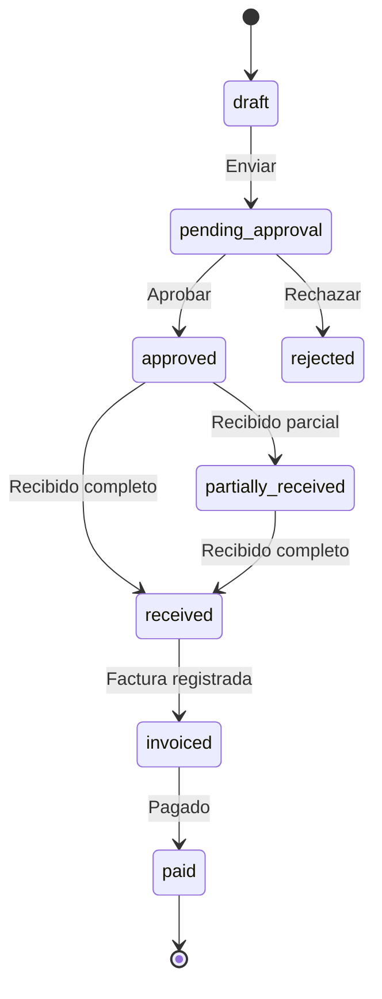

# 0016 — Compras (Purchasing)

---

## 1. Descripción y Alcance

Gestión de compras: Proveedores (Suppliers), Órdenes de Compra (Purchase Orders), Recepción de Mercancía, y Facturas de Proveedor (Supplier Invoices). Flujo completo desde solicitud hasta pago.

---

## 2. Diagrama de Flujo



---

## 3. Pantallas

### 3.1 Lista de Órdenes de Compra

**Tabla**: Número, Proveedor, Fecha, Total, Estado, Acciones
**Filtros**: Estado, Proveedor, Rango de fechas
**Resumen**: Total pendiente, Total recibido, Total pagado

### 3.2 Crear Orden de Compra

**Formulario**:
- Select: Proveedor
- Fecha de entrega estimada
- Referencia de solicitud (opcional)
- Líneas de producto:
  - Select: Producto
  - Cantidad
  - Precio unitario
  - Subtotal (calculado)
- Notas
- Botón: "Crear orden"

### 3.3 Detalle de Orden

**Header**: Número, Proveedor, Estado, Fecha
**Acciones según estado**:
- Draft: Editar, Enviar
- Pending: Aprobar, Rechazar
- Approved: Registrar Recepción
- Received: Registrar Factura

**Secciones**:
- Líneas de producto con cantidades
- Historial de recepciones
- Facturas asociadas
- Timeline de cambios de estado

### 3.4 Registrar Recepción

**Formulario**:
- Líneas con cantidad recibida
- Si recibido > ordenado: error
- Si recibido < ordenado: marcar como parcial
- Fecha de recepción
- Almacén destino
- Botón: "Registrar"

### 3.5 Registrar Factura de Proveedor

**Formulario**:
- Número de factura del proveedor
- Fecha de factura
- Monto total
- Líneas asociadas a orden
- Botón: "Registrar"

---

## 4. Backend

### 4.1 Use Cases

#### CreatePurchaseOrderUseCase
```typescript
class CreatePurchaseOrderUseCase {
  async execute(dto: CreatePurchaseOrderDto, userId: string): Promise<PurchaseOrder> {
    // 1. Validar proveedor
    const supplier = await this.supplierRepository.findById(dto.supplierId);
    if (!supplier) throw ErrorFactory.purchasing('PUR_001');
    
    // 2. Validar productos
    for (const line of dto.lines) {
      const product = await this.productRepository.findById(line.productId);
      if (!product) throw ErrorFactory.purchasing('PUR_002');
    }
    
    // 3. Generar número secuencial
    const number = await this.sequenceService.generate(
      dto.organizationId, 'PO'
    );
    
    // 4. Crear orden con líneas
    return this.prisma.$transaction(async (tx) => {
      const order = await this.purchaseOrderRepository.create(tx, {
        number,
        supplierId: dto.supplierId,
        organizationId: dto.organizationId,
        expectedDate: dto.expectedDate,
        notes: dto.notes,
        createdBy: userId,
        status: 'draft'
      });
      
      for (const line of dto.lines) {
        await this.purchaseOrderLineRepository.create(tx, {
          purchaseOrderId: order.id,
          productId: line.productId,
          quantity: line.quantity,
          unitPrice: line.unitPrice
        });
      }
      
      // 5. Audit + Event
      return order;
    });
  }
}
```

#### ReceiveGoodsUseCase
```typescript
class ReceiveGoodsUseCase {
  async execute(dto: ReceiveGoodsDto, userId: string): Promise<void> {
    return this.prisma.$transaction(async (tx) => {
      // 1. Validar orden en estado válido
      const order = await this.purchaseOrderRepository.findById(dto.purchaseOrderId);
      if (order.status !== 'approved') {
        throw ErrorFactory.purchasing('PUR_005');
      }
      
      // 2. Validar cantidades
      for (const receipt of dto.receipts) {
        const line = await this.purchaseOrderLineRepository.findById(
          tx, receipt.purchaseOrderLineId
        );
        if (receipt.quantity > (line.orderedQuantity - line.receivedQuantity)) {
          throw ErrorFactory.purchasing('PUR_006');
        }
      }
      
      // 3. Registrar recepciones
      for (const receipt of dto.receipts) {
        await this.purchaseOrderLineRepository.updateReceived(
          tx, receipt.purchaseOrderLineId, receipt.quantity
        );
        
        // 4. Actualizar stock
        await this.stockMovementRepository.create(tx, {
          productId: receipt.productId,
          warehouseId: dto.warehouseId,
          type: 'in',
          quantity: receipt.quantity,
          referenceType: 'purchase_order',
          referenceId: dto.purchaseOrderId
        });
      }
      
      // 5. Actualizar estado de orden
      const allReceived = await this.checkAllReceived(tx, dto.purchaseOrderId);
      await this.purchaseOrderRepository.updateStatus(
        tx, dto.purchaseOrderId,
        allReceived ? 'received' : 'partially_received'
      );
      
      // 6. Audit + Event
    });
  }
}
```

---

## 5. Frontend

### 5.1 Components
- `PurchaseOrderList` - Lista de órdenes
- `PurchaseOrderForm` - Crear/editar orden
- `PurchaseOrderDetail` - Detalle completo
- `PurchaseOrderLineForm` - Línea de producto
- `ReceiveGoodsForm` - Formulario de recepción
- `SupplierInvoiceForm` - Registro de factura
- `SupplierList` - Lista de proveedores
- `SupplierForm` - Crear/editar proveedor

### 5.2 Hooks
```typescript
usePurchaseOrders()      // GET /api/v1/purchase-orders
useCreatePurchaseOrder() // POST /api/v1/purchase-orders
useReceiveGoods()        // POST /api/v1/purchase-orders/:id/receive
useSuppliers()           // GET /api/v1/suppliers
useCreateSupplier()      // POST /api/v1/suppliers
```

---

## 6. API REST

```http
POST   /api/v1/purchase-orders           # Create PO
GET    /api/v1/purchase-orders           # List POs
GET    /api/v1/purchase-orders/:id       # Get PO
PATCH  /api/v1/purchase-orders/:id       # Update PO
PATCH  /api/v1/purchase-orders/:id/status # Change status
POST   /api/v1/purchase-orders/:id/receive # Receive goods

POST   /api/v1/suppliers                 # Create supplier
GET    /api/v1/suppliers                 # List suppliers
GET    /api/v1/suppliers/:id             # Get supplier
PATCH  /api/v1/suppliers/:id             # Update supplier
```

---

## 7. Base de Datos

```sql
CREATE TABLE suppliers (
  id UUID PRIMARY KEY DEFAULT gen_random_uuid(),
  organization_id UUID NOT NULL REFERENCES organizations(id),
  name VARCHAR(255) NOT NULL,
  tax_id VARCHAR(100),
  email VARCHAR(255),
  phone VARCHAR(50),
  address JSONB,
  payment_terms INTEGER DEFAULT 30, -- días
  is_active BOOLEAN DEFAULT true,
  created_at TIMESTAMPTZ DEFAULT NOW()
);

CREATE TABLE purchase_orders (
  id UUID PRIMARY KEY DEFAULT gen_random_uuid(),
  organization_id UUID NOT NULL REFERENCES organizations(id),
  number VARCHAR(50) NOT NULL,
  supplier_id UUID NOT NULL REFERENCES suppliers(id),
  status VARCHAR(30) DEFAULT 'draft',
  expected_date DATE,
  notes TEXT,
  total BIGINT DEFAULT 0, -- cents
  created_by UUID REFERENCES users(id),
  created_at TIMESTAMPTZ DEFAULT NOW(),
  updated_at TIMESTAMPTZ DEFAULT NOW(),
  UNIQUE(organization_id, number)
);

CREATE TABLE purchase_order_lines (
  id UUID PRIMARY KEY DEFAULT gen_random_uuid(),
  purchase_order_id UUID NOT NULL REFERENCES purchase_orders(id) ON DELETE CASCADE,
  product_id UUID NOT NULL REFERENCES products(id),
  quantity INTEGER NOT NULL,
  received_quantity INTEGER DEFAULT 0,
  unit_price BIGINT NOT NULL, -- cents
  subtotal BIGINT NOT NULL, -- cents
  created_at TIMESTAMPTZ DEFAULT NOW()
);

CREATE TABLE supplier_invoices (
  id UUID PRIMARY KEY DEFAULT gen_random_uuid(),
  organization_id UUID NOT NULL REFERENCES organizations(id),
  purchase_order_id UUID NOT NULL REFERENCES purchase_orders(id),
  supplier_id UUID NOT NULL REFERENCES suppliers(id),
  invoice_number VARCHAR(100) NOT NULL,
  invoice_date DATE NOT NULL,
  total BIGINT NOT NULL, -- cents
  status VARCHAR(20) DEFAULT 'pending',
  created_by UUID REFERENCES users(id),
  created_at TIMESTAMPTZ DEFAULT NOW(),
  UNIQUE(supplier_id, invoice_number)
);
```

---

## 8. Eventos

```
PurchaseOrderCreated { orderId, number, supplierId, organizationId }
PurchaseOrderApproved { orderId, organizationId }
PurchaseOrderRejected { orderId, reason, organizationId }
GoodsReceived { orderId, warehouseId, lines, organizationId }
SupplierInvoiceCreated { invoiceId, orderId, organizationId }
```

---

## 9. Permisos

| Recurso | Acciones |
|---------|----------|
| `purchasing.supplier` | create, read, update, delete |
| `purchasing.order` | create, read, update, delete |
| `purchasing.order.approve` | manager+ |
| `purchasing.receipt` | create, read |
| `purchasing.invoice` | create, read |

---

## 10. Validaciones

### Purchase Order
- `supplierId`: obligatorio, debe existir
- `lines`: al menos 1 línea
- `quantity`: entero positivo
- `unitPrice`: entero positivo (cents)

### Receipt
- Cantidad recibida ≤ cantidad pendiente
- Orden en estado 'approved'

---

## 11. Nova Tools

| Tool | Descripción | Risk Flag | Permiso |
|------|-------------|-----------|---------|
| `find_supplier` | Buscar proveedor | - | `purchasing.supplier.read` |
| `create_purchase_order` | Crear orden de compra | high_impact | `purchasing.order.create` |
| `get_purchase_orders` | Listar órdenes | - | `purchasing.order.read` |

---

## 12. Notificaciones

```
PurchaseOrderApproved → in-app a comprador
GoodsReceived → in-app a comprador
SupplierInvoiceCreated → in-app a finance
```

---

## 13. Auditoría

Todas las operaciones de compras se auditan.

---

## 14. Criterios de Aceptación

### US-PUR-01: Crear orden de compra
```
Given un usuario con permiso purchasing.order.create
When crea orden con 3 líneas
Then se genera número secuencial (PO-2026-00001)
Y estado es 'draft'
```

### US-PUR-02: Recibir mercancía
```
Given orden aprobada con 100 unidades
When recibe 60 unidades
Then stock aumenta en 60
Y orden queda como 'partially_received'
Y pendiente: 40 unidades
```

### US-PUR-03: Recepción completa
```
Given orden con 40 unidades pendientes
When recibe 40 unidades
Then stock aumenta en 40
Y orden queda como 'received'
```

---

## 15. Dependencias

| Módulo | Relación |
|--------|----------|
| Inventory (011) | Actualización de stock |
| Finance (017) | Pagos a proveedores |
| Sales (010) | Datos de productos |

---

## 16. Checklist

- [ ] Supplier CRUD
- [ ] Purchase Order CRUD
- [ ] Purchase Order Lines
- [ ] State machine de órdenes
- [ ] Recepción de mercancía
- [ ] Recepción parcial
- [ ] Actualización de stock automática
- [ ] Supplier Invoice registration
- [ ] Sequential numbering
- [ ] Event publishing
- [ ] Audit logging
- [ ] Permission guards
- [ ] Nova tools
- [ ] Responsive mobile
