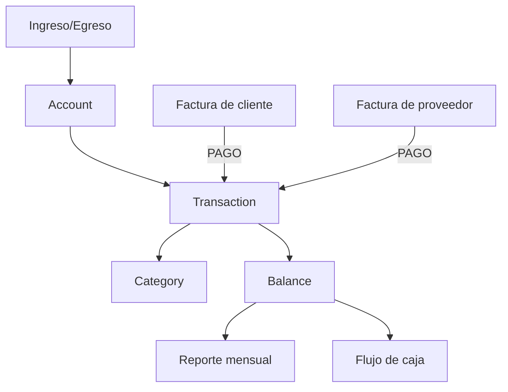

# 0017 — Finanzas (Finance)

---

## 1. Descripción y Alcance

Gestión financiera: Accounts (cuentas bancarias/cajas), Transactions (ingresos/egresos), Financial Categories, Conciliación, y Reportes básicos. Integra datos de Sales y Purchasing.

---

## 2. Diagrama de Flujo



---

## 3. Pantallas

### 3.1 Resumen Financiero

**Cards superiores**:
- Balance total
- Ingresos del mes
- Egresos del mes
- Flujo de caja

**Gráfico**: Ingresos vs Egresos (últimos 6 meses)
**Tabla**: Últimas transacciones

### 3.2 Cuentas (Accounts)

**Tabla**: Nombre, Tipo (Banco/Caja/Tarjeta), Saldo, Moneda, Estado
**Crear**: Nombre, Tipo, Moneda, Saldo inicial
**Detalle**: Saldo, Historial de transacciones, Conciliación

### 3.3 Transacciones

**Tabla**: Fecha, Descripción, Categoría, Ingreso, Egreso, Balance, Account
**Filtros**: Rango de fechas, Categoría, Tipo (ingreso/egreso), Account
**Crear**: Fecha, Account, Tipo, Monto, Categoría, Descripción, Referencia

### 3.4 Categorías

**Árbol de categorías**:
```
Ingresos
├── Ventas
├── Servicios
└── Otros ingresos

Egresos
├── Compras
├── Nómina
├── Alquiler
├── Servicios
└── Otros egresos
```

**Crear**: Nombre, Padre (opcional), Tipo (ingreso/egreso)

### 3.5 Reportes

**Disponibles**:
- Balance General
- Estado de Resultados
- Flujo de Caja
- Por Categoría
- Por Account

**Filtros**: Rango de fechas, Account, Categoría

---

## 4. Backend

### 4.1 Use Cases

#### CreateTransactionUseCase
```typescript
class CreateTransactionUseCase {
  async execute(dto: CreateTransactionDto, userId: string): Promise<Transaction> {
    return this.prisma.$transaction(async (tx) => {
      // 1. Validar account
      const account = await this.accountRepository.findById(tx, dto.accountId);
      if (!account) throw ErrorFactory.finance('FIN_001');
      
      // 2. Crear transacción
      const transaction = await this.transactionRepository.create(tx, {
        accountId: dto.accountId,
        categoryId: dto.categoryId,
        type: dto.type,
        amount: dto.amount,
        description: dto.description,
        referenceType: dto.referenceType,
        referenceId: dto.referenceId,
        transactionDate: dto.transactionDate,
        createdBy: userId
      });
      
      // 3. Actualizar balance de account
      const balanceChange = dto.type === 'income' ? dto.amount : -dto.amount;
      await this.accountRepository.updateBalance(tx, dto.accountId, balanceChange);
      
      // 4. Audit + Event
      return transaction;
    });
  }
}
```

#### ReconcileAccountUseCase
```typescript
class ReconcileAccountUseCase {
  async execute(dto: ReconcileDto): Promise<void> {
    // 1. Marcar transacciones como conciliadas
    for (const transactionId of dto.transactionIds) {
      await this.transactionRepository.markReconciled(transactionId);
    }
    
    // 2. Actualizar saldo conciliado
    await this.accountRepository.updateReconciledBalance(
      dto.accountId, dto.reconciledBalance
    );
  }
}
```

---

## 5. Frontend

### 5.1 Components
- `FinanceSummary` - Dashboard financiero
- `AccountList` - Lista de cuentas
- `AccountForm` - Crear/editar cuenta
- `AccountDetail` - Detalle con historial
- `TransactionList` - Lista de transacciones
- `TransactionForm` - Crear transacción
- `CategoryTree` - Árbol de categorías
- `CategoryForm` - Crear/editar categoría
- `FinanceReports` - Selector de reportes
- `CashFlowChart` - Gráfico de flujo de caja

### 5.2 Hooks
```typescript
useAccounts()           // GET /api/v1/finance/accounts
useCreateAccount()      // POST /api/v1/finance/accounts
useTransactions()       // GET /api/v1/finance/transactions
useCreateTransaction()  // POST /api/v1/finance/transactions
useCategories()         // GET /api/v1/finance/categories
useFinanceSummary()     // GET /api/v1/finance/summary
useFinanceReport()      // POST /api/v1/finance/reports
```

---

## 6. API REST

```http
POST   /api/v1/finance/accounts          # Create account
GET    /api/v1/finance/accounts          # List accounts
GET    /api/v1/finance/accounts/:id      # Get account
PATCH  /api/v1/finance/accounts/:id      # Update account

POST   /api/v1/finance/transactions      # Create transaction
GET    /api/v1/finance/transactions      # List transactions
GET    /api/v1/finance/transactions/:id  # Get transaction

POST   /api/v1/finance/categories        # Create category
GET    /api/v1/finance/categories        # List categories (tree)

POST   /api/v1/finance/reports           # Generate report
GET    /api/v1/finance/summary           # Get summary
```

---

## 7. Base de Datos

```sql
CREATE TABLE finance_accounts (
  id UUID PRIMARY KEY DEFAULT gen_random_uuid(),
  organization_id UUID NOT NULL REFERENCES organizations(id),
  name VARCHAR(100) NOT NULL,
  type VARCHAR(20) NOT NULL, -- 'bank' | 'cash' | 'credit_card'
  currency VARCHAR(3) DEFAULT 'USD',
  balance BIGINT DEFAULT 0, -- cents, current balance
  reconciled_balance BIGINT DEFAULT 0,
  is_active BOOLEAN DEFAULT true,
  created_at TIMESTAMPTZ DEFAULT NOW()
);

CREATE TABLE finance_categories (
  id UUID PRIMARY KEY DEFAULT gen_random_uuid(),
  organization_id UUID NOT NULL REFERENCES organizations(id),
  name VARCHAR(100) NOT NULL,
  parent_id UUID REFERENCES finance_categories(id),
  type VARCHAR(10) NOT NULL, -- 'income' | 'expense'
  created_at TIMESTAMPTZ DEFAULT NOW(),
  UNIQUE(organization_id, name)
);

CREATE TABLE finance_transactions (
  id UUID PRIMARY KEY DEFAULT gen_random_uuid(),
  organization_id UUID NOT NULL REFERENCES organizations(id),
  account_id UUID NOT NULL REFERENCES finance_accounts(id),
  category_id UUID REFERENCES finance_categories(id),
  type VARCHAR(10) NOT NULL, -- 'income' | 'expense'
  amount BIGINT NOT NULL, -- cents, always positive
  description TEXT,
  reference_type VARCHAR(50), -- 'invoice' | 'purchase_order' | 'manual'
  reference_id UUID,
  transaction_date DATE NOT NULL,
  is_reconciled BOOLEAN DEFAULT false,
  created_by UUID REFERENCES users(id),
  created_at TIMESTAMPTZ DEFAULT NOW()
);

CREATE INDEX idx_finance_trans_org ON finance_transactions(organization_id);
CREATE INDEX idx_finance_trans_account ON finance_transactions(account_id);
CREATE INDEX idx_finance_trans_date ON finance_transactions(transaction_date DESC);
```

---

## 8. Eventos

```
TransactionCreated { transactionId, type, amount, accountId, organizationId }
AccountBalanceUpdated { accountId, oldBalance, newBalance }
AccountReconciled { accountId, reconciledBalance, transactionCount }
```

---

## 9. Permisos

| Recurso | Acciones |
|---------|----------|
| `finance.account` | create, read, update |
| `finance.transaction` | create, read, update, delete |
| `finance.category` | create, read, update |
| `finance.report` | read, export |

---

## 10. Validaciones

### Account
- `name`: obligatorio, 1-100 chars
- `type`: enum válido
- `currency`: ISO 4217

### Transaction
- `accountId`: obligatorio, debe existir
- `amount`: entero positivo
- `type`: 'income' | 'expense'
- `transactionDate`: fecha válida

---

## 11. Nova Tools

| Tool | Descripción | Risk Flag | Permiso |
|------|-------------|-----------|---------|
| `get_financial_summary` | Resumen financiero | - | `finance.account.read` |
| `create_transaction` | Crear transacción | medium | `finance.transaction.create` |
| `get_transactions` | Listar transacciones | - | `finance.transaction.read` |

---

## 12. Notificaciones

```
LargeTransaction → in-app a Owner/Admin (configurable umbral)
MonthlyReport → email a Owner/Admin
```

---

## 13. Auditoría

Todas las transacciones financieras se auditan.

---

## 14. Criterios de Aceptación

### US-FIN-01: Crear transacción
```
Given una cuenta con saldo de $1000
When registra un ingreso de $500
Then saldo actualiza a $1500
Y transacción aparece en historial
```

### US-FIN-02: Reporte mensual
```
Given transacciones del último mes
When genera reporte de flujo de caja
Then ve ingresos, egresos, y flujo neto
Y puede exportar a PDF/CSV
```

---

## 15. Dependencias

| Módulo | Relación |
|--------|----------|
| Sales (010) | Pagos de clientes → ingresos |
| Purchasing (016) | Pagos a proveedores → egresos |
| Dashboard (007) | KPIs financieros |

---

## 16. Checklist

- [ ] Account CRUD
- [ ] Transaction CRUD
- [ ] Category tree
- [ ] Balance calculation
- [ ] Reconciliation
- [ ] Financial reports
- [ ] Cash flow chart
- [ ] Export PDF/CSV
- [ ] Event publishing
- [ ] Audit logging
- [ ] Permission guards
- [ ] Nova tools
- [ ] Responsive mobile
