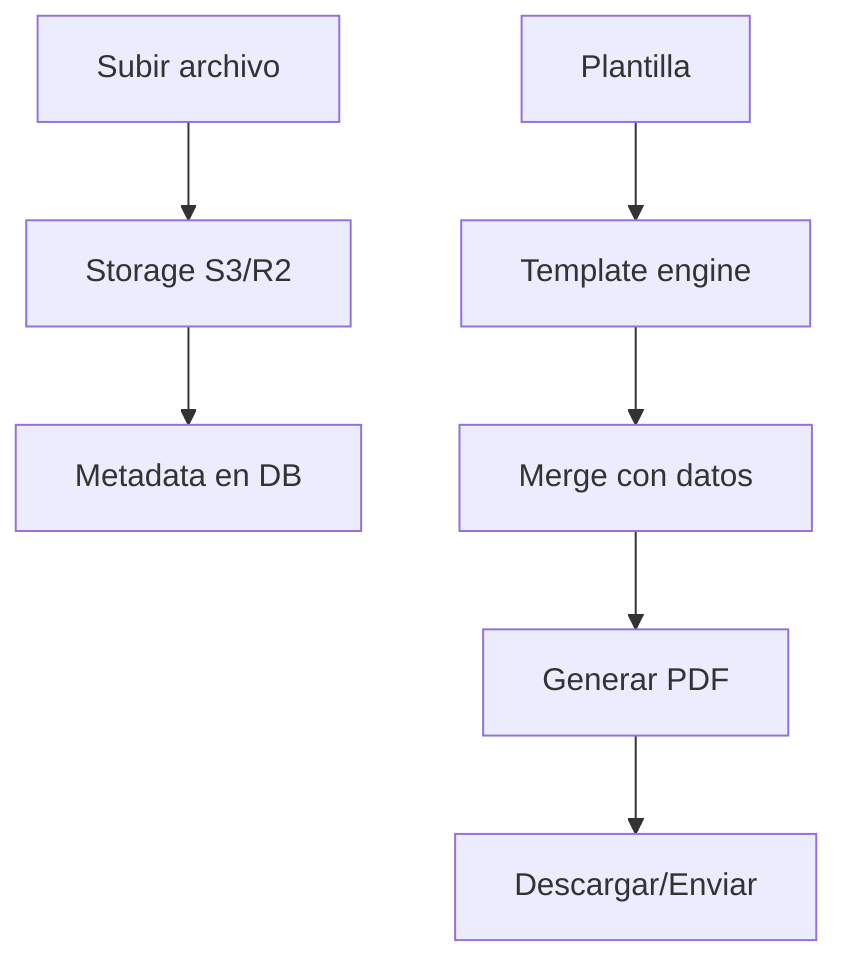

# 0018 — Documentos y Plantillas

---

## 1. Descripción y Alcance

Gestión de documentos: upload/download de archivos, plantillas reutilizables (quotes, invoices), merge de datos, y generación de PDF.

---

## 2. Diagrama de Flujo



---

## 3. Pantallas

### 3.1 Documentos

**Tabla**: Nombre, Tipo, Tamaño, Entidad asociada, Fecha, Acciones
**Subir**: Drag & drop, Select de archivo
**Filtros**: Tipo, Entidad, Rango de fechas

### 3.2 Plantillas

**Lista**: Nombre, Tipo (quote/invoice/custom), Preview, Acciones
**Crear/Editar**:
- Nombre
- Tipo
- Contenido (rich text editor)
- Variables disponibles: `{client_name}`, `{total}`, `{items}`, etc.

### 3.3 Generar desde Plantilla

**Seleccionar plantilla** → **Seleccionar entidad** → **Preview** → **Generar PDF** → **Descargar/Enviar**

---

## 4. Backend

### 4.1 Use Cases

#### UploadDocumentUseCase
```typescript
class UploadDocumentUseCase {
  async execute(dto: UploadDocumentDto): Promise<Document> {
    // 1. Validar tamaño (máx 10MB)
    if (dto.file.size > 10 * 1024 * 1024) {
      throw ErrorFactory.general('GEN_007');
    }
    
    // 2. Subir a storage
    const key = `org/${dto.organizationId}/${dto.entityType}/${dto.entityId}/${dto.file.name}`;
    const url = await this.storageService.upload(key, dto.file);
    
    // 3. Guardar metadata
    return this.documentRepository.create({
      organizationId: dto.organizationId,
      entityType: dto.entityType,
      entityId: dto.entityId,
      fileName: dto.file.name,
      fileSize: dto.file.size,
      mimeType: dto.file.mimeType,
      storageKey: key,
      url
    });
  }
}
```

#### GenerateFromTemplateUseCase
```typescript
class GenerateFromTemplateUseCase {
  async execute(dto: GenerateDocumentDto): Promise<Buffer> {
    // 1. Obtener plantilla
    const template = await this.templateRepository.findById(dto.templateId);
    
    // 2. Obtener datos de la entidad
    const data = await this.entityDataService.get(
      dto.entityType, dto.entityId
    );
    
    // 3. Merge plantilla con datos
    const content = this.templateEngine.render(template.content, data);
    
    // 4. Generar PDF
    const pdf = await this.pdfService.generate(content);
    
    // 5. Guardar documento
    await this.uploadDocument({
      organizationId: dto.organizationId,
      entityType: dto.entityType,
      entityId: dto.entityId,
      file: { name: `${template.name}-${data.number}.pdf`, content: pdf }
    });
    
    return pdf;
  }
}
```

---

## 5. Frontend

### 5.1 Components
- `DocumentList` - Lista de documentos
- `DocumentUpload` - Upload con drag & drop
- `DocumentPreview` - Preview de imagen/PDF
- `TemplateList` - Lista de plantillas
- `TemplateEditor` - Editor de plantillas
- `DocumentGenerator` - Generador desde plantilla

### 5.2 Hooks
```typescript
useDocuments()           // GET /api/v1/documents
useUploadDocument()      // POST /api/v1/documents
useDeleteDocument()      // DELETE /api/v1/documents/:id
useTemplates()           // GET /api/v1/templates
useCreateTemplate()      // POST /api/v1/templates
useGenerateDocument()    // POST /api/v1/documents/generate
```

---

## 6. API REST

```http
POST   /api/v1/documents                 # Upload document
GET    /api/v1/documents                 # List documents
GET    /api/v1/documents/:id             # Get document
DELETE /api/v1/documents/:id             # Delete document

POST   /api/v1/templates                 # Create template
GET    /api/v1/templates                 # List templates
GET    /api/v1/templates/:id             # Get template
PATCH  /api/v1/templates/:id             # Update template

POST   /api/v1/documents/generate        # Generate from template
```

---

## 7. Base de Datos

```sql
CREATE TABLE documents (
  id UUID PRIMARY KEY DEFAULT gen_random_uuid(),
  organization_id UUID NOT NULL REFERENCES organizations(id),
  entity_type VARCHAR(50) NOT NULL,
  entity_id UUID NOT NULL,
  file_name VARCHAR(255) NOT NULL,
  file_size INTEGER NOT NULL,
  mime_type VARCHAR(100) NOT NULL,
  storage_key VARCHAR(500) NOT NULL,
  url VARCHAR(1000) NOT NULL,
  created_by UUID REFERENCES users(id),
  created_at TIMESTAMPTZ DEFAULT NOW()
);

CREATE TABLE templates (
  id UUID PRIMARY KEY DEFAULT gen_random_uuid(),
  organization_id UUID NOT NULL REFERENCES organizations(id),
  name VARCHAR(100) NOT NULL,
  type VARCHAR(50) NOT NULL, -- 'quotation' | 'invoice' | 'custom'
  content TEXT NOT NULL, -- HTML/template syntax
  variables JSONB, -- available variables
  is_default BOOLEAN DEFAULT false,
  created_at TIMESTAMPTZ DEFAULT NOW()
);
```

---

## 8. Eventos

```
DocumentUploaded { documentId, entityType, entityId, organizationId }
DocumentGenerated { documentId, templateId, entityType, entityId }
```

---

## 9. Permisos

| Recurso | Acciones |
|---------|----------|
| `document` | create, read, delete |
| `template` | create, read, update, delete |

---

## 10. Validaciones

### Document
- `file`: máx 10MB, tipos permitidos (pdf, png, jpg, docx)
- `entityType` + `entityId`: deben ser válidos

### Template
- `name`: obligatorio, 1-100 chars
- `type`: enum válido
- `content`: HTML válido

---

## 11. Nova Tools

| Tool | Descripción | Risk Flag | Permiso |
|------|-------------|-----------|---------|
| `generate_invoice` | Generar factura PDF | medium | `document.create` |
| `generate_quotation` | Generar presupuesto PDF | medium | `document.create` |
| `find_document` | Buscar documento | - | `document.read` |

---

## 12. Notificaciones

No genera notificaciones.

---

## 13. Auditoría

Generación de documentos se audita.

---

## 14. Criterios de Aceptación

### US-DOC-01: Subir documento
```
Given un usuario con permiso document.create
When sube un PDF de 5MB
Then se guarda en storage
Y aparece en la lista de documentos
```

### US-DOC-02: Generar desde plantilla
```
Given una plantilla de factura
When genera para una venta específica
Then se mergean los datos
Y se descarga el PDF
```

---

## 15. Dependencias

| Módulo | Relación |
|--------|----------|
| Sales (010) | Generar facturas/presupuestos |
| CRM (009) | Documentos de clientes |
| Storage (infrastructure) | Almacenamiento de archivos |

---

## 16. Checklist

- [ ] Document upload (drag & drop)
- [ ] Document list con filtros
- [ ] Document preview
- [ ] Document download
- [ ] Document delete
- [ ] Template CRUD
- [ ] Template editor
- [ ] Template merge engine
- [ ] PDF generation
- [ ] Storage integration (S3/R2)
- [ ] Permission guards
- [ ] Nova tools
- [ ] Responsive mobile
