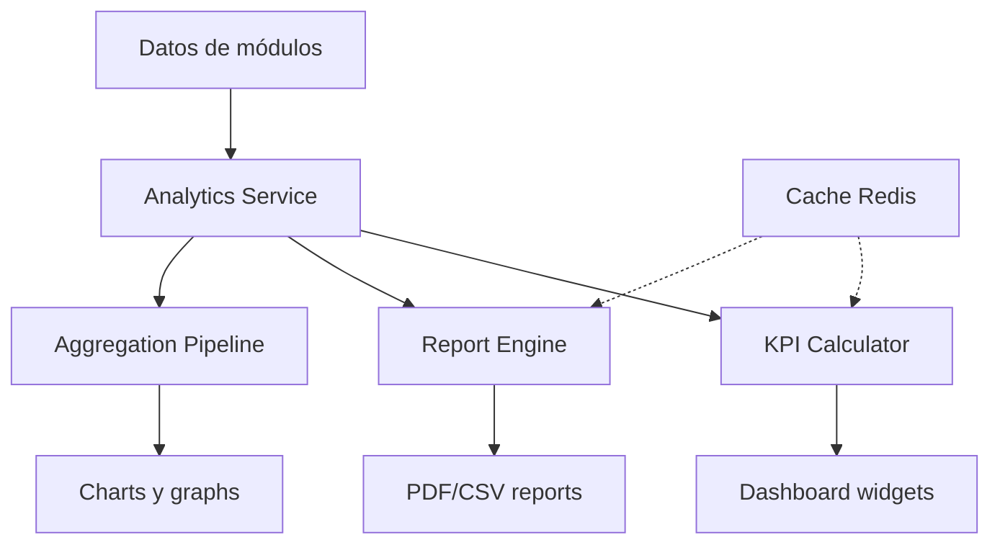

# 0019 — Analytics y Reportes

---

## 1. Descripción y Alcance

Motor de analytics: KPIs calculados, reportes predefinidos, dashboards configurables, exportación, y aggregation pipeline. Datos de todos los módulos.

---

## 2. Diagrama de Flujo



---

## 3. Pantallas

### 3.1 Analytics Dashboard

**Cards de KPIs**:
- Revenue (mes actual vs anterior)
- New Customers
- Conversion Rate
- Average Order Value
- Inventory Turnover

**Gráficos**:
- Revenue Trend (line chart)
- Sales by Category (pie chart)
- Top Products (bar chart)
- Customer Acquisition (line chart)

### 3.2 Reportes Predefinidos

| Reporte | Descripción |
|---------|-------------|
| Revenue by Period | Ingresos por día/semana/mes |
| Sales Report | Ventas detalladas |
| Customer Report | Clientes nuevos vs recurrentes |
| Inventory Report | Stock levels, rotación |
| Finance Report | Ingresos, egresos, balance |
| Product Performance | Top productos, menos vendidos |

### 3.3 Generador de Reportes

**Pasos**:
1. Seleccionar reporte
2. Configurar filtros (fecha, categoría, etc.)
3. Preview
4. Generar PDF o CSV
5. Descargar o enviar por email

### 3.4 Dashboard Configurable

**Widgets disponibles**:
- KPI Card
- Line Chart
- Bar Chart
- Pie Chart
- Table
- Trend Indicator

**Drag & drop** para reordenar widgets

---

## 4. Backend

### 4.1 Use Cases

#### CalculateKPIsUseCase
```typescript
class CalculateKPIsUseCase {
  async execute(organizationId: string, period: DateRange): Promise<KPIs> {
    const cacheKey = `kpis:${organizationId}:${period.start}:${period.end}`;
    const cached = await this.cache.get(cacheKey);
    if (cached) return cached;
    
    const [revenue, customers, orders, products] = await Promise.all([
      this.calculateRevenue(organizationId, period),
      this.calculateCustomers(organizationId, period),
      this.calculateOrders(organizationId, period),
      this.calculateProducts(organizationId, period)
    ]);
    
    const kpis = {
      revenue,
      customers,
      orders,
      products,
      conversionRate: orders.count / customers.new * 100,
      averageOrderValue: revenue.total / orders.count
    };
    
    await this.cache.set(cacheKey, kpis, 300); // 5 min cache
    return kpis;
  }
}
```

#### GenerateReportUseCase
```typescript
class GenerateReportUseCase {
  async execute(dto: GenerateReportDto): Promise<ReportResult> {
    // 1. Obtener configuración del reporte
    const reportConfig = this.reportRegistry.get(dto.reportType);
    
    // 2. Ejecutar query
    const data = await reportConfig.query(
      dto.organizationId, dto.filters
    );
    
    // 3. Formatear datos
    const formatted = reportConfig.format(data);
    
    // 4. Generar salida
    if (dto.format === 'pdf') {
      return this.pdfService.generate(reportConfig.template, formatted);
    } else {
      return this.csvService.generate(formatted);
    }
  }
}
```

---

## 5. Frontend

### 5.1 Components
- `AnalyticsDashboard` - Dashboard principal de analytics
- `KPICard` - Card de KPI individual
- `ChartWidget` - Wrapper para gráficos
- `ReportList` - Lista de reportes disponibles
- `ReportGenerator` - Generador de reportes
- `DashboardBuilder` - Constructor de dashboards
- `DateRangePicker` - Selector de rango de fechas
- `FilterPanel` - Panel de filtros

### 5.2 Hooks
```typescript
useAnalytics(period)       // GET /api/v1/analytics/dashboard
useKPIs(period)            // GET /api/v1/analytics/kpis
useReport(type, filters)   // POST /api/v1/analytics/reports
useCharts(period)          // GET /api/v1/analytics/charts
useDashboardConfig()       // GET /api/v1/analytics/dashboard-config
useUpdateDashboard()       // PATCH /api/v1/analytics/dashboard-config
```

---

## 6. API REST

```http
GET    /api/v1/analytics/dashboard        # Dashboard data
GET    /api/v1/analytics/kpis             # KPIs
POST   /api/v1/analytics/reports          # Generate report
GET    /api/v1/analytics/charts           # Chart data

GET    /api/v1/analytics/dashboard-config # Get dashboard config
PATCH  /api/v1/analytics/dashboard-config # Update dashboard config
```

---

## 7. Base de Datos

```sql
-- Cache de KPIs (opcional, puede ser Redis)
CREATE TABLE analytics_cache (
  id UUID PRIMARY KEY DEFAULT gen_random_uuid(),
  organization_id UUID NOT NULL REFERENCES organizations(id),
  cache_key VARCHAR(255) NOT NULL,
  data JSONB NOT NULL,
  expires_at TIMESTAMPTZ NOT NULL,
  created_at TIMESTAMPTZ DEFAULT NOW(),
  UNIQUE(organization_id, cache_key)
);

-- Configuración de dashboards por usuario
CREATE TABLE dashboard_configs (
  id UUID PRIMARY KEY DEFAULT gen_random_uuid(),
  user_id UUID NOT NULL REFERENCES users(id),
  organization_id UUID NOT NULL REFERENCES organizations(id),
  layout JSONB NOT NULL, -- widget positions and settings
  created_at TIMESTAMPTZ DEFAULT NOW(),
  updated_at TIMESTAMPTZ DEFAULT NOW(),
  UNIQUE(user_id, organization_id)
);
```

---

## 8. Eventos

```
ReportGenerated { reportId, type, organizationId, generatedBy }
DashboardUpdated { userId, organizationId }
```

---

## 9. Permisos

| Recurso | Acciones |
|---------|----------|
| `analytics` | read |
| `analytics.report` | read, create, export |
| `analytics.dashboard` | read, update |

---

## 10. Validaciones

### Report
- `reportType`: tipo válido del registry
- `filters`: según configuración del reporte
- `format`: 'pdf' | 'csv' | 'json'

### Dashboard
- `layout`: JSON válido con widgets
- Máximo 20 widgets por dashboard

---

## 11. Nova Tools

| Tool | Descripción | Risk Flag | Permiso |
|------|-------------|-----------|---------|
| `get_analytics` | Obtener analytics | - | `analytics.read` |
| `generate_report` | Generar reporte | - | `analytics.report.create` |
| `get_kpis` | Obtener KPIs | - | `analytics.read` |

---

## 12. Notificaciones

```
ReportGenerated → in-app al usuario que solicitó
ScheduledReport → email diario/semanal (configurable)
```

---

## 13. Auditoría

Generación de reportes se audita.

---

## 14. Criterios de Aceptación

### US-ANAL-01: Dashboard de analytics
```
Given un usuario con permisos
When accede a Analytics
Then ve KPIs del mes actual
Y gráficos de tendencia
Y datos actualizados (cache 5min)
```

### US-ANAL-02: Generar reporte
```
Given ventas del último trimestre
When genera reporte de ventas
Then puede filtrar por categoría
Y exportar a PDF o CSV
```

### US-ANAL-03: Dashboard configurable
```
Given un usuario
When reordena widgets en el dashboard
Then la configuración se guarda
Y la próxima vez ve el mismo layout
```

---

## 15. Dependencias

| Módulo | Relación |
|--------|----------|
| Sales (010) | Datos de ventas |
| CRM (009) | Datos de clientes |
| Inventory (011) | Datos de inventario |
| Finance (017) | Datos financieros |

---

## 16. Checklist

- [ ] KPI Calculator
- [ ] Report Engine
- [ ] Aggregation Pipeline
- [ ] Report registry (extensible)
- [ ] PDF generation
- [ ] CSV export
- [ ] Cache layer (Redis)
- [ ] Dashboard config CRUD
- [ ] Dashboard builder (drag & drop)
- [ ] Charts integration
- [ ] Date range picker
- [ ] Filter panel
- [ ] Permission guards
- [ ] Nova tools
- [ ] Responsive mobile
