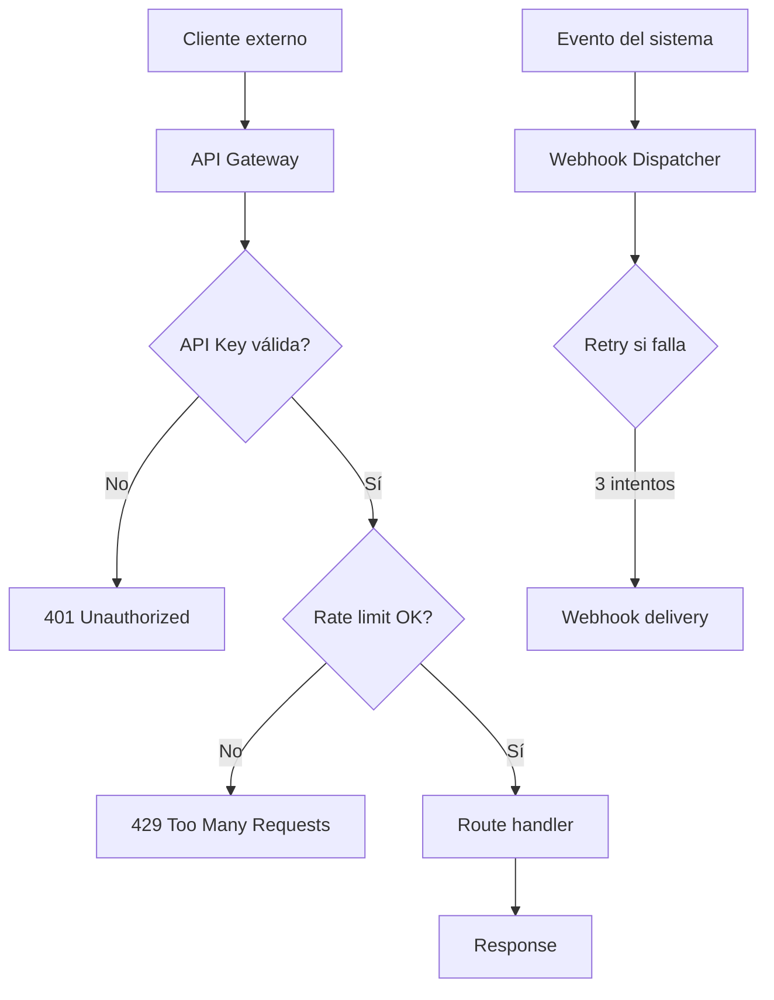

# 0020 — API Pública (REST + Webhooks)

---

## 1. Descripción y Alcance

API pública para integraciones externas: REST API versionada, autenticación API Keys, rate limiting, webhooks para eventos, documentación OpenAPI, y portal de developer.

---

## 2. Diagrama de Flujo



---

## 3. Pantallas

### 3.1 Developer Portal

**Dashboard**: API keys activas, Uso este mes, Webhooks activos
**Docs**: OpenAPI spec interactiva (Swagger UI)
**Keys**: Crear/revocar API keys
**Webhooks**: Configurar endpoints y eventos

### 3.2 API Keys

**Tabla**: Nombre, Key (máscara), Permisos, Último uso, Acciones
**Crear**: Nombre, Permisos (checkboxes), Expiración (opcional)
**Detalle**: Key completa (solo al crear), Logs de uso

### 3.3 Webhooks

**Tabla**: URL, Eventos suscritos, Estado, Último envío, Acciones
**Crear/Editar**:
- URL del endpoint
- Eventos a suscribir (checkboxes)
- Secret para firmas
- Activo/inactivo

**Logs**: Cada delivery con request/response, estado, reintentos

---

## 4. Backend

### 4.1 API Key Authentication

```typescript
@Injectable()
export class ApiKeyGuard implements CanActivate {
  async canActivate(context: ExecutionContext): Promise<boolean> {
    const request = context.switchToHttp().getRequest();
    const apiKey = request.headers['x-api-key'];
    
    if (!apiKey) throw new UnauthorizedException('API key required');
    
    const key = await this.apiKeyService.validate(apiKey);
    if (!key) throw new UnauthorizedException('Invalid API key');
    
    // Rate limiting
    await this.rateLimiter.check(key.organizationId);
    
    // Attach to request
    request.apiKey = key;
    request.user = { org: key.organizationId, role: 'api' };
    
    return true;
  }
}
```

### 4.2 Webhook Dispatcher

```typescript
class WebhookDispatcher {
  async dispatch(event: DomainEvent): Promise<void> {
    const subscriptions = await this.webhookRepository.findByEvent(
      event.organizationId, event.type
    );
    
    for (const sub of subscriptions) {
      await this.webhookQueue.add('deliver-webhook', {
        webhookId: sub.id,
        url: sub.url,
        secret: sub.secret,
        event: {
          type: event.type,
          data: event.data,
          timestamp: new Date().toISOString()
        }
      }, {
        attempts: 3,
        backoff: { type: 'exponential', delay: 5000 }
      });
    }
  }
}

// Webhook delivery con firma HMAC
async function deliverWebhook(job: WebhookJob): Promise<void> {
  const signature = createHmac('sha256', job.secret)
    .update(JSON.stringify(job.event))
    .digest('hex');
  
  await fetch(job.url, {
    method: 'POST',
    headers: {
      'Content-Type': 'application/json',
      'X-Nexora-Signature': `sha256=${signature}`,
      'X-Nexora-Timestamp': job.event.timestamp
    },
    body: JSON.stringify(job.event)
  });
}
```

### 4.3 Rate Limiting

```typescript
class RateLimiter {
  async check(organizationId: string): Promise<void> {
    const plan = await this.planService.get(organizationId);
    const limits = {
      free: { requests: 100, window: 60 }, // 100/min
      pro: { requests: 1000, window: 60 },
      enterprise: { requests: 10000, window: 60 }
    };
    
    const key = `ratelimit:${organizationId}`;
    const current = await this.redis.incr(key);
    
    if (current === 1) {
      await this.redis.expire(key, limits[plan].window);
    }
    
    if (current > limits[plan].requests) {
      throw new HttpException('Rate limit exceeded', 429);
    }
  }
}
```

---

## 5. Frontend

### 5.1 Components
- `ApiKeyList` - Lista de API keys
- `ApiKeyCreate` - Formulario de creación
- `WebhookList` - Lista de webhooks
- `WebhookForm` - Formulario de webhook
- `WebhookLogs` - Logs de delivery
- `ApiDocs` - Swagger UI embed
- `UsageChart` - Gráfico de uso

### 5.2 Hooks
```typescript
useApiKeys()           // GET /api/v1/api-keys
useCreateApiKey()      // POST /api/v1/api-keys
useRevokeApiKey()      // DELETE /api/v1/api-keys/:id
useWebhooks()          // GET /api/v1/webhooks
useCreateWebhook()     // POST /api/v1/webhooks
useWebhookLogs()       // GET /api/v1/webhooks/:id/logs
useApiUsage()          // GET /api/v1/api-usage
```

---

## 6. API REST (API pública v1)

```http
# Autenticación: X-API-Key header

# CRM
GET    /api/v1/crm/contacts              # List contacts
POST   /api/v1/crm/contacts              # Create contact
GET    /api/v1/crm/contacts/:id          # Get contact
PATCH  /api/v1/crm/contacts/:id          # Update contact

GET    /api/v1/crm/leads                 # List leads
POST   /api/v1/crm/leads                 # Create lead

# Sales
GET    /api/v1/sales/invoices            # List invoices
POST   /api/v1/sales/invoices            # Create invoice
GET    /api/v1/sales/invoices/:id        # Get invoice

# Inventory
GET    /api/v1/inventory/products        # List products
GET    /api/v1/inventory/stock           # Stock levels

# Webhooks
POST   /api/v1/webhooks                  # Create webhook
GET    /api/v1/webhooks                  # List webhooks
DELETE /api/v1/webhooks/:id              # Delete webhook

# API Keys
POST   /api/v1/api-keys                  # Create API key
GET    /api/v1/api-keys                  # List API keys
DELETE /api/v1/api-keys/:id              # Revoke API key
```

---

## 7. Base de Datos

```sql
CREATE TABLE api_keys (
  id UUID PRIMARY KEY DEFAULT gen_random_uuid(),
  organization_id UUID NOT NULL REFERENCES organizations(id),
  name VARCHAR(100) NOT NULL,
  key_hash VARCHAR(255) NOT NULL UNIQUE,
  key_prefix VARCHAR(10) NOT NULL, -- para mostrar: "nex_live_abc..."
  permissions JSONB NOT NULL DEFAULT '["read"]',
  expires_at TIMESTAMPTZ,
  last_used_at TIMESTAMPTZ,
  is_active BOOLEAN DEFAULT true,
  created_at TIMESTAMPTZ DEFAULT NOW()
);

CREATE TABLE webhooks (
  id UUID PRIMARY KEY DEFAULT gen_random_uuid(),
  organization_id UUID NOT NULL REFERENCES organizations(id),
  url VARCHAR(500) NOT NULL,
  secret VARCHAR(255) NOT NULL,
  events TEXT[] NOT NULL, -- ['invoice.created', 'payment.received']
  is_active BOOLEAN DEFAULT true,
  created_at TIMESTAMPTZ DEFAULT NOW()
);

CREATE TABLE webhook_deliveries (
  id UUID PRIMARY KEY DEFAULT gen_random_uuid(),
  webhook_id UUID NOT NULL REFERENCES webhooks(id),
  event_type VARCHAR(100) NOT NULL,
  status VARCHAR(20) NOT NULL, -- 'success' | 'failed' | 'pending'
  request_body JSONB,
  response_status INTEGER,
  response_body TEXT,
  attempts INTEGER DEFAULT 0,
  created_at TIMESTAMPTZ DEFAULT NOW()
);

CREATE TABLE api_usage (
  id UUID PRIMARY KEY DEFAULT gen_random_uuid(),
  organization_id UUID NOT NULL REFERENCES organizations_id,
  api_key_id UUID REFERENCES api_keys(id),
  endpoint VARCHAR(200) NOT NULL,
  method VARCHAR(10) NOT NULL,
  status_code INTEGER NOT NULL,
  response_time_ms INTEGER,
  created_at TIMESTAMPTZ DEFAULT NOW()
);
```

---

## 8. Eventos (Webhooks disponibles)

```
invoice.created
invoice.paid
invoice.voided
payment.received
order.created
order.delivered
product.created
stock.updated
contact.created
lead.converted
```

---

## 9. Permisos

| Recurso | Acciones |
|---------|----------|
| `api_key` | create, read, delete |
| `webhook` | create, read, update, delete |

---

## 10. Validaciones

### API Key
- `name`: obligatorio, 1-100 chars
- `permissions`: array de permisos válidos
- `expires_at`: fecha futura (opcional)

### Webhook
- `url`: URL válida, HTTPS
- `events`: al menos 1 evento
- `secret`: mínimo 32 caracteres

---

## 11. Nova Tools

Nova NO accede a la API pública (son para clientes externos).

---

## 12. Notificaciones

```
WebhookDeliveryFailed → email al admin de la organización
ApiKeyExpiringSoon → in-app (7 días antes)
```

---

## 13. Auditoría

Uso de API keys se audita (endpoint, timestamp, IP).

---

## 14. Criterios de Aceptación

### US-API-01: Autenticación con API key
```
Given un API key activo
When envía request con X-API-Key header
Then se autentica correctamente
Y la request se procesa
```

### US-API-02: Rate limiting
```
Given plan free (100 req/min)
When envía 101 requests en 1 minuto
Then recibe 429 Too Many Requests
```

### US-API-03: Webhook delivery
```
Given webhook suscrito a 'invoice.created'
When se crea una factura
Then se envía POST a la URL configurada
Con firma HMAC en X-Nexora-Signature
Y se reintenta 3 veces si falla
```

---

## 15. Dependencias

| Módulo | Relación |
|--------|----------|
| Todos | Eventos para webhooks |
| Auth (004) | API key validation |

---

## 16. Checklist

- [ ] API Key generation y validation
- [ ] Rate limiting por plan
- [ ] Webhook dispatcher
- [ ] Webhook delivery con firma HMAC
- [ ] Retry logic (3 intentos)
- [ ] API usage tracking
- [ ] OpenAPI/Swagger documentation
- [ ] Developer portal
- [ ] API key rotation
- [ ] Webhook logs
- [ ] Permission guards
- [ ] Responsive mobile
