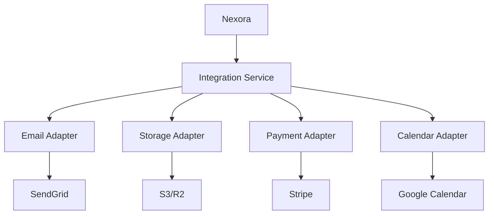

# 0021 — Integraciones Externas

---

## 1. Descripción y Alcance

Conectores para servicios externos: Email (SendGrid), Storage (S3/R2), Payment Gateways (Stripe), Accounting (QuickBooks), y Calendar (Google). Patrón de adaptador para cada integración.

---

## 2. Diagrama de Flujo



---

## 3. Pantallas

### 3.1 Panel de Integraciones

**Cards de integraciones disponibles**:
- Email (SendGrid) - ✅ Conectado
- Storage (S3) - ✅ Conectado
- Payments (Stripe) - ⚠️ Pendiente
- Calendar (Google) - ❌ No conectado

**Cada card**: Estado, Última sync, Configurar

### 3.2 Configurar Integración

**Formulario dinámico** según integración:
- Email: API Key, From Email, From Name
- Storage: Bucket, Region, Access Key, Secret Key
- Payments: Stripe Secret Key, Webhook Secret
- Calendar: OAuth2 connect

### 3.3 Logs de Integración

**Tabla**: Integración, Evento, Estado, Timestamp, Detalles
**Filtros**: Integración, Estado, Rango de fechas

---

## 4. Backend

### 4.1 Integration Service

```typescript
class IntegrationService {
  private adapters: Map<string, IntegrationAdapter> = new Map();
  
  constructor() {
    this.adapters.set('email', new SendGridAdapter());
    this.adapters.set('storage', new S3Adapter());
    this.adapters.set('payments', new StripeAdapter());
    this.adapters.set('calendar', new GoogleCalendarAdapter());
  }
  
  async execute(integration: string, action: string, params: any) {
    const adapter = this.adapters.get(integration);
    if (!adapter) throw new Error('Integration not found');
    
    const config = await this.getConfig(integration);
    return adapter.execute(action, params, config);
  }
}
```

### 4.2 Adapters

```typescript
interface IntegrationAdapter {
  name: string;
  actions: string[];
  execute(action: string, params: any, config: any): Promise<any>;
  validate(config: any): boolean;
}

class SendGridAdapter implements IntegrationAdapter {
  name = 'email';
  actions = ['send_email', 'send_template'];
  
  async execute(action: string, params: any, config: any) {
    const sg = require('@sendgrid/mail');
    sg.setApiKey(config.apiKey);
    
    if (action === 'send_email') {
      return sg.send({
        to: params.to,
        from: config.fromEmail,
        subject: params.subject,
        html: params.html
      });
    }
  }
}

class StripeAdapter implements IntegrationAdapter {
  name = 'payments';
  actions = ['create_payment', 'create_subscription', 'webhook'];
  
  async execute(action: string, params: any, config: any) {
    const stripe = require('stripe')(config.secretKey);
    
    if (action === 'create_payment') {
      return stripe.paymentIntents.create({
        amount: params.amount,
        currency: params.currency,
        metadata: params.metadata
      });
    }
  }
}
```

---

## 5. Frontend

### 5.1 Components
- `IntegrationList` - Lista de integraciones
- `IntegrationCard` - Card de integración
- `IntegrationConfig` - Formulario de configuración
- `IntegrationLogs` - Logs de integración
- `OAuthConnect` - Botón de conexión OAuth

### 5.2 Hooks
```typescript
useIntegrations()           // GET /api/v1/integrations
useIntegrationConfig()      // GET /api/v1/integrations/:type
useUpdateIntegration()      // PATCH /api/v1/integrations/:type
useTestIntegration()        // POST /api/v1/integrations/:type/test
useIntegrationLogs()        // GET /api/v1/integrations/:type/logs
```

---

## 6. API REST

```http
GET    /api/v1/integrations               # List integrations
GET    /api/v1/integrations/:type         # Get config
PATCH  /api/v1/integrations/:type         # Update config
POST   /api/v1/integrations/:type/test    # Test connection
GET    /api/v1/integrations/:type/logs    # Get logs

# OAuth callbacks
GET    /api/v1/integrations/oauth/callback # OAuth callback
```

---

## 7. Base de Datos

```sql
CREATE TABLE integrations (
  id UUID PRIMARY KEY DEFAULT gen_random_uuid(),
  organization_id UUID NOT NULL REFERENCES organizations(id),
  type VARCHAR(50) NOT NULL, -- 'email' | 'storage' | 'payments' | 'calendar'
  config JSONB NOT NULL, -- encrypted config
  status VARCHAR(20) DEFAULT 'pending',
  last_sync_at TIMESTAMPTZ,
  created_at TIMESTAMPTZ DEFAULT NOW(),
  UNIQUE(organization_id, type)
);

CREATE TABLE integration_logs (
  id UUID PRIMARY KEY DEFAULT gen_random_uuid(),
  integration_id UUID NOT NULL REFERENCES integrations(id),
  action VARCHAR(100) NOT NULL,
  status VARCHAR(20) NOT NULL,
  request JSONB,
  response JSONB,
  error TEXT,
  created_at TIMESTAMPTZ DEFAULT NOW()
);
```

---

## 8. Eventos

```
IntegrationConnected { integrationId, type, organizationId }
IntegrationDisconnected { integrationId, type, organizationId }
IntegrationFailed { integrationId, type, error, organizationId }
```

---

## 9. Permisos

| Recurso | Acciones |
|---------|----------|
| `integration` | read, update |
| `integration.admin` | connect, disconnect |

Solo Owner/Admin pueden conectar/desconectar integraciones.

---

## 10. Validaciones

### Config
- Validación específica por integración
- API keys se almacenan encriptadas
- Test connection antes de guardar

---

## 11. Nova Tools

| Tool | Descripción | Risk Flag | Permiso |
|------|-------------|-----------|---------|
| `check_integration` | Ver estado de integración | - | `integration.read` |

---

## 12. Notificaciones

```
IntegrationFailed → email al admin
IntegrationReconnected → in-app al admin
```

---

## 13. Auditoría

Conexiones/desconexiones de integraciones se auditan.

---

## 14. Criterios de Aceptación

### US-INT-01: Conectar SendGrid
```
Given un admin con API key de SendGrid
When configura la integración de email
Then se valida la conexión
Y se guarda la config encriptada
Y puede enviar emails
```

### US-INT-02: Conectar Stripe
```
Given un admin con Stripe keys
When configura la integración de pagos
Then se valida la conexión
Y puede procesar pagos
```

---

## 15. Dependencias

| Módulo | Relación |
|--------|----------|
| Notifications (012) | Envío de emails |
| Finance (017) | Procesamiento de pagos |
| Documents (018) | Almacenamiento |

---

## 16. Checklist

- [ ] Integration adapter pattern
- [ ] SendGrid adapter
- [ ] S3/R2 adapter
- [ ] Stripe adapter
- [ ] Google Calendar adapter
- [ ] Config encryption
- [ ] Test connection
- [ ] OAuth2 flow
- [ ] Integration logs
- [ ] Error handling
- [ ] Permission guards
- [ ] Responsive mobile
