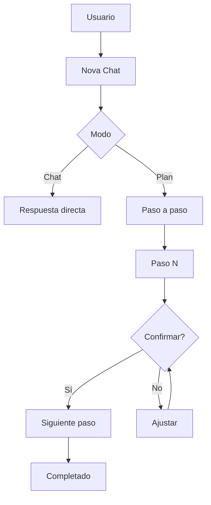

# 0022 — Nova Avanzado

---

## 1. Descripción y Alcance

Funcionalidades avanzadas de Nova: Plan Mode (ejecución paso a paso con confirmación), Nova Skills (plugins instalables por la organización), Analytics de uso de IA, y Conversation History.

---

## 2. Diagrama de Flujo



---

## 3. Pantallas

### 3.1 Plan Mode

**Visualización de pasos**:
- Paso completado: check verde
- Paso en proceso: spinner
- Paso pendiente: gris
- Controles: Confirmar, Ajustar, Cancelar

### 3.2 Skills Panel

**Skills disponibles**:
| Skill | Descripción | Estado |
|-------|-------------|--------|
| Sales Analyzer | Análisis profundo de ventas | Instalado |
| Email Composer | Emails profesionales | Instalado |
| Report Builder | Reportes personalizados | No instalado |

### 3.3 Analytics de Nova

**Métricas**: Consultas totales, Tools ejecutados, Tasa de éxito, Tiempo promedio, Errores, Ahorro estimado

---

## 4. Backend

### 4.1 Plan Mode Service

```typescript
class PlanModeService {
  async createPlan(dto: CreatePlanDto): Promise<Plan> {
    const plan = await this.llmService.generatePlan(dto.message, dto.context);
    return this.planRepository.create({
      userId: dto.userId,
      organizationId: dto.organizationId,
      steps: plan.steps,
      status: 'pending_confirmation'
    });
  }

  async executeStep(planId: string, stepIndex: number): Promise<StepResult> {
    const plan = await this.planRepository.findById(planId);
    const step = plan.steps[stepIndex];
    const result = await this.toolRegistry.execute(step.tool, step.params, plan.organizationId);
    plan.steps[stepIndex].status = 'completed';
    plan.steps[stepIndex].result = result;
    await this.planRepository.update(plan);
    return result;
  }
}
```

### 4.2 Nova Skills Service

```typescript
class NovaSkillsService {
  async installSkill(skillId: string, organizationId: string): Promise<void> {
    const skill = await this.skillRepository.findById(skillId);
    if (skill.requiredPermissions.length > 0) {
      await this.permissionService.checkMultiple(organizationId, skill.requiredPermissions);
    }
    await this.orgSkillRepository.create({ skillId, organizationId });
  }

  async executeSkill(skillId: string, params: any, organizationId: string) {
    const skill = await this.skillRepository.findById(skillId);
    return this.llmService.executeWithSkill(skill, params, organizationId);
  }
}
```

---

## 5. Frontend

### 5.1 Components
- `NovaChatEnhanced` - Chat con modos
- `PlanModeView` - Visualización de plan
- `PlanStepCard` - Card de paso
- `PlanControls` - Controles del plan
- `SkillsPanel` - Panel de skills
- `SkillCard` - Card de skill
- `NovaAnalytics` - Dashboard de analytics
- `ConversationHistory` - Historial

### 5.2 Hooks
```typescript
useNovaChat()
useNovaPlan()
useExecutePlanStep()
useConfirmPlanStep()
useNovaSkills()
useInstallSkill()
useNovaAnalytics()
useConversationHistory()
```

---

## 6. API REST

```http
POST   /api/v1/nova/plans
GET    /api/v1/nova/plans/:id
POST   /api/v1/nova/plans/:id/execute/:step
POST   /api/v1/nova/plans/:id/confirm/:step
POST   /api/v1/nova/plans/:id/cancel

GET    /api/v1/nova/skills
POST   /api/v1/nova/skills/:id/install
DELETE /api/v1/nova/skills/:id/uninstall
POST   /api/v1/nova/skills/:id/execute

GET    /api/v1/nova/analytics
GET    /api/v1/nova/conversations
```

---

## 7. Base de Datos

```sql
CREATE TABLE nova_plans (
  id UUID PRIMARY KEY DEFAULT gen_random_uuid(),
  user_id UUID NOT NULL REFERENCES users(id),
  organization_id UUID NOT NULL REFERENCES organizations(id),
  title VARCHAR(255),
  steps JSONB NOT NULL,
  status VARCHAR(30) DEFAULT 'pending_confirmation',
  created_at TIMESTAMPTZ DEFAULT NOW(),
  completed_at TIMESTAMPTZ
);

CREATE TABLE nova_skills (
  id UUID PRIMARY KEY DEFAULT gen_random_uuid(),
  name VARCHAR(100) NOT NULL UNIQUE,
  description TEXT NOT NULL,
  required_permissions TEXT[],
  prompt_template TEXT NOT NULL,
  tools JSONB,
  is_system BOOLEAN DEFAULT false,
  created_at TIMESTAMPTZ DEFAULT NOW()
);

CREATE TABLE nova_org_skills (
  id UUID PRIMARY KEY DEFAULT gen_random_uuid(),
  organization_id UUID NOT NULL REFERENCES organizations(id),
  skill_id UUID NOT NULL REFERENCES nova_skills(id),
  installed_at TIMESTAMPTZ DEFAULT NOW(),
  UNIQUE(organization_id, skill_id)
);

CREATE TABLE nova_analytics (
  id UUID PRIMARY KEY DEFAULT gen_random_uuid(),
  organization_id UUID NOT NULL REFERENCES organizations(id),
  user_id UUID REFERENCES users(id),
  event_type VARCHAR(50) NOT NULL,
  tool_name VARCHAR(100),
  success BOOLEAN,
  response_time_ms INTEGER,
  tokens_used INTEGER,
  created_at TIMESTAMPTZ DEFAULT NOW()
);
```

---

## 8. Eventos

```
PlanCreated { planId, userId, stepCount }
PlanStepExecuted { planId, stepIndex, toolName, success }
PlanCompleted { planId, organizationId }
SkillInstalled { skillId, organizationId }
```

---

## 9. Permisos

| Recurso | Acciones |
|---------|----------|
| `nova.chat` | use |
| `nova.plan` | create, execute, cancel |
| `nova.skill` | read, install, uninstall |

---

## 10. Validaciones

### Plan
- `steps`: al menos 1 paso
- Cada paso: tool, params, description

### Skills
- Verificar permisos antes de instalar
- Skills del sistema no se desinstalan

---

## 11. Nova Tools (Meta)

| Tool | Descripción | Risk Flag | Permiso |
|------|-------------|-----------|---------|
| `create_plan` | Crear plan paso a paso | - | `nova.plan.create` |
| `execute_plan_step` | Ejecutar paso | medium | `nova.plan.execute` |
| `install_skill` | Instalar skill | low | `nova.skill.install` |

---

## 12. Notificaciones

```
PlanCompleted -> in-app al usuario
PlanFailed -> in-app con error
```

---

## 13. Auditoria

Uso de Nova se audita (queries, tools, tokens).

---

## 14. Criterios de Aceptacion

### US-NOVA-01: Plan mode
```
Given usuario pide crear campana de marketing
When Nova genera un plan de 5 pasos
Then ve los pasos numerados con estado
And puede confirmar o ajustar cada paso
And se ejecuta secuencialmente
```

### US-NOVA-02: Skills
```
Given organizacion instala Sales Analyzer
When usuario consulta metricas de ventas
Then Nova usa el skill instalado
And提供 analisis mas profundo
```

---

## 15. Dependencias

| Modulo | Relacion |
|--------|----------|
| Nova (008) | Base de Nova |
| Todos | Analytics de uso |

---

## 16. Checklist

- [ ] Plan mode CRUD
- [ ] Plan step execution
- [ ] Plan confirmation flow
- [ ] Skills registry
- [ ] Skills install/uninstall
- [ ] Skills execution
- [ ] Analytics tracking
- [ ] Conversation history
- [ ] Permission guards
- [ ] Responsive mobile
