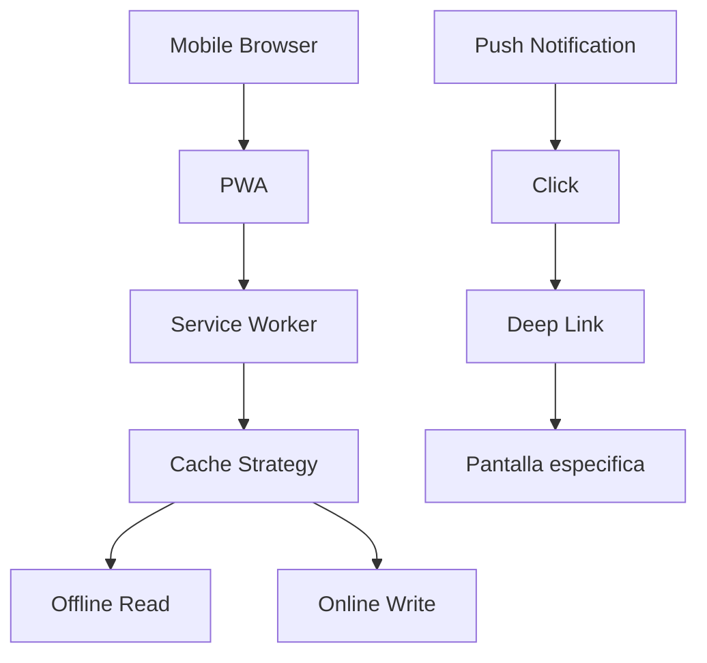

# 0023 — Mobile Experience

---

## 1. Descripción y Alcance

Experiencia mobile-first: PWA completa, responsive design, bottom navigation, gesture support, push notifications, offline capability para consultas, y mobile-optimized forms.

---

## 2. Diagrama de Flujo



---

## 3. Pantallas

### 3.1 Bottom Navigation

```
┌─────────────────────────────────┐
│                                 │
│         [Content Area]          │
│                                 │
├─────────────────────────────────┤
│ 🏠     📊     ➕     💬     👤  │
│ Home  Dash   Nova   Chat  Perfil│
└─────────────────────────────────┘
```

### 3.2 Mobile Dashboard

**Cards compactas** en scroll vertical
**Charts**: Touch-friendly, swipe para ver mas datos
**Quick actions**: Botones grandes para acciones frecuentes

### 3.3 Mobile Forms

**Inputs**: Full-width, touch-friendly (min 44px tap target)
**Selects**: Bottom sheets en vez de dropdowns
**Date pickers**: Native mobile pickers
**Submit**: Botones fijos en bottom

### 3.4 Mobile Nova

**Chat**: Full-screen, keyboard-aware
**Voice input**: Boton de microfono
**Plan mode**: Stepper vertical compacto

---

## 4. Backend

### 4.1 PWA Configuration

```json
{
  "name": "Nexora",
  "short_name": "Nexora",
  "start_url": "/dashboard",
  "display": "standalone",
  "background_color": "#0a0a0f",
  "theme_color": "#3b82f6",
  "icons": [
    { "src": "/icons/192.png", "sizes": "192x192", "type": "image/png" },
    { "src": "/icons/512.png", "sizes": "512x512", "type": "image/png" }
  ]
}
```

### 4.2 Service Worker

```typescript
// Cache strategy
const CACHE_STRATEGIES = {
  api: 'network-first',
  static: 'cache-first',
  images: 'cache-first',
  fonts: 'cache-first'
};

// Offline support
self.addEventListener('fetch', (event) => {
  if (event.request.url.includes('/api/')) {
    // API: network first, fallback to cache
    event.respondWith(
      fetch(event.request).catch(() => caches.match(event.request))
    );
  } else {
    // Static: cache first
    event.respondWith(
      caches.match(event.request).then(r => r || fetch(event.request))
    );
  }
});
```

---

## 5. Frontend

### 5.1 Components
- `MobileNav` - Bottom navigation bar
- `MobileLayout` - Layout mobile-optimized
- `MobileCard` - Card compacta
- `MobileForm` - Formulario mobile
- `MobileSheet` - Bottom sheet
- `MobileDatePicker` - Date picker nativo
- `MobilePullToRefresh` - Pull to refresh
- `MobileInfiniteScroll` - Infinite scroll
- `MobileGesture` - Gesture handler
- `OfflineIndicator` - Indicador de offline

### 5.2 Hooks
```typescript
useMobileDetect()        // Detectar dispositivo
useOnlineStatus()        // Estado de conexion
usePushNotifications()   // Push notifications
useInstallPrompt()       // Prompt de instalacion PWA
usePullToRefresh()       // Pull to refresh
useInfiniteScroll()      // Infinite scroll
useSwipeGesture()        // Swipe gestures
```

---

## 6. API REST

No endpoints adicionales. El frontend maneja PWA y offline.

---

## 7. Base de Datos

No requiere tablas adicionales.

---

## 8. Eventos

```
PushNotificationSent { userId, title, body, deepLink }
AppInstalled { userId, organizationId, platform }
```

---

## 9. Permisos

Sin permisos adicionales.

---

## 10. Validaciones

### PWA
- Service worker registrado
- Manifest válido
- Icons correctos

### Mobile UX
- Tap targets minimos 44x44px
- Font size minimo 16px
- Spacing generoso
- Animaciones suaves (60fps)

---

## 11. Nova Tools

| Tool | Descripción | Risk Flag | Permiso |
|------|-------------|-----------|---------|
| `voice_input` | Entrada por voz | - | `nova.chat.use` |

---

## 12. Notificaciones

```
PushNotification -> dispositivo movil
DeepLink -> pantalla especifica
```

---

## 13. Auditoria

Instalaciones de PWA se auditan.

---

## 14. Criterios de Aceptacion

### US-MOB-01: PWA install
```
Given usuario en mobile browser
When visita la app
Then ve prompt de instalacion
And al instalar, app aparece en home screen
And abre en modo standalone
```

### US-MOB-02: Offline read
```
Given usuario sin conexion
When accede a dashboard
Then ve datos cacheados
And indicador de offline
And datos se actualizan al reconectar
```

### US-MOB-03: Mobile navigation
```
Given usuario en mobile
When navega por la app
Then bottom navigation siempre visible
And transiciones suaves
And pull to refresh funciona
```

---

## 15. Dependencias

| Modulo | Relacion |
|--------|----------|
| Dashboard (007) | Mobile dashboard |
| Nova (008) | Mobile chat |
| Notifications (012) | Push notifications |

---

## 16. Checklist

- [ ] PWA manifest
- [ ] Service worker
- [ ] Offline caching
- [ ] Bottom navigation
- [ ] Mobile-optimized layouts
- [ ] Touch-friendly forms
- [ ] Bottom sheets
- [ ] Pull to refresh
- [ ] Infinite scroll
- [ ] Push notifications
- [ ] Deep linking
- [ ] Gesture support
- [ ] Dark mode mobile
- [ ] Performance optimization
