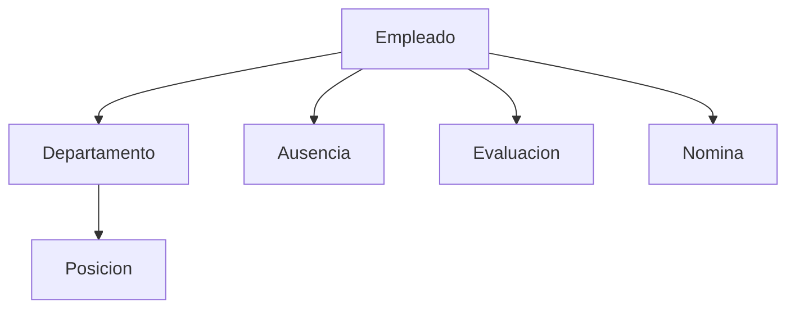

# 0024 — Recursos Humanos (HR)

---

## 1. Descripción y Alcance

Gestion de talento: Employees, Departments, Positions, Nomina basica, Ausencias, y Evaluaciones simples.

---

## 2. Diagrama de Flujo



---

## 3. Pantallas

### 3.1 Lista de Empleados

**Tabla**: Nombre, Departamento, Posicion, Estado, Fecha ingreso, Acciones
**Filtros**: Departamento, Estado, Busqueda

### 3.2 Crear Empleado

**Formulario**: Nombre, Email, Telefono, Departamento, Posicion, Fecha ingreso, Salario, Tipo contrato

### 3.3 Perfil del Empleado

**Secciones**: Info personal, Departamento, Historial de ausencias, Evaluaciones, Documentos

### 3.4 Ausencias

**Calendario**: Vista mensual con ausencias
**Solicitar**: Tipo (vacaciones/permiso/enfermedad), Fechas, Notas
**Aprobar/Rechazar**: Manager

### 3.5 Evaluaciones

**Periodo**: Trimestral/Anual
**Formulario**: Autoevaluacion + Manager
**Metricas**: Productividad, Trabajo en equipo, Comunicacion

---

## 4. Backend

### 4.1 Use Cases

```typescript
class CreateEmployeeUseCase {
  async execute(dto: CreateEmployeeDto, userId: string): Promise<Employee> {
    // 1. Validar email unico
    const existing = await this.employeeRepository.findByEmail(dto.email);
    if (existing) throw ErrorFactory.hr('HR_001');

    // 2. Crear employee
    const employee = await this.employeeRepository.create({
      ...dto,
      organizationId: dto.organizationId,
      createdBy: userId
    });

    // 3. Asignar rol de employee al usuario
    await this.roleService.assignRole(dto.userId, 'employee', dto.organizationId);

    // 4. Audit + Event
    return employee;
  }
}

class RequestAbsenceUseCase {
  async execute(dto: RequestAbsenceDto, userId: string): Promise<Absence> {
    // 1. Validar fechas
    if (dto.startDate > dto.endDate) throw ErrorFactory.hr('HR_003');

    // 2. Verificar balance de vacaciones
    if (dto.type === 'vacation') {
      const balance = await this.getVacationBalance(userId, dto.organizationId);
      const days = differenceInDays(dto.endDate, dto.startDate);
      if (balance < days) throw ErrorFactory.hr('HR_004');
    }

    // 3. Crear ausencia pendiente
    return this.absenceRepository.create({
      employeeId: dto.employeeId,
      type: dto.type,
      startDate: dto.startDate,
      endDate: dto.endDate,
      notes: dto.notes,
      status: 'pending'
    });
  }
}
```

---

## 5. Frontend

### 5.1 Components
- `EmployeeList` - Lista de empleados
- `EmployeeForm` - Formulario crear/editar
- `EmployeeProfile` - Perfil completo
- `DepartmentList` - Lista de departamentos
- `AbsenceCalendar` - Calendario de ausencias
- `AbsenceForm` - Solicitar ausencia
- `EvaluationForm` - Formulario de evaluacion
- `PayrollSummary` - Resumen de nomina

### 5.2 Hooks
```typescript
useEmployees()
useCreateEmployee()
useUpdateEmployee()
useDepartments()
useAbsences()
useRequestAbsence()
useApproveAbsence()
useEvaluations()
```

---

## 6. API REST

```http
POST   /api/v1/hr/employees
GET    /api/v1/hr/employees
GET    /api/v1/hr/employees/:id
PATCH  /api/v1/hr/employees/:id

POST   /api/v1/hr/departments
GET    /api/v1/hr/departments

POST   /api/v1/hr/absences
GET    /api/v1/hr/absences
PATCH  /api/v1/hr/absences/:id/approve
PATCH  /api/v1/hr/absences/:id/reject

POST   /api/v1/hr/evaluations
GET    /api/v1/hr/evaluations
```

---

## 7. Base de Datos

```sql
CREATE TABLE departments (
  id UUID PRIMARY KEY DEFAULT gen_random_uuid(),
  organization_id UUID NOT NULL REFERENCES organizations(id),
  name VARCHAR(100) NOT NULL,
  manager_id UUID REFERENCES employees(id),
  created_at TIMESTAMPTZ DEFAULT NOW()
);

CREATE TABLE positions (
  id UUID PRIMARY KEY DEFAULT gen_random_uuid(),
  organization_id UUID NOT NULL REFERENCES organizations(id),
  name VARCHAR(100) NOT NULL,
  department_id UUID REFERENCES departments(id),
  created_at TIMESTAMPTZ DEFAULT NOW()
);

CREATE TABLE employees (
  id UUID PRIMARY KEY DEFAULT gen_random_uuid(),
  organization_id UUID NOT NULL REFERENCES organizations(id),
  user_id UUID REFERENCES users(id),
  first_name VARCHAR(100) NOT NULL,
  last_name VARCHAR(100) NOT NULL,
  email VARCHAR(255) NOT NULL,
  phone VARCHAR(50),
  department_id UUID REFERENCES departments(id),
  position_id UUID REFERENCES positions(id),
  hire_date DATE NOT NULL,
  salary BIGINT, -- cents
  contract_type VARCHAR(20), -- 'full_time' | 'part_time' | 'contract'
  status VARCHAR(20) DEFAULT 'active',
  created_at TIMESTAMPTZ DEFAULT NOW()
);

CREATE TABLE absences (
  id UUID PRIMARY KEY DEFAULT gen_random_uuid(),
  employee_id UUID NOT NULL REFERENCES employees(id),
  type VARCHAR(20) NOT NULL, -- 'vacation' | 'sick' | 'personal'
  start_date DATE NOT NULL,
  end_date DATE NOT NULL,
  notes TEXT,
  status VARCHAR(20) DEFAULT 'pending', -- 'pending' | 'approved' | 'rejected'
  approved_by UUID REFERENCES users(id),
  created_at TIMESTAMPTZ DEFAULT NOW()
);

CREATE TABLE evaluations (
  id UUID PRIMARY KEY DEFAULT gen_random_uuid(),
  employee_id UUID NOT NULL REFERENCES employees(id),
  period VARCHAR(20) NOT NULL, -- 'Q1-2026' | '2026'
  self_score INTEGER, -- 1-5
  manager_score INTEGER,
  notes TEXT,
  created_at TIMESTAMPTZ DEFAULT NOW()
);
```

---

## 8. Eventos

```
EmployeeCreated { employeeId, departmentId, organizationId }
AbsenceRequested { absenceId, employeeId, type }
AbsenceApproved { absenceId, employeeId, approvedBy }
AbsenceRejected { absenceId, employeeId, reason }
EvaluationSubmitted { evaluationId, employeeId, period }
```

---

## 9. Permisos

| Recurso | Acciones |
|---------|----------|
| `hr.employee` | create, read, update |
| `hr.department` | create, read, update |
| `hr.absence` | create, read, approve, reject |
| `hr.evaluation` | create, read |

---

## 10. Validaciones

### Employee
- `email`: unico por organizacion
- `hireDate`: no futuro
- `salary`: positivo

### Absence
- `endDate` >= `startDate`
- Sin solapamiento con otras ausencias
- Balance suficiente para vacaciones

---

## 11. Nova Tools

| Tool | Descripción | Risk Flag | Permiso |
|------|-------------|-----------|---------|
| `find_employee` | Buscar empleado | - | `hr.employee.read` |
| `get_absence_balance` | Ver balance vacaciones | - | `hr.absence.read` |
| `request_absence` | Solicitar ausencia | medium | `hr.absence.create` |

---

## 12. Notificaciones

```
AbsenceRequested -> in-app al manager
AbsenceApproved -> in-app al empleado
AbsenceRejected -> in-app al empleado con razon
EvaluationDue -> in-app al manager
```

---

## 13. Auditoria

Cambios en salario y contrataciones se auditan.

---

## 14. Criterios de Aceptacion

### US-HR-01: Crear empleado
```
Given admin crea empleado
Then se asigna rol employee
And puede acceder a la plataforma
```

### US-HR-02: Solicitar vacaciones
```
Given empleado con 15 dias de balance
When solicita 5 dias de vacaciones
Then queda pendiente de aprobacion
And balance se reserva
```

### US-HR-03: Aprobar ausencia
```
Given manager con solicitud pendiente
When aprueba la ausencia
Then empleado recibe notificacion
And ausencia queda registrada
```

---

## 15. Dependencias

| Modulo | Relacion |
|--------|----------|
| Auth (004) | Asignacion de roles |
| Notifications (012) | Notificaciones de ausencias |
| Core (006) | Departments como Branch |

---

## 16. Checklist

- [ ] Employee CRUD
- [ ] Department CRUD
- [ ] Position CRUD
- [ ] Absence request/approve/reject
- [ ] Vacation balance
- [ ] Absence calendar
- [ ] Evaluations
- [ ] Payroll summary
- [ ] Event publishing
- [ ] Audit logging
- [ ] Permission guards
- [ ] Nova tools
- [ ] Responsive mobile
