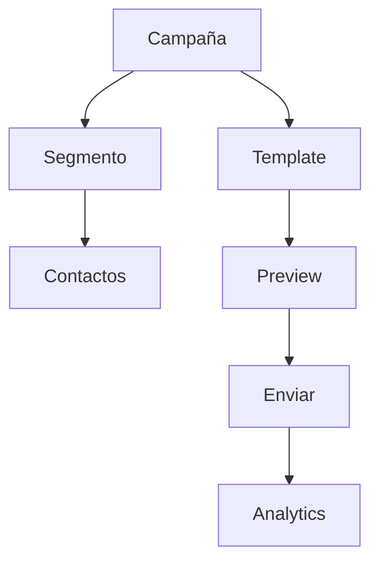

# 0025 — Marketing

---

## 1. Descripción y Alcance

Gestión de marketing: Campaigns (email marketing), Email Templates, Segmentation, Analytics de campañas, y Landing Pages builder.

---

## 2. Diagrama de Flujo



---

## 3. Pantallas

### 3.1 Lista de Campañas

**Tabla**: Nombre, Tipo, Estado, Enviados, Aperturas, Clicks, Acciones
**Estados**: Borrador, Programada, Enviada, Completada

### 3.2 Crear Campaña

**Pasos**:
1. Info básica (nombre, tipo, asunto)
2. Seleccionar segmento
3. Seleccionar/crear template
4. Preview y enviar

### 3.3 Email Template Editor

**Editor visual**: Drag & drop de bloques
**Bloques**: Texto, Imagen, Botón, Divider, Spacer
**Variables**: `{first_name}`, `{company}`, `{unsubscribe_link}`

### 3.4 Segmentos

**Reglas de segmentación**:
- Contacto con tag = "VIP"
- Última compra hace < 30 días
- Lead con score > 50
- Empresa con industria = "Tech"

### 3.5 Analytics de Campaña

**Métricas**: Enviados, Entregados, Aperturas, Clicks, Bounces, Unsubscribes
**Gráfico**: Timeline de aperturas/clicks
**Heatmap**: Clicks por enlace

---

## 4. Backend

### 4.1 Use Cases

```typescript
class CreateCampaignUseCase {
  async execute(dto: CreateCampaignDto, userId: string): Promise<Campaign> {
    // 1. Validar segmento
    const segment = await this.segmentRepository.findById(dto.segmentId);
    if (!segment) throw ErrorFactory.marketing('MKT_001');

    // 2. Calcular audiencia
    const audience = await this.segmentService.calculate(segment);

    // 3. Crear campaña
    return this.campaignRepository.create({
      name: dto.name,
      type: dto.type,
      subject: dto.subject,
      templateId: dto.templateId,
      segmentId: dto.segmentId,
      audienceSize: audience.length,
      organizationId: dto.organizationId,
      createdBy: userId,
      status: 'draft'
    });
  }
}

class SendCampaignUseCase {
  async execute(campaignId: string): Promise<void> {
    const campaign = await this.campaignRepository.findById(campaignId);

    // 1. Calcular audiencia
    const segment = await this.segmentRepository.findById(campaign.segmentId);
    const contacts = await this.segmentService.calculate(segment);

    // 2. Enviar emails en lotes
    for (const batch of chunk(contacts, 100)) {
      await this.emailQueue.add('send-campaign', {
        campaignId,
        contacts: batch,
        templateId: campaign.templateId,
        subject: campaign.subject
      });
    }

    // 3. Actualizar estado
    await this.campaignRepository.updateStatus(campaignId, 'sending');
  }
}
```

---

## 5. Frontend

### 5.1 Components
- `CampaignList` - Lista de campañas
- `CampaignForm` - Crear campaña
- `CampaignDetail` - Detalle con analytics
- `EmailTemplateEditor` - Editor visual
- `SegmentBuilder` - Constructor de segmentos
- `CampaignAnalytics` - Dashboard de analytics
- `CampaignPreview` - Preview de email

### 5.2 Hooks
```typescript
useCampaigns()
useCreateCampaign()
useSendCampaign()
useEmailTemplates()
useCreateEmailTemplate()
useSegments()
useCreateSegment()
useCampaignAnalytics()
```

---

## 6. API REST

```http
POST   /api/v1/marketing/campaigns
GET    /api/v1/marketing/campaigns
GET    /api/v1/marketing/campaigns/:id
POST   /api/v1/marketing/campaigns/:id/send

POST   /api/v1/marketing/templates
GET    /api/v1/marketing/templates
GET    /api/v1/marketing/templates/:id
PATCH  /api/v1/marketing/templates/:id

POST   /api/v1/marketing/segments
GET    /api/v1/marketing/segments
GET    /api/v1/marketing/segments/:id/preview

GET    /api/v1/marketing/campaigns/:id/analytics
```

---

## 7. Base de Datos

```sql
CREATE TABLE marketing_campaigns (
  id UUID PRIMARY KEY DEFAULT gen_random_uuid(),
  organization_id UUID NOT NULL REFERENCES organizations(id),
  name VARCHAR(255) NOT NULL,
  type VARCHAR(30) NOT NULL, -- 'email' | 'sms' | 'push'
  subject VARCHAR(255),
  template_id UUID REFERENCES email_templates(id),
  segment_id UUID REFERENCES marketing_segments(id),
  audience_size INTEGER DEFAULT 0,
  status VARCHAR(20) DEFAULT 'draft',
  scheduled_at TIMESTAMPTZ,
  sent_at TIMESTAMPTZ,
  created_by UUID REFERENCES users(id),
  created_at TIMESTAMPTZ DEFAULT NOW()
);

CREATE TABLE email_templates (
  id UUID PRIMARY KEY DEFAULT gen_random_uuid(),
  organization_id UUID NOT NULL REFERENCES organizations(id),
  name VARCHAR(100) NOT NULL,
  subject VARCHAR(255),
  content TEXT NOT NULL, -- HTML with variables
  created_at TIMESTAMPTZ DEFAULT NOW()
);

CREATE TABLE marketing_segments (
  id UUID PRIMARY KEY DEFAULT gen_random_uuid(),
  organization_id UUID NOT NULL REFERENCES organizations(id),
  name VARCHAR(100) NOT NULL,
  rules JSONB NOT NULL, -- [{field, operator, value}]
  created_at TIMESTAMPTZ DEFAULT NOW()
);

CREATE TABLE campaign_events (
  id UUID PRIMARY KEY DEFAULT gen_random_uuid(),
  campaign_id UUID NOT NULL REFERENCES marketing_campaigns(id),
  contact_id UUID NOT NULL REFERENCES crm_contacts(id),
  event_type VARCHAR(20) NOT NULL, -- 'sent' | 'delivered' | 'opened' | 'clicked' | 'bounced' | 'unsubscribed'
  metadata JSONB,
  created_at TIMESTAMPTZ DEFAULT NOW()
);
```

---

## 8. Eventos

```
CampaignCreated { campaignId, name, audienceSize }
CampaignSent { campaignId, sentCount }
CampaignOpened { campaignId, contactId }
CampaignClicked { campaignId, contactId, link }
```

---

## 9. Permisos

| Recurso | Acciones |
|---------|----------|
| `marketing.campaign` | create, read, update, send |
| `marketing.template` | create, read, update |
| `marketing.segment` | create, read, update |

---

## 10. Validaciones

### Campaign
- `name`: obligatorio
- `subject`: obligatorio para email
- `segmentId`: debe existir
- `templateId`: debe existir

### Segment
- `rules`: al menos 1 regla
- Cada regla: field, operator, value

---

## 11. Nova Tools

| Tool | Descripción | Risk Flag | Permiso |
|------|-------------|-----------|---------|
| `create_campaign` | Crear campaña | medium | `marketing.campaign.create` |
| `get_campaign_analytics` | Ver analytics | - | `marketing.campaign.read` |
| `create_segment` | Crear segmento | low | `marketing.segment.create` |

---

## 12. Notificaciones

```
CampaignCompleted -> in-app con resumen
CampaignBounceHigh -> in-app alerta ( > 5% bounces)
```

---

## 13. Auditoría

Envíos de campañas se auditan.

---

## 14. Criterios de Aceptación

### US-MKT-01: Crear campaña
```
Given usuario crea campaña de email
When selecciona segmento y template
Then se calcula audiencia (150 contactos)
And campaña queda en borrador
```

### US-MKT-02: Enviar campaña
```
Given campaña con 150 contactos
When envía la campaña
Then se procesan emails en lotes de 100
And analytics muestran progreso en tiempo real
```

---

## 15. Dependencias

| Modulo | Relacion |
|--------|----------|
| CRM (009) | Contactos para segmentacion |
| Notifications (012) | Envio de emails via SendGrid |
| Integrations (021) | SendGrid adapter |

---

## 16. Checklist

- [ ] Campaign CRUD
- [ ] Email template editor
- [ ] Segment builder
- [ ] Campaign sending (batched)
- [ ] Campaign analytics
- [ ] Email tracking (open/click)
- [ ] Unsubscribe handling
- [ ] Bounce handling
- [ ] Event publishing
- [ ] Permission guards
- [ ] Nova tools
- [ ] Responsive mobile
