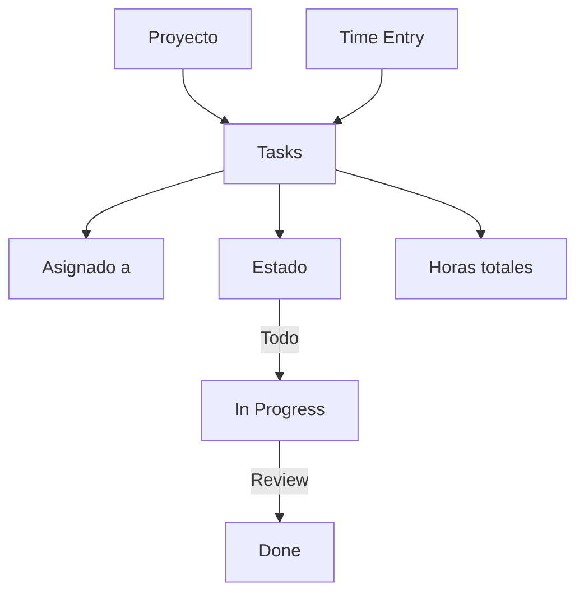

# 0026 — Projects y Tareas

---

## 1. Descripción y Alcance

Gestión de proyectos: Projects, Tasks, Time Tracking, Kanban Board, y Calendar view. Integración con CRM y Sales para seguir ventas por proyecto.

---

## 2. Diagrama de Flujo



---

## 3. Pantallas

### 3.1 Lista de Proyectos

**Tabla**: Nombre, Cliente, Estado, Progreso, Fecha limite, Acciones
**Estados**: Planning, Active, On Hold, Completed

### 3.2 Kanban Board

**Columnas**: Todo, In Progress, Review, Done
**Cards**: Tarea con asignado, prioridad, tiempo estimado
**Drag & drop**: Mover tareas entre columnas

### 3.3 Detalle de Proyecto

**Header**: Nombre, Cliente, Fechas, Presupuesto
**Tabs**:
- Tasks (lista o kanban)
- Time Tracking
- Budget (horas vs estimado)
- Team

### 3.4 Time Tracking

**Timer**: Iniciar/Detener por tarea
**Manual**: Registrar horas manualmente
**Reporte**: Horas por tarea, por miembro, por semana

### 3.5 Calendar View

**Vista**: Calendario con deadlines de tareas
**Filtros**: Asignado, Proyecto, Estado

---

## 4. Backend

### 4.1 Use Cases

```typescript
class CreateProjectUseCase {
  async execute(dto: CreateProjectDto, userId: string): Promise<Project> {
    return this.projectRepository.create({
      name: dto.name,
      clientId: dto.clientId,
      organizationId: dto.organizationId,
      startDate: dto.startDate,
      endDate: dto.endDate,
      budget: dto.budget, // horas estimadas
      createdBy: userId,
      status: 'planning'
    });
  }
}

class CreateTaskUseCase {
  async execute(dto: CreateTaskDto, userId: string): Promise<Task> {
    return this.taskRepository.create({
      projectId: dto.projectId,
      title: dto.title,
      description: dto.description,
      assigneeId: dto.assigneeId,
      priority: dto.priority, // low, medium, high, urgent
      estimatedHours: dto.estimatedHours,
      dueDate: dto.dueDate,
      createdBy: userId,
      status: 'todo'
    });
  }
}

class LogTimeUseCase {
  async execute(dto: LogTimeDto, userId: string): Promise<TimeEntry> {
    return this.timeEntryRepository.create({
      taskId: dto.taskId,
      userId,
      hours: dto.hours,
      description: dto.description,
      date: dto.date
    });
  }
}
```

---

## 5. Frontend

### 5.1 Components
- `ProjectList` - Lista de proyectos
- `ProjectForm` - Crear/editar proyecto
- `ProjectDetail` - Detalle del proyecto
- `KanbanBoard` - Tablero kanban
- `TaskCard` - Card de tarea
- `TaskForm` - Crear/editar tarea
- `TimeTracker` - Timer de tiempo
- `TimeLogForm` - Log manual
- `ProjectCalendar` - Vista calendario
- `ProjectBudget` - Vista de presupuesto

### 5.2 Hooks
```typescript
useProjects()
useCreateProject()
useProjectTasks()
useCreateTask()
useUpdateTaskStatus()
useTimeEntries()
useLogTime()
useProjectBudget()
```

---

## 6. API REST

```http
POST   /api/v1/projects
GET    /api/v1/projects
GET    /api/v1/projects/:id
PATCH  /api/v1/projects/:id

POST   /api/v1/projects/:id/tasks
GET    /api/v1/projects/:id/tasks
PATCH  /api/v1/tasks/:id
PATCH  /api/v1/tasks/:id/status

POST   /api/v1/tasks/:id/time
GET    /api/v1/tasks/:id/time

GET    /api/v1/projects/:id/budget
GET    /api/v1/projects/:id/calendar
```

---

## 7. Base de Datos

```sql
CREATE TABLE projects (
  id UUID PRIMARY KEY DEFAULT gen_random_uuid(),
  organization_id UUID NOT NULL REFERENCES organizations(id),
  client_id UUID REFERENCES crm_contacts(id),
  name VARCHAR(255) NOT NULL,
  description TEXT,
  status VARCHAR(20) DEFAULT 'planning',
  start_date DATE,
  end_date DATE,
  budget_hours INTEGER, -- horas estimadas
  created_by UUID REFERENCES users(id),
  created_at TIMESTAMPTZ DEFAULT NOW()
);

CREATE TABLE tasks (
  id UUID PRIMARY KEY DEFAULT gen_random_uuid(),
  project_id UUID NOT NULL REFERENCES projects(id) ON DELETE CASCADE,
  title VARCHAR(255) NOT NULL,
  description TEXT,
  assignee_id UUID REFERENCES users(id),
  priority VARCHAR(10) DEFAULT 'medium', -- low, medium, high, urgent
  status VARCHAR(20) DEFAULT 'todo', -- todo, in_progress, review, done
  estimated_hours INTEGER,
  due_date DATE,
  created_by UUID REFERENCES users(id),
  created_at TIMESTAMPTZ DEFAULT NOW(),
  completed_at TIMESTAMPTZ
);

CREATE TABLE time_entries (
  id UUID PRIMARY KEY DEFAULT gen_random_uuid(),
  task_id UUID NOT NULL REFERENCES tasks(id),
  user_id UUID NOT NULL REFERENCES users(id),
  hours DECIMAL(5,2) NOT NULL,
  description TEXT,
  entry_date DATE NOT NULL,
  created_at TIMESTAMPTZ DEFAULT NOW()
);
```

---

## 8. Eventos

```
ProjectCreated { projectId, name, clientId }
ProjectStatusChanged { projectId, oldStatus, newStatus }
TaskCreated { taskId, projectId, assigneeId }
TaskCompleted { taskId, projectId }
TimeLogged { timeEntryId, taskId, hours, userId }
```

---

## 9. Permisos

| Recurso | Acciones |
|---------|----------|
| `projects.project` | create, read, update |
| `projects.task` | create, read, update |
| `projects.time` | create, read |

---

## 10. Validaciones

### Project
- `name`: obligatorio
- `endDate` >= `startDate`

### Task
- `title`: obligatorio
- `estimatedHours`: positivo
- `dueDate`: opcional

---

## 11. Nova Tools

| Tool | Descripción | Risk Flag | Permiso |
|------|-------------|-----------|---------|
| `find_project` | Buscar proyecto | - | `projects.project.read` |
| `create_task` | Crear tarea | low | `projects.task.create` |
| `log_time` | Registrar horas | low | `projects.time.create` |

---

## 12. Notificaciones

```
TaskAssigned -> in-app al asignado
TaskDueSoon -> in-app (1 dia antes)
TaskOverdue -> in-app al asignado y manager
ProjectCompleted -> in-app al equipo
```

---

## 13. Auditoría

Creación y completado de tareas se audita.

---

## 14. Criterios de Aceptación

### US-PROJ-01: Kanban board
```
Given proyecto con 5 tareas
When accede al kanban
Then ve tareas en columnas por estado
And puede drag & drop para cambiar estado
```

### US-PROJ-02: Time tracking
```
Given tarea "Diseñar landing"
When inicia timer por 2 horas
Then se registra time entry de 2h
Y se acumula en el total del proyecto
```

---

## 15. Dependencias

| Modulo | Relacion |
|--------|----------|
| CRM (009) | Clientes como proyectos |
| Dashboard (007) | KPIs de proyectos |
| HR (024) | Asignacion de equipo |

---

## 16. Checklist

- [ ] Project CRUD
- [ ] Task CRUD
- [ ] Kanban board con drag & drop
- [ ] Calendar view
- [ ] Time tracking (timer + manual)
- [ ] Budget tracking (horas)
- [ ] Notifications de vencimiento
- [ ] Event publishing
- [ ] Permission guards
- [ ] Nova tools
- [ ] Responsive mobile
