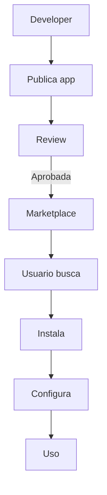

# 0027 — Marketplace

---

## 1. Descripción y Alcance

Marketplace de extensiones: Developer portal, App listings, Install/uninstall, Billing (Stripe), Reviews, y Usage analytics.

---

## 2. Diagrama de Flujo



---

## 3. Pantallas

### 3.1 Marketplace Home

**Featured apps**: Apps destacadas
**Categories**: CRM, Sales, Analytics, Communication, etc.
**Search**: Buscar apps

### 3.2 App Listing

**Card**: Logo, Nombre, Descripcion, Rating, Precio, Install button
**Detalle**: Screenshots, Descripcion completa, Reviews, Pricing

### 3.3 Developer Portal

**Dashboard**: Apps publicadas, Installs, Revenue
**Submit App**: Formulario de submission
**Analytics**: Uso de la app

### 3.4 App Configuration

**After install**: Configuracion de la app
**API keys**: Credenciales necesarias
**Permissions**: Permisos requeridos

---

## 4. Backend

### 4.1 Use Cases

```typescript
class SubmitAppUseCase {
  async execute(dto: SubmitAppDto, developerId: string): Promise<MarketplaceApp> {
    return this.appRepository.create({
      developerId,
      name: dto.name,
      description: dto.description,
      category: dto.category,
      pricing: dto.pricing, // 'free' | 'monthly' | 'per_use'
      price: dto.price,
      icon: dto.icon,
      screenshots: dto.screenshots,
      configSchema: dto.configSchema,
      status: 'pending_review'
    });
  }
}

class InstallAppUseCase {
  async execute(dto: InstallAppDto, userId: string): Promise<AppInstallation> {
    // 1. Verificar permisos
    const app = await this.appRepository.findById(dto.appId);
    if (app.status !== 'approved') throw ErrorFactory.marketplace('MKTPL_001');

    // 2. Verificar billing si es de pago
    if (app.pricing !== 'free') {
      await this.billingService.setupSubscription(dto.organizationId, app);
    }

    // 3. Instalar
    return this.installationRepository.create({
      appId: dto.appId,
      organizationId: dto.organizationId,
      installedBy: userId,
      config: {}
    });
  }
}
```

---

## 5. Frontend

### 5.1 Components
- `MarketplaceHome` - Home del marketplace
- `AppCard` - Card de app
- `AppDetail` - Detalle de app
- `AppListings` - Lista de apps instaladas
- `DeveloperPortal` - Portal de desarrollador
- `AppSubmitForm` - Formulario de submission
- `AppConfig` - Configuracion de app instalada
- `ReviewList` - Reviews de la app

### 5.2 Hooks
```typescript
useMarketplaceApps()
useAppDetail()
useInstallApp()
useUninstallApp()
useMyApps()
useSubmitApp()
useDeveloperDashboard()
```

---

## 6. API REST

```http
GET    /api/v1/marketplace/apps
GET    /api/v1/marketplace/apps/:id
POST   /api/v1/marketplace/apps/:id/install
DELETE /api/v1/marketplace/apps/:id/uninstall

GET    /api/v1/marketplace/my-apps

POST   /api/v1/marketplace/developer/apps
GET    /api/v1/marketplace/developer/apps
GET    /api/v1/marketplace/developer/analytics

POST   /api/v1/marketplace/apps/:id/reviews
GET    /api/v1/marketplace/apps/:id/reviews
```

---

## 7. Base de Datos

```sql
CREATE TABLE marketplace_apps (
  id UUID PRIMARY KEY DEFAULT gen_random_uuid(),
  developer_id UUID NOT NULL REFERENCES users(id),
  name VARCHAR(100) NOT NULL,
  description TEXT NOT NULL,
  category VARCHAR(50) NOT NULL,
  icon VARCHAR(500),
  screenshots TEXT[],
  pricing VARCHAR(20) DEFAULT 'free',
  price BIGINT, -- cents per month or per use
  config_schema JSONB,
  status VARCHAR(20) DEFAULT 'pending_review',
  approved_at TIMESTAMPTZ,
  created_at TIMESTAMPTZ DEFAULT NOW()
);

CREATE TABLE app_installations (
  id UUID PRIMARY KEY DEFAULT gen_random_uuid(),
  app_id UUID NOT NULL REFERENCES marketplace_apps(id),
  organization_id UUID NOT NULL REFERENCES organizations(id),
  installed_by UUID REFERENCES users(id),
  config JSONB DEFAULT '{}',
  is_active BOOLEAN DEFAULT true,
  installed_at TIMESTAMPTZ DEFAULT NOW()
);

CREATE TABLE app_reviews (
  id UUID PRIMARY KEY DEFAULT gen_random_uuid(),
  app_id UUID NOT NULL REFERENCES marketplace_apps(id),
  user_id UUID NOT NULL REFERENCES users(id),
  rating INTEGER NOT NULL, -- 1-5
  comment TEXT,
  created_at TIMESTAMPTZ DEFAULT NOW(),
  UNIQUE(app_id, user_id)
);
```

---

## 8. Eventos

```
AppSubmitted { appId, developerId, category }
AppApproved { appId }
AppInstalled { appId, organizationId, installedBy }
AppUninstalled { appId, organizationId }
ReviewCreated { appId, userId, rating }
```

---

## 9. Permisos

| Recurso | Acciones |
|---------|----------|
| `marketplace.app` | read, install, uninstall |
| `marketplace.developer` | create, read |
| `marketplace.review` | create, read |

---

## 10. Validaciones

### App
- `name`: obligatorio, 1-100 chars
- `description`: obligatorio
- `category`: enum valido
- `pricing`: 'free' | 'monthly' | 'per_use'
- `price`: requerido si no es free

### Review
- `rating`: 1-5
- 1 review por usuario por app

---

## 11. Nova Tools

| Tool | Descripción | Risk Flag | Permiso |
|------|-------------|-----------|---------|
| `search_marketplace` | Buscar apps | - | `marketplace.app.read` |
| `install_app` | Instalar app | medium | `marketplace.app.install` |

---

## 12. Notificaciones

```
AppApproved -> email al developer
NewReview -> email al developer
AppInstalled -> in-app al admin
```

---

## 13. Auditoría

Instalaciones/desinstalaciones se auditan.

---

## 14. Criterios de Aceptación

### US-MKTPL-01: Install app
```
Given usuario con permisos de admin
When instala app gratuita
Then app queda activa
And puede configurarla
```

### US-MKTPL-02: Developer submit
```
Given developer registra app
When sube screenshots y descripcion
Then app queda en review
And al aprobarse, aparece en marketplace
```

---

## 15. Dependencias

| Modulo | Relacion |
|--------|----------|
| Auth (004) | Developer accounts |
| Integrations (021) | Billing via Stripe |

---

## 16. Checklist

- [ ] App listing CRUD
- [ ] Developer portal
- [ ] App submission
- [ ] Review system
- [ ] Install/uninstall
- [ ] Billing integration
- [ ] App configuration
- [ ] Analytics de uso
- [ ] Search y categorias
- [ ] Event publishing
- [ ] Permission guards
- [ ] Nova tools
- [ ] Responsive mobile
