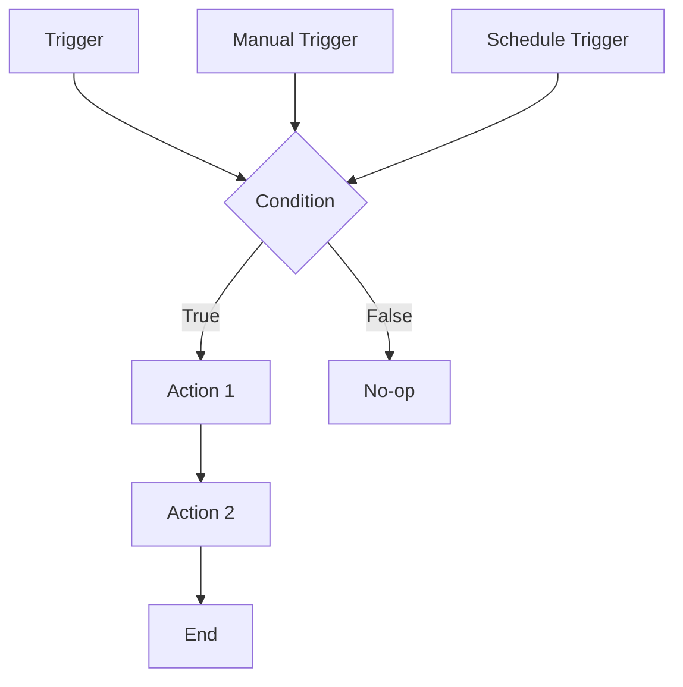

# 0028 — Automations (Nexora Flow)

---

## 1. Descripción y Alcance

Motor de automatizaciones no-code: Workflow builder visual, triggers, conditions, actions, templates predefinidos, execution logs, y monitoring.

---

## 2. Diagrama de Flujo



---

## 3. Pantallas

### 3.1 Lista de Automations

**Tabla**: Nombre, Trigger, Estado, Ultima ejecucion, Acciones
**Estados**: Active, Paused, Draft

### 3.2 Workflow Builder

**Canvas visual**: Arrastrar nodos de trigger, condition, action
**Nodos disponibles**:
- Triggers: Record created, Record updated, Schedule, Manual
- Conditions: Field equals, Date is, AND/OR logic
- Actions: Send email, Update record, Create task, Webhook, Notify

**Propiedades**: Panel lateral con config del nodo seleccionado

### 3.3 Execution Logs

**Tabla**: Automation, Trigger, Estado, Duracion, Timestamp
**Detalle**: Steps ejecutados, resultados, errores

### 3.4 Templates

**Predefinidos**:
- Lead asignar vendedor automaticamente
- Recordatorio de follow-up
- Notificar stock bajo
- Enviar email de bienvenida

---
## 4. Backend

### 4.1 Arquitectura del Engine Propio

```
┌──────────────────────────────────────────────────────────────┐
│                     NEXORA AUTOMATION ENGINE                  │
│                                                              │
│  ┌──────────────┐  ┌──────────────┐  ┌──────────────────┐  │
│  │   Trigger    │  │   Condition  │  │   Action         │  │
│  │   Listener   │  │   Evaluator  │  │   Executor       │  │
│  │              │  │              │  │                  │  │
│  │ Escucha      │  │ Evalúa       │  │ Ejecuta          │  │
│  │ eventos del  │  │ condiciones  │  │ acciones del     │  │
│  │ sistema      │  │ del sistema  │  │ catálogo         │  │
│  └──────┬───────┘  └──────┬───────┘  └────────┬─────────┘  │
│         │                 │                    │             │
│         ▼                 ▼                    ▼             │
│  ┌──────────────────────────────────────────────────────┐   │
│  │              AUTOMATION WORKFLOW STORE                │   │
│  │  PostgreSQL: Automation + AutomationExecution        │   │
│  └──────────────────────────────────────────────────────┘   │
└──────────────────────────────────────────────────────────────┘
```

### 4.2 Use Cases

```typescript
class CreateAutomationUseCase {
  async execute(dto: CreateAutomationDto, userId: string, createdBy: 'user' | 'nova' = 'user'): Promise<Automation> {
    return this.automationRepository.create({
      name: dto.name,
      description: dto.description,
      triggerType: dto.triggerType,
      triggerConfig: dto.triggerConfig,
      conditions: dto.conditions,
      actions: dto.actions,
      organizationId: dto.organizationId,
      createdBy,
      createdByUserId: createdBy === 'user' ? userId : null,
      status: 'draft'
    });
  }
}

class ExecuteAutomationUseCase {
  async execute(automationId: string, triggerData: any): Promise<ExecutionResult> {
    const automation = await this.automationRepository.findById(automationId);
    if (automation.status !== 'active') return null;
    const startTime = Date.now();

    // 1. Evaluar condiciones
    const conditionsMet = this.conditionEvaluator.evaluate(
      automation.conditions, triggerData
    );
    if (!conditionsMet) {
      return this.executionRepository.create({
        automationId,
        triggerData,
        conditionsMet: false,
        results: [],
        status: 'skipped',
        durationMs: Date.now() - startTime
      });
    }

    // 2. Ejecutar acciones en orden
    const results = [];
    for (const action of automation.actions) {
      const result = await this.actionExecutor.execute(action, triggerData);
      results.push(result);
      if (result.status === 'failed' && action.stopOnFailure) break;
    }

    // 3. Actualizar stats del automation
    const allSuccess = results.every(r => r.status === 'success');
    const anyFailed = results.some(r => r.status === 'failed');
    
    await this.automationRepository.updateStats(automationId, {
      lastExecutedAt: new Date(),
      executionCount: { increment: 1 },
      successCount: allSuccess ? { increment: 1 } : undefined,
      failureCount: anyFailed ? { increment: 1 } : undefined,
    });

    // 4. Registrar ejecucion
    return this.executionRepository.create({
      automationId,
      triggerData,
      conditionsMet: true,
      results,
      status: allSuccess ? 'completed' : anyFailed ? 'failed' : 'partial',
      durationMs: Date.now() - startTime
    });
  }
}
```

### 4.3 Trigger Listener (Event-Driven)

```typescript
@Injectable()
export class AutomationTriggerListener {
  constructor(
    private automationService: AutomationsService,
    private conditionEvaluator: ConditionEvaluator,
    private actionExecutor: ActionExecutor,
  ) {}

  @OnEvent('lead.created')
  async handleLeadCreated(event: LeadCreatedEvent) {
    await this.processTrigger(event.organizationId, 'lead.created', event);
  }

  @OnEvent('lead.stage_changed')
  async handleLeadStageChanged(event: LeadStageChangedEvent) {
    await this.processTrigger(event.organizationId, 'lead.stage_changed', event);
  }

  @OnEvent('order.created')
  async handleOrderCreated(event: OrderCreatedEvent) {
    await this.processTrigger(event.organizationId, 'order.created', event);
  }

  @OnEvent('invoice.paid')
  async handleInvoicePaid(event: InvoicePaidEvent) {
    await this.processTrigger(event.organizationId, 'invoice.paid', event);
  }

  @OnEvent('invoice.overdue')
  async handleInvoiceOverdue(event: InvoiceOverdueEvent) {
    await this.processTrigger(event.organizationId, 'invoice.overdue', event);
  }

  @OnEvent('stock.low')
  async handleStockLow(event: StockLowEvent) {
    await this.processTrigger(event.organizationId, 'stock.low', event);
  }

  @OnEvent('employee.hired')
  async handleEmployeeHired(event: EmployeeHiredEvent) {
    await this.processTrigger(event.organizationId, 'employee.hired', event);
  }

  private async processTrigger(organizationId: string, triggerType: string, eventData: any) {
    const automations = await this.automationService.findByTrigger(
      organizationId, triggerType
    );

    for (const automation of automations) {
      if (automation.status !== 'active') continue;
      
      try {
        await this.automationService.executeAutomation(automation.id, eventData);
      } catch (error) {
        // Log error but don't throw - automation failure shouldn't block the event
        console.error(`Automation ${automation.id} failed:`, error);
      }
    }
  }
}
```

### 4.4 Condition Evaluator

```typescript
@Injectable()
export class ConditionEvaluator {
  evaluate(conditions: AutomationCondition[] | null, data: any): boolean {
    if (!conditions || conditions.length === 0) return true;

    return conditions.every(condition => {
      const value = this.getNestedValue(data, condition.field);
      return this.compare(value, condition.operator, condition.value);
    });
  }

  private compare(actual: any, operator: string, expected: any): boolean {
    switch (operator) {
      case 'eq': return actual === expected;
      case 'neq': return actual !== expected;
      case 'gt': return actual > expected;
      case 'gte': return actual >= expected;
      case 'lt': return actual < expected;
      case 'lte': return actual <= expected;
      case 'contains': return String(actual).includes(String(expected));
      case 'in': return Array.isArray(expected) && expected.includes(actual);
      default: return false;
    }
  }

  private getNestedValue(obj: any, path: string): any {
    return path.split('.').reduce((current, key) => current?.[key], obj);
  }
}
```

### 4.5 Action Executor

```typescript
@Injectable()
export class ActionExecutor {
  constructor(
    private invoiceService: SalesInvoiceService,
    private leadService: CrmLeadService,
    private emailAdapter: EmailAdapter,
    private notificationService: NotificationsService,
    private schedulerService: SchedulerService,
  ) {}

  async execute(action: AutomationAction, triggerData: any): Promise<ActionResult> {
    const startTime = Date.now();
    try {
      let result: any;

      switch (action.type) {
        // Sales Actions
        case 'invoice.create':
          result = await this.invoiceService.createFromOrder(action.config, triggerData);
          break;
        
        // CRM Actions
        case 'lead.assign':
          result = await this.leadService.autoAssign(action.config, triggerData);
          break;
        case 'lead.update_stage':
          result = await this.leadService.updateStage(action.config.leadId, action.config.stage);
          break;
        case 'lead.add_tag':
          result = await this.leadService.addTag(action.config.leadId, action.config.tag);
          break;

        // Notification Actions
        case 'email.send':
          result = await this.emailAdapter.send(action.config);
          break;
        case 'whatsapp.send':
          result = await this.whatsappAdapter.send(action.config);
          break;
        case 'notify':
          result = await this.notificationService.send(action.config);
          break;

        // Schedule Actions
        case 'schedule.follow_up':
          result = await this.schedulerService.scheduleFollowUp(action.config);
          break;

        // Generic Actions
        case 'record.update':
          result = await this.recordService.update(action.config);
          break;
        case 'webhook.call':
          result = await this.webhookService.call(action.config);
          break;

        default:
          throw new Error(`Unknown action type: ${action.type}`);
      }

      return {
        action: action.type,
        status: 'success',
        result,
        durationMs: Date.now() - startTime
      };
    } catch (error) {
      return {
        action: action.type,
        status: 'failed',
        error: error.message,
        durationMs: Date.now() - startTime
      };
    }
  }
}
```

### 4.6 Trigger Types

| TriggerType | EventData | Description |
|-------------|-----------|-------------|
| `lead.created` | `{ leadId, pipelineId, source }` | Lead creado |
| `lead.stage_changed` | `{ leadId, fromStage, toStage }` | Lead cambió etapa |
| `order.created` | `{ orderId, total, customerId }` | Orden creada |
| `invoice.paid` | `{ invoiceId, amount, method }` | Factura pagada |
| `invoice.overdue` | `{ invoiceId, daysOverdue }` | Factura vencida |
| `stock.low` | `{ productId, currentStock, minStock }` | Stock bajo mínimo |
| `employee.hired` | `{ employeeId, position }` | Empleado contratado |
| `schedule.cron` | `{ timestamp }` | Expresión cron |

### 4.7 Action Types

| ActionType | Module | Config |
|------------|--------|--------|
| `invoice.create` | Sales | `fromOrder?: boolean`, `contactId?` |
| `lead.assign` | CRM | `strategy?: 'least_active' \| 'round_robin'` |
| `lead.update_stage` | CRM | `leadId: string`, `stage: string` |
| `lead.add_tag` | CRM | `leadId: string`, `tag: string` |
| `email.send` | Integrations | `to?: string`, `template?: string` |
| `whatsapp.send` | Integrations | `to?: string`, `template?: string` |
| `notify` | Core | `userId: string`, `title: string`, `message: string` |
| `schedule.follow_up` | Core | `delay: string`, `type: 'call' \| 'email'` |
| `record.update` | Core | `entity: string`, `entityId: string`, `fields: object` |
| `webhook.call` | Integrations | `url: string`, `method?: string`, `body?: object` |
---

## 5. Frontend

### 5.1 Components
- `AutomationList` - Lista de automations
- `AutomationForm` - Crear/editar
- `WorkflowBuilder` - Canvas visual
- `TriggerNode` - Nodo de trigger
- `ConditionNode` - Nodo de condicion
- `ActionNode` - Nodo de accion
- `NodeProperties` - Panel de propiedades
- `ExecutionLogs` - Logs de ejecucion
- `AutomationTemplates` - Templates predefinidos

### 5.2 Hooks
```typescript
useAutomations()
useCreateAutomation()
useToggleAutomation()
useAutomationLogs()
useWorkflowBuilder()
useAutomationTemplates()
```

---

## 6. API REST

```http
POST   /api/v1/automations
GET    /api/v1/automations
GET    /api/v1/automations/:id
PATCH  /api/v1/automations/:id
PATCH  /api/v1/automations/:id/toggle

POST   /api/v1/automations/:id/execute
GET    /api/v1/automations/:id/logs

GET    /api/v1/automation-templates
POST   /api/v1/automation-templates/:id/use
```

---

## 7. Base de Datos

```sql
CREATE TABLE automations (
  id UUID PRIMARY KEY DEFAULT gen_random_uuid(),
  organization_id UUID NOT NULL REFERENCES organizations(id),
  name VARCHAR(100) NOT NULL,
  description TEXT,
  trigger_type VARCHAR(50) NOT NULL, -- 'lead.created', 'order.created', 'schedule.cron', etc.
  trigger_config JSONB NOT NULL, -- {minAmount, pipelineId, cron, etc.}
  conditions JSONB, -- [{field, op, value}]
  actions JSONB NOT NULL, -- [{type, config}]
  status VARCHAR(20) DEFAULT 'draft', -- draft, active, paused
  created_by VARCHAR(20) DEFAULT 'user', -- 'user' | 'nova'
  created_by_user_id UUID REFERENCES users(id),
  last_executed_at TIMESTAMPTZ,
  execution_count INTEGER DEFAULT 0,
  success_count INTEGER DEFAULT 0,
  failure_count INTEGER DEFAULT 0,
  created_at TIMESTAMPTZ DEFAULT NOW(),
  updated_at TIMESTAMPTZ DEFAULT NOW()
);

CREATE TABLE automation_executions (
  id UUID PRIMARY KEY DEFAULT gen_random_uuid(),
  automation_id UUID NOT NULL REFERENCES automations(id) ON DELETE CASCADE,
  trigger_data JSONB,
  conditions_met BOOLEAN DEFAULT true,
  results JSONB, -- [{action, status, result, durationMs}]
  status VARCHAR(20) NOT NULL, -- 'completed' | 'failed' | 'partial' | 'skipped'
  error TEXT,
  duration_ms INTEGER,
  created_at TIMESTAMPTZ DEFAULT NOW()
);
```

---

## 8. Eventos

```
AutomationCreated { automationId, name, organizationId }
AutomationToggled { automationId, newStatus }
AutomationExecuted { automationId, executionId, status, duration }
```

---

## 9. Permisos

| Recurso | Acciones |
|---------|----------|
| `automation` | create, read, update, toggle, execute |

Solo admin+ pueden crear/editar automations.

---

## 10. Validaciones

### Automation
- `name`: obligatorio
- `trigger_config`: tipo valido
- `actions`: al menos 1 accion
- Max 50 actions por automation

### Conditions
- `field`: campo existente en la entidad
- `operator`: operador valido para el tipo

---

## 11. Nova Tools

| Tool | Descripción | Risk Flag | Permiso |
|------|-------------|-----------|---------|
| `create_automation` | Crear automation | medium | `automation.create` |
| `toggle_automation` | Activar/desactivar | medium | `automation.update` |
| `get_automation_logs` | Ver logs | - | `automation.read` |

---

## 12. Notificaciones

```
AutomationFailed -> in-app al admin
AutomationExecuted -> in-app (si es action de notificacion)
```

---

## 13. Auditoría

Creacion y ejecuciones se auditan.

---

## 14. Criterios de Aceptación

### US-AUTO-01: Crear automation
```
Given admin crea automation
When configura trigger "lead_created" + action "send_email"
Then automation queda en draft
And al activarla, se ejecuta en el proximo lead
```

### US-AUTO-02: Ejecucion automatica
```
Given automation activa de "stock_below_minimum"
When stock cae por debajo del minimo
Then automation se ejecuta automaticamente
Y envia notificacion configurada
```

---

## 15. Dependencias

| Modulo | Relacion |
|--------|----------|
| Todos | Triggers de eventos |
| Notifications (012) | Actions de notificacion |
| CRM/Sales/Inventory | Records como triggers |

---

## 16. Checklist

- [ ] Automation CRUD
- [ ] Workflow builder visual
- [ ] Trigger listeners
- [ ] Condition evaluator
- [ ] Action executor
- [ ] Execution logs
- [ ] Templates predefinidos
- [ ] Schedule trigger (cron)
- [ ] Manual trigger
- [ ] Toggle active/paused
- [ ] Event publishing
- [ ] Permission guards
- [ ] Nova tools
- [ ] Responsive mobile
